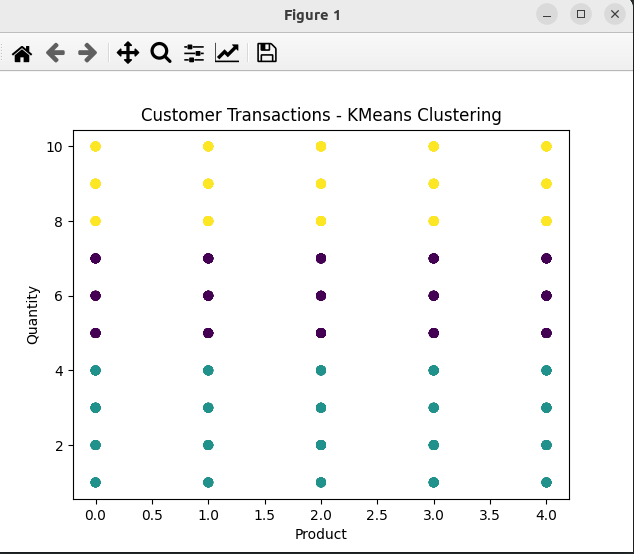
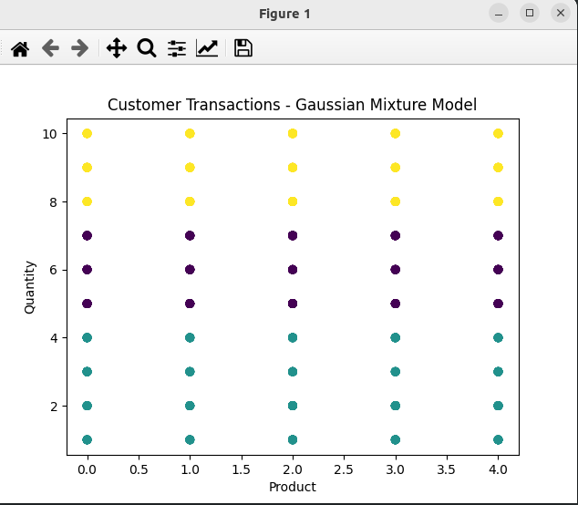
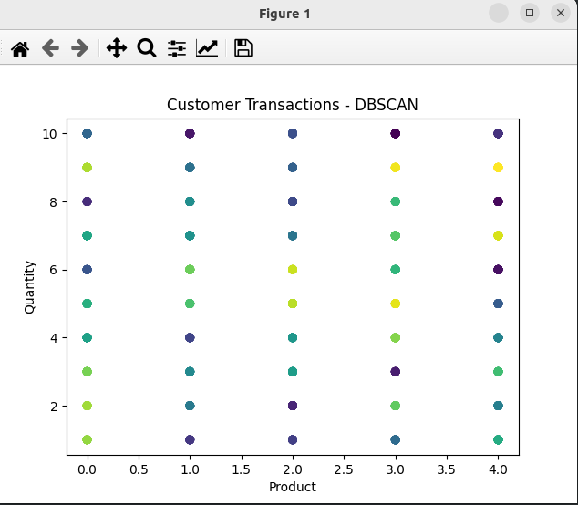

### Clustering

*K-means*: is a type of unsupervised learning algorithm used for clustering problem. The goal of this algorithm is to find groups (clusters) in the given data.

Here is how it works:
1. **Initialization**: K initial "means" (centroids) are randomly generated within the data domain.
2. **Assignment step**: K clusters are created by associating each observation with the nearest centroid.
3. **Update step**: The centroid of the clusters becomes the new mean.

Steps 2 and 3 are repeated until convergence has been reached, i.e. the assignments no longer change.

The algorithm aims to choose centroids that minimise the within-cluster sum of squares, measuring the 
distance between each data point and the centroid of its assigned cluster.
The number of clusters, K, is an input parameter and a critical one to the performance of the algorithm. The optimal number of clusters is often ambiguous and depends on the method used to measure similarities and the parameters used for partitioning.

A key limitation of K-means is its sensitivity to the initial choice of centroids. Different initializations may lead to different clusters. To mitigate this, the algorithm is often run multiple times with different initializations and the most common output is chosen.

Algorithms similar to K-means ¹:
- *DBSCAN*: This algorithm finds arbitrarily shaped clusters based on the density of data points in different regions. It separates regions by areas of low-density so that it can detect outliers between the high-density clusters.
- *Gaussian Mixture Model*: This algorithm uses multiple Gaussian distributions to fit arbitrarily shaped data. It calculates the probability that a data point belongs to a specific Gaussian distribution and that's the cluster it will fall under.
- *BIRCH*: This algorithm works better on large data sets than the k-means algorithm. It breaks the data into little summaries that are clustered instead of the original data points.
- *Affinity Propagation*: Each data point communicates with all of the other data points to let each other know how similar they are and that starts to reveal the clusters in the data.
- *Mean-Shift*: This algorithm finds clusters without an initial number of clusters being set. It works by iterating over all of the data points and shifts them towards the mode.
- *OPTICS*: This algorithm can find meaningful clusters in data that varies in density. It does this by ordering the data points so that the closest points are neighbors in the ordering.
- *Agglomerative Hierarchy*: This is the most common type of hierarchical clustering algorithm. It's used to group objects in clusters based on how similar they are to each other.

### KMeans

### Gaussian Mixture Model (GMM)
 

### DBSCAN
