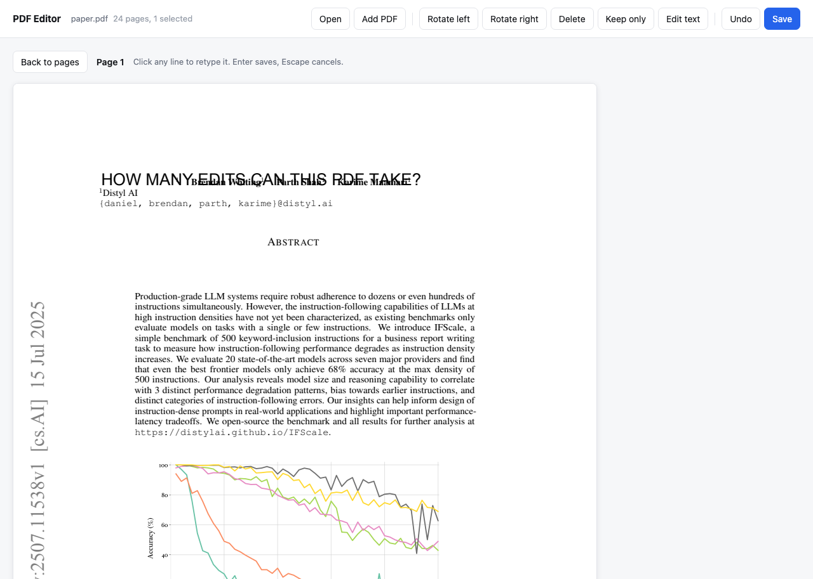
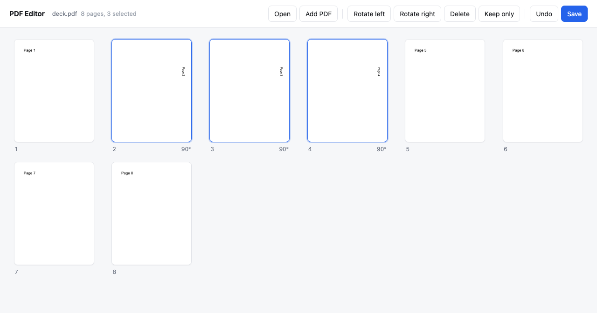
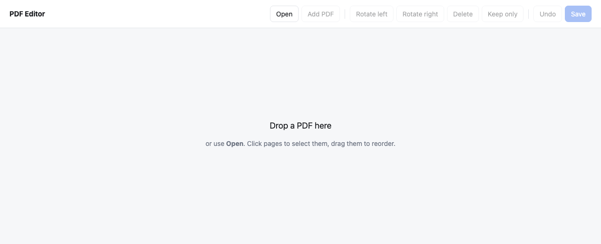

# PDF Editor Simple

A visual PDF editor that runs in the browser on your own machine. Open any PDF and
**click a line of text to retype it**, or work on whole pages: rotate, delete, drag
into a new order, merge another PDF in, then save the result. The same page
operations are also a command line tool, so anything you can do by clicking to a
page you can do in a script.

Nothing leaves the machine. The server binds to `127.0.0.1` and the file you open is
held in memory until you replace it.







## What it does

| Action        | How                                                          |
|---------------|--------------------------------------------------------------|
| Open a PDF    | `Open`, or drop the file anywhere on the page                 |
| Select pages  | click a page, shift-click for a range, `Cmd/Ctrl+A` for all   |
| Rotate        | `Rotate left` / `Rotate right`, a quarter turn each press     |
| Delete        | `Delete`, or the `Backspace` key                              |
| Keep only     | drops every page you did not select                           |
| Reorder       | drag a page and drop it before or after another               |
| Merge         | `Add PDF`, or drop a second file in, appends its pages        |
| Undo          | `Undo`, or `Cmd/Ctrl+Z`, back through the last 30 edits       |
| Edit text     | select one page, `Edit text`, then click any line and retype  |
| Save          | `Save` downloads the edited PDF                               |

Page edits are held as a list of page slots, each one pointing at a page in an
opened file plus a rotation. Nothing is rewritten while you work, so undo is cheap
and the original bytes stay untouched. The PDF is built once, when you save.

## Editing the text

`Edit text` renders the page and lays a clickable box over every line it finds.
Click one, retype it, press Enter. Escape cancels, `Undo` reverts, and the page
thumbnail updates.

A PDF stores positioned glyphs, not sentences, so how a line can be changed depends
on how the file was produced. The editor picks the best of three routes per line and
tells you which one it used when you hover it:

| Route      | When it is used                                                  | What you get                           |
|------------|------------------------------------------------------------------|----------------------------------------|
| in place   | the line is one text operator in a non embedded standard font     | **the original font is kept**          |
| replaced   | the line is several operators, or an embedded font                | old text removed, redrawn in Helvetica |
| covered    | the text is drawn somewhere this editor cannot reach into         | old text covered, redrawn in Helvetica |

Which route a line takes is decided by position. The content stream is walked while
tracking the text matrix, so every text operator has a place on the page, and the
line you clicked is matched to the operators that actually drew it. That is why a
line can be edited even in a file whose text is broken into kerned fragments, as
LaTeX does.

Every route keeps the position, the size and the colour of the line it replaces. The
covering rectangle is filled with the page's own dominant background colour, not
plain white, so it disappears on tinted pages. Turned pages are handled: a page with
a `/Rotate` of 90, 180 or 270 has its boxes mapped into the turned view, so the line
you click is the line you see.

### What it will not do

- **No reflow.** A longer line does not push the rest of the page down, because a
  PDF has no paragraphs to reflow. A much longer line can run into what sits next
  to it.
- **The covered route leaves the old text in the file.** It is hidden from view and
  from this editor, but a text search or a copy and paste still finds the old words.
  The other two routes remove it properly, which is the usual case.
- **Redrawn text is Helvetica.** Only the in place route can keep an embedded font,
  since the glyphs for the letters you type may simply not exist in a subset font.
- **Latin characters only when redrawing.** A character Helvetica cannot draw is
  refused with a message rather than quietly turned into a question mark.

## Requirements

- Python 3.14.6

## Install dependencies

```bash
./install-deps.sh
```

## Run the editor

```bash
./serve.sh
```

Then open http://127.0.0.1:8099. `PORT=9000 ./serve.sh` picks another port.

## Command line

The page operations without the browser. Text editing is browser only. Page selection uses one syntax everywhere,
1-based like a page number on paper.

```bash
./run.sh <command> [options]
```

| Command   | What it does                                            |
|-----------|---------------------------------------------------------|
| `info`    | page count, page size in points, rotation, metadata     |
| `sample`  | write a small multi page PDF to work on                 |
| `extract` | keep the given pages, **in the order given**            |
| `delete`  | drop the given pages, keep the rest in document order   |
| `rotate`  | turn the given pages clockwise by a multiple of 90      |
| `merge`   | join several PDFs into one                              |
| `split`   | write every page as its own file                        |
| `text`    | print the text of the given pages                       |

`extract` doubles as the reorder tool. `-p 3,1` means page 3 first, then page 1,
because the selection keeps the order you typed rather than sorting it.

```
-p 2          a single page
-p 1-3        an inclusive range, pages 1, 2 and 3
-p 1-3,7      ranges and single pages together
-p 3,1        page 3, then page 1
```

A page outside the document, a backwards range like `4-2`, text instead of a number,
or a selection that would leave an empty document is an error. The command exits
non-zero and writes no file, so a bad selection never leaves a half edited PDF on
disk. The editor refuses the same things, and says so instead of silently doing less
than you asked.

## Result

```
$ ./run.sh sample -o out/deck.pdf -n 8
out/deck.pdf
```

Opened in the editor, pages 2, 3 and 4 selected and rotated right, then page 8
dragged to the front and saved:

```
$ ./run.sh info out/edited.pdf
out/edited.pdf: 8 pages, encrypted=False
producer: pypdf
page 1: 612x792 pt, rotation 0
page 2: 612x792 pt, rotation 0
page 3: 612x792 pt, rotation 90
page 4: 612x792 pt, rotation 90
page 5: 612x792 pt, rotation 90
page 6: 612x792 pt, rotation 0
page 7: 612x792 pt, rotation 0
page 8: 612x792 pt, rotation 0

$ ./run.sh text out/edited.pdf | head -4
--- page 1
Page 8
--- page 2
Page 1
```

The same file from the command line only:

```
$ ./run.sh extract out/deck.pdf -p 3,1 -o out/reordered.pdf
out/reordered.pdf

$ ./run.sh text out/reordered.pdf
--- page 1
Page 3
--- page 2
Page 1

$ ./run.sh split out/reordered.pdf -o out/pages
out/pages/page-001.pdf
out/pages/page-002.pdf
```

Refused selections:

```
$ ./run.sh extract out/deck.pdf -p 99 -o out/x.pdf
error: page 99 is outside 1-8

$ ./run.sh delete out/deck.pdf -p 1-8 -o out/x.pdf
error: deleting every page would leave an empty document

$ ./run.sh rotate out/deck.pdf -p 1 -a 45 -o out/x.pdf
error: angle must be a multiple of 90
```

## Tests

```bash
./test.sh
```

```
Ran 51 tests in 0.058s

OK
```

The tests cover the three places every edit is decided. `test_pages.py` pins page
selection: order is kept so `extract` can reorder, a page named twice is written
once, ranges are inclusive, and out of range, backwards, non numeric and empty
selections raise instead of quietly selecting fewer pages. `test_document.py` pins
the editor model against the file it produces: the saved PDF follows the order shown
on screen, rotation reaches the file and wraps at 360, undo restores what was
deleted, a freshly opened file has nothing to undo, and a reorder that would lose a
page is refused. `test_textedit.py` pins the text layer: escaped and octal strings
survive the tokenizer, a kerned array counts as one operation, a single operator in
a standard font is edited in place and leaves no covering rectangle, a line split
across two operators has its old text removed rather than hidden, a redrawn line
keeps the position of the line it replaced, and a character Helvetica cannot draw is
refused instead of mangled. Three of its cases are there because they were bugs: an
operator's position must follow the text matrix and the current transform, a clicked
box must stay on the page whatever the `/Rotate`, and editing the same line twice
must leave no trace of the first edit.

## How the pieces fit

The browser holds no PDF logic. It draws the page list the server sends, and posts
back what you clicked. Every edit returns the whole new state, so the screen cannot
drift from the document.

```
web/app.js ──POST /open, /add, /op, /text──▶ server.py ──▶ document.py ──▶ pypdf
     ▲                                           │
     └────── page list as JSON ──────────────────┘
       GET /runs?uid=<page>  ──▶ textedit.py ──▶ textmap.py ──▶ content.py
       GET /thumb|/view/<source>/<page>.png ──▶ render.py ──▶ pypdfium2 ──▶ png.py
       GET /save ─────────────────────────────▶ document.save()
```

Thumbnails are rendered once per source page and cached, and rotation is applied in
the browser with a CSS transform, so turning a page is instant and never re-renders.

## Layout

```
pdf-editor-simple
├── src
│   ├── server.py    HTTP endpoints, one document in memory
│   ├── document.py  the editor model: page slots, undo, save
│   ├── textedit.py  applying a text change to a page
│   ├── textmap.py   finding the editable lines and how each can be changed
│   ├── content.py   content stream tokenizer
│   ├── render.py    page thumbnails and page views, cached
│   ├── png.py       PNG encoder, zlib and struct only
│   ├── main.py      command line argument parsing
│   ├── editor.py    command line page operations
│   ├── pages.py     page selection parsing
│   └── sample.py    raw PDF bytes writer for the sample file
├── web
│   ├── index.html
│   ├── app.css
│   └── app.js
├── test_pages.py
├── test_document.py
├── test_textedit.py
├── install-deps.sh
├── serve.sh
├── run.sh
└── test.sh
```

## Stack

- Python 3.14.6, standard library HTTP server
- [pypdf](https://pypi.org/project/pypdf/) to read and write PDF structure
- [pypdfium2](https://pypi.org/project/pypdfium2/) to rasterize pages and to locate
  the text on them
- No frontend framework, no JavaScript dependencies, no PNG library
