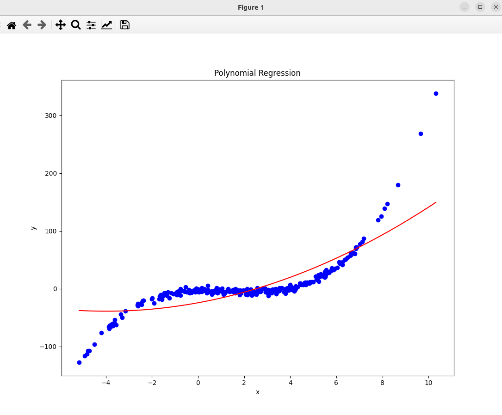

### Result
* Regression
* Polinomial Regression
* Polinomial means that the data is not linear, but it can be approximated by a polynomial function.
* Polynomial has degrees from 0 to n.
* Synthetic data was used to demonstrate the polynomial regression.

