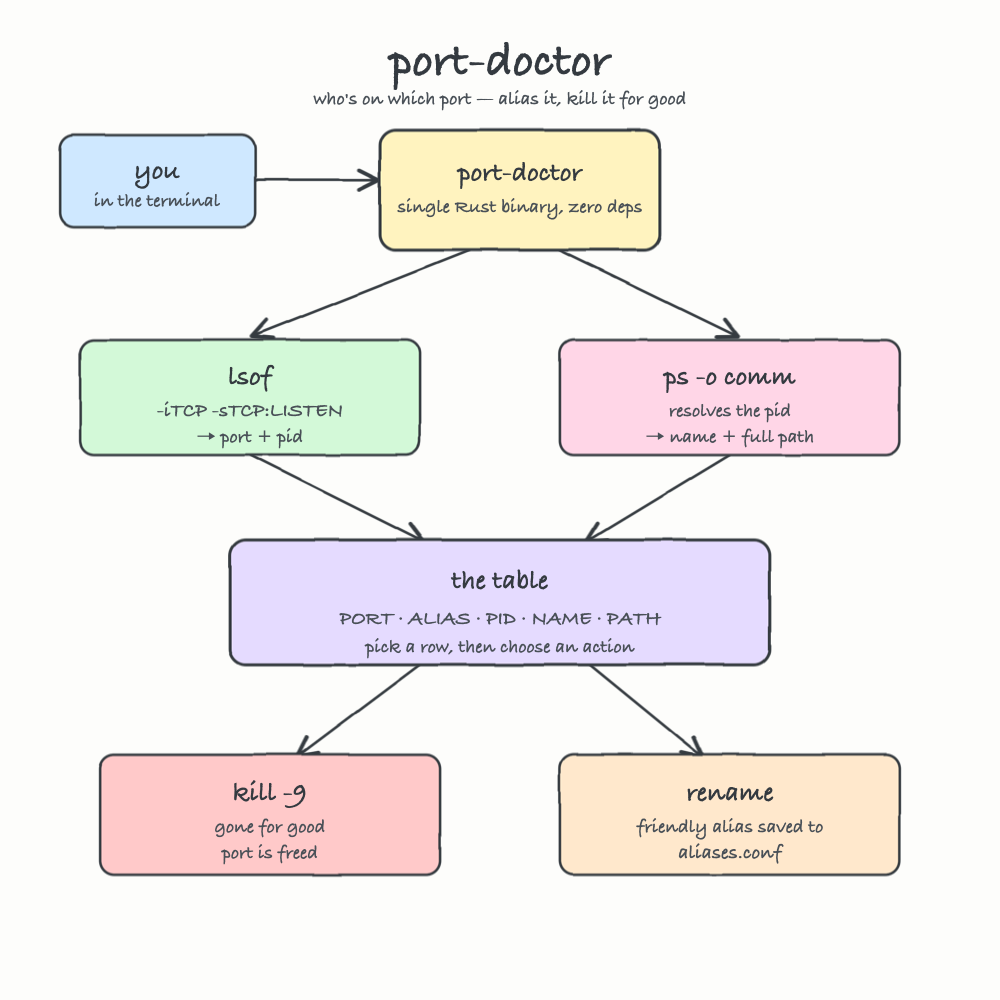

# port-doctor

A tiny Rust tool that answers one question fast: **who's on which port?** — then lets you tag that port with a friendly name or kill the process holding it, for good.

For every listening TCP port it tells you the **PORT**, the **PID**, the process **NAME**, and the **full PATH** to the executable. Pick a row and either kill it (`kill -9`, no catching that) or give the port a memorable alias that sticks around.

Single binary. Zero external crates. It just orchestrates `lsof`, `ps`, and `kill`.

## Result

```
❯ ./run.sh

 port-doctor who's on which port — alias it, kill it for good

#   PORT   ALIAS  PID    NAME           PATH
1   3000   -      82478  node           node
2   5000   -      1117   ControlCenter  /System/Library/CoreServices/ControlCenter.app/Contents/MacOS/ControlCenter
3   5173   -      24373  node           node
4   5174   -      31173  node           node
5   5432   -      89786  gvproxy        /opt/homebrew/Cellar/podman/5.7.1/libexec/podman/gvproxy
6   7000   -      1117   ControlCenter  /System/Library/CoreServices/ControlCenter.app/Contents/MacOS/ControlCenter
7   7768   -      1350   Spotify        /Applications/Spotify.app/Contents/MacOS/Spotify
8   8080   -      31131  backend-bin    /Users/diegopacheco/git/diegopacheco/ai-playground/pocs/agent-speech-to-map/.run/backend-bin
9   8090   -      12202  Python         /Library/Developer/CommandLineTools/Library/Frameworks/Python3.framework/Versions/3.9/Resources/Python.app/Contents/MacOS/Python
10  17600  -      1639   Dropbox        /Applications/Dropbox.app/Contents/MacOS/Dropbox
11  17603  -      1639   Dropbox        /Applications/Dropbox.app/Contents/MacOS/Dropbox
12  50037  -      953    rapportd       /usr/libexec/rapportd
13  51566  -      1350   Spotify        /Applications/Spotify.app/Contents/MacOS/Spotify
14  53415  -      61134  app_inkwell    /Applications/Grammarly Desktop.app/Contents/Frameworks/ProjectLlamaContent.framework/Versions/A/Frameworks/WebUI.framework/Versions/A/Helpers/Superhuman Web UI.app/Contents/MacOS/app_inkwell
15  53877  -      89786  gvproxy        /opt/homebrew/Cellar/podman/5.7.1/libexec/podman/gvproxy
16  53884  -      89789  vfkit          /opt/homebrew/Cellar/podman/5.7.1/libexec/podman/vfkit
17  57621  -      1350   Spotify        /Applications/Spotify.app/Contents/MacOS/Spotify

select # (k=kill via menu) · r=refresh · q=quit:
```

## How it works



You run `port-doctor`. It calls `lsof -iTCP -sTCP:LISTEN` to learn every listening port and the PID behind it, then asks `ps -o comm` to turn each PID into a process name and its full executable path. Those are merged into one table — **PORT · ALIAS · PID · NAME · PATH** — and you pick a row. From there one path runs `kill -9` and the port is freed; the other writes a friendly alias to `aliases.conf` so the port is recognisable next time. No daemon, no state beyond that one alias file.

## Build

```bash
cargo build --release
```

The binary lands at `target/release/port-doctor`.

## Usage

Run it with no arguments for the interactive flow — list, pick a row, then kill or rename:

```bash
port-doctor
```

Or drive it directly:

```bash
port-doctor list                 # print the port table and exit
port-doctor kill 3000            # kill whatever holds port 3000, for good
port-doctor alias 5432 postgres  # tag a port with a friendly name
port-doctor alias 5432           # clear that tag
port-doctor help
```

## What a scan looks like

```
#   PORT   ALIAS           PID    NAME           PATH
1   5432   postgres        612    postgres       /opt/homebrew/opt/postgresql/bin/postgres
2   7000   -               1117   ControlCenter  /System/Library/CoreServices/ControlCenter.app/Contents/MacOS/ControlCenter
3   54321  my-test-server  83212  Python         /Library/Developer/CommandLineTools/.../MacOS/Python
```

Green port, magenta alias, yellow PID, the process name, then the dimmed full path so you always know exactly which binary you are about to kill.

## The interactive flow

```
select # · r=refresh · q=quit: 3
port 54321 · pid 83212 · Python · /Library/.../MacOS/Python
[k]ill for good · [a]lias/rename · [c]ancel: k
kill pid 83212 (Python) on port 54321 for good? [y/N]: y
killed pid 83212 for good
```

Killing always confirms first, then sends `SIGKILL` so the process cannot ignore it. The list refreshes after every action, so you immediately see the port disappear.

## What "rename" means here

macOS gives no clean way to rename a *running* process, so rename does the useful thing instead: it pins a **friendly alias to the port**. The alias is saved to `~/.config/port-doctor/aliases.conf` (plain `port=name` lines) and shown in the **ALIAS** column on every future scan — so the next time something grabs `5432` you instantly read `postgres` rather than guessing.

## Notes

- Listening **TCP** ports only — exactly the ports you fight over when one is "already in use".
- Killing a process owned by another user needs `sudo`; if a kill is denied, port-doctor prints the reason instead of failing silently.
- macOS only. It relies on `/usr/sbin/lsof`, `/bin/ps`, and `/bin/kill`.
