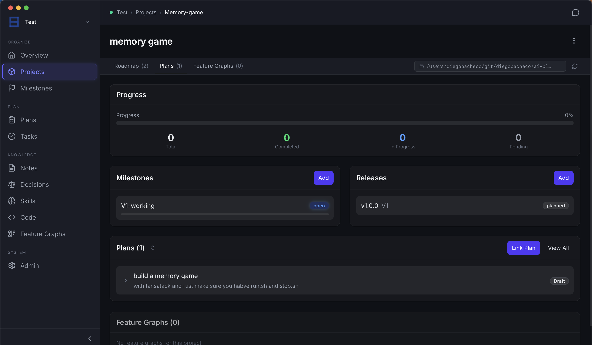
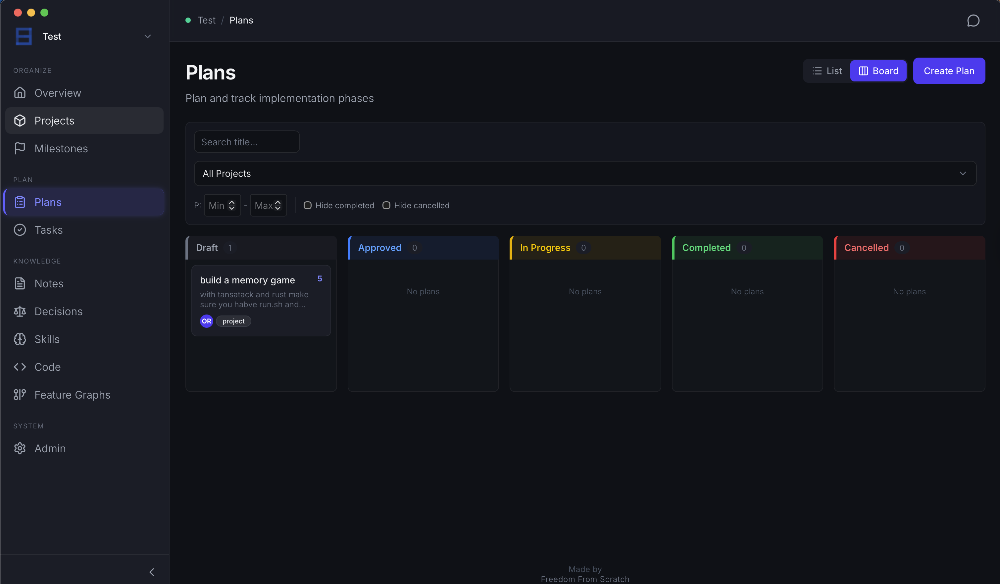
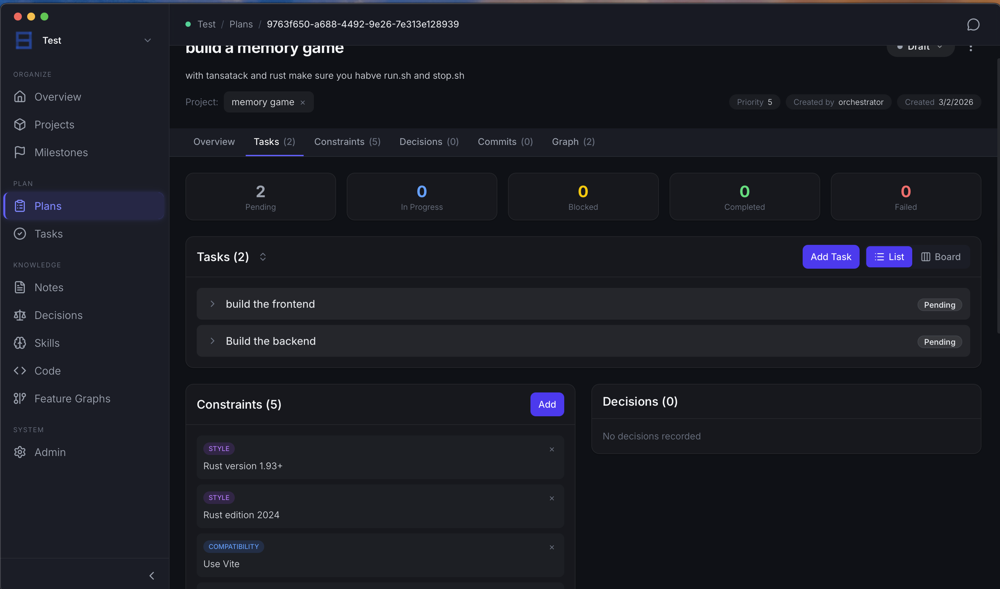

# Project Orchestrator

https://github.com/this-rs/project-orchestrator?tab=readme-ov-file

## Experience Notes

* Installion for mac was smooth.
* Interesting UI
* However a lot of buttons a very laggy and dont open or take a long time to opne.
* The UI also generate some commands in french. 
* 

## Result

Project Orchestrator 1  

Project Orchestrator 2  

Project Orchestrator 3  
