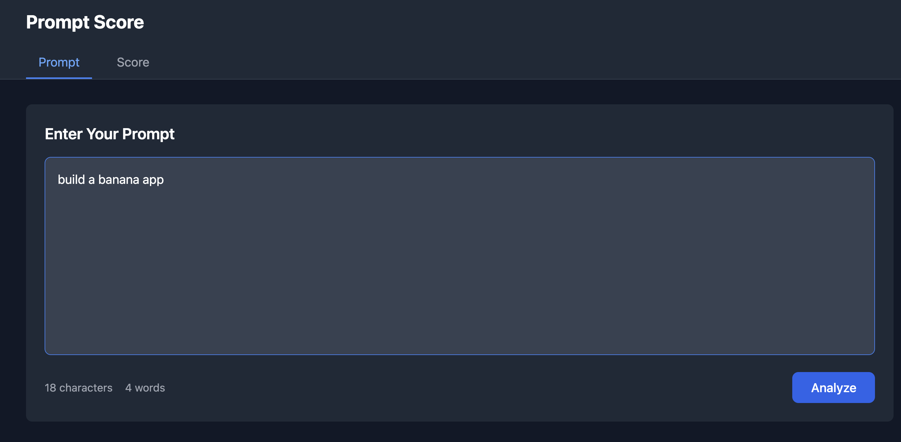
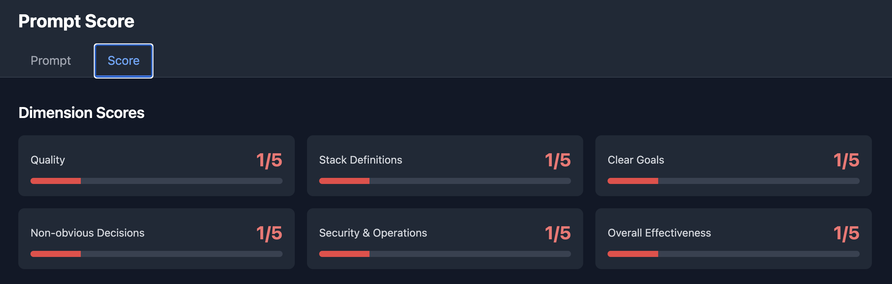
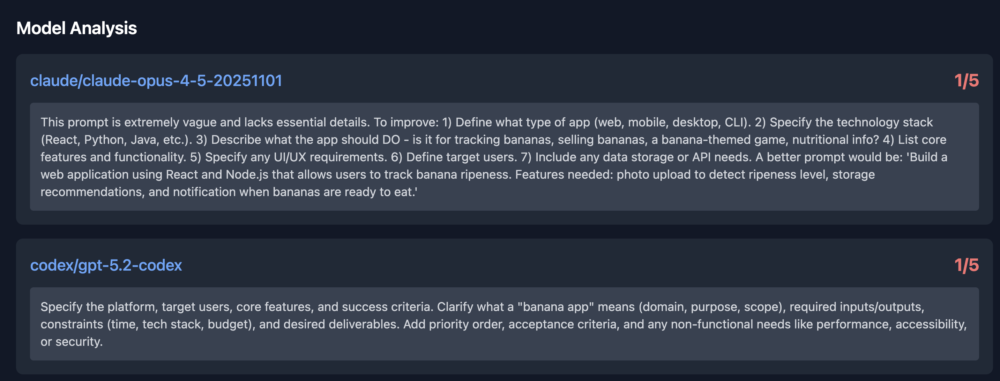
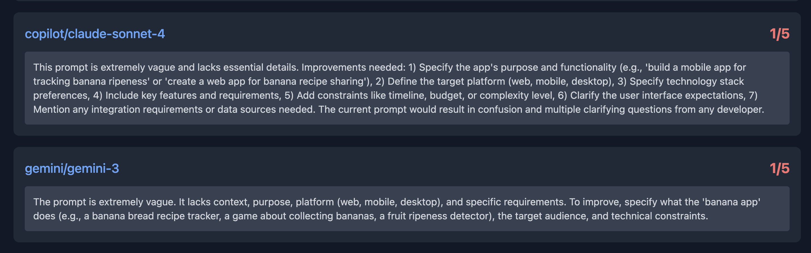

# Prompt Score

Prompt Score analyzes AI prompt quality using multiple LLM agents with real-time SSE progress updates.


### 1. Write your prompt


### 2. View scores and feedback





## Features

- 6 quality dimensions scored by Claude opus-4.5
- Recommendations from 4 AI models (Claude, Codex, Copilot, Gemini)
- Real-time progress bar via Server-Sent Events
- Character and word count tracking

## Tech Stack

| Layer | Technologies |
|-------|-------------|
| Frontend | React 19, TanStack Router, TailwindCSS, Vite, Bun, TypeScript |
| Backend | Rust 2024, Tokio, Axum, SSE |

## Quality Dimensions (1-5 scale)

| Dimension | Description |
|-----------|-------------|
| Quality | Clarity, structure, professionalism |
| Stack Definitions | Technical stack specifications |
| Clear Goals | Objectives and deliverables |
| Non-obvious Decisions | Edge cases, constraints, trade-offs |
| Security & Operations | Security, deployment, monitoring |
| Overall Effectiveness | Combined effectiveness |

## AI Models

| Agent | Model | Command |
|-------|-------|---------|
| Claude | opus-4.5 | `claude -p --model claude-opus-4-5-20251101` |
| Codex | gpt-5.2-codex | `codex exec --full-auto --model gpt-5.2-codex` |
| Copilot | sonnet4 | `copilot -p --model claude-sonnet-4` |
| Gemini | gemini-3 | `gemini -y` |

## Run

```bash
./run.sh
```

- Backend: http://localhost:8080
- Frontend: http://localhost:3000

## Architecture

```
Frontend (React 19 + Vite + Bun)
        │
        │ POST /api/analyze (SSE)
        ▼
Backend (Rust + Axum)
        │
        ├─► Score Engine (Claude opus-4.5) ─► 6 dimension scores
        │
        └─► Agent Executor
              ├─► Claude CLI
              ├─► Codex CLI
              ├─► Copilot CLI
              └─► Gemini CLI
```

## Design Doc

See [design-doc.md](design-doc.md) for detailed architecture and API documentation.
