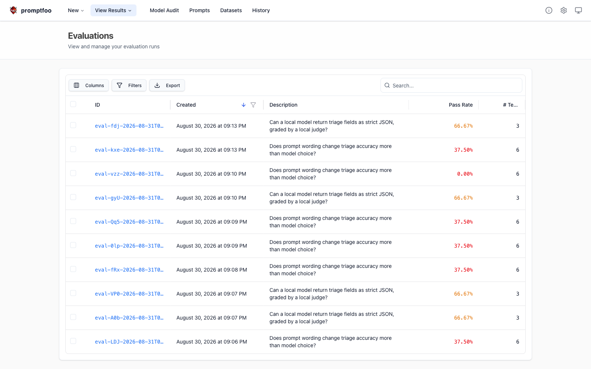
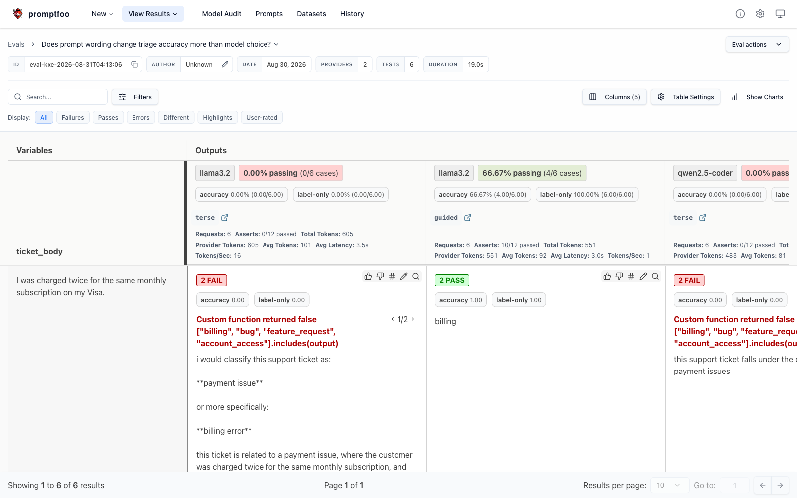
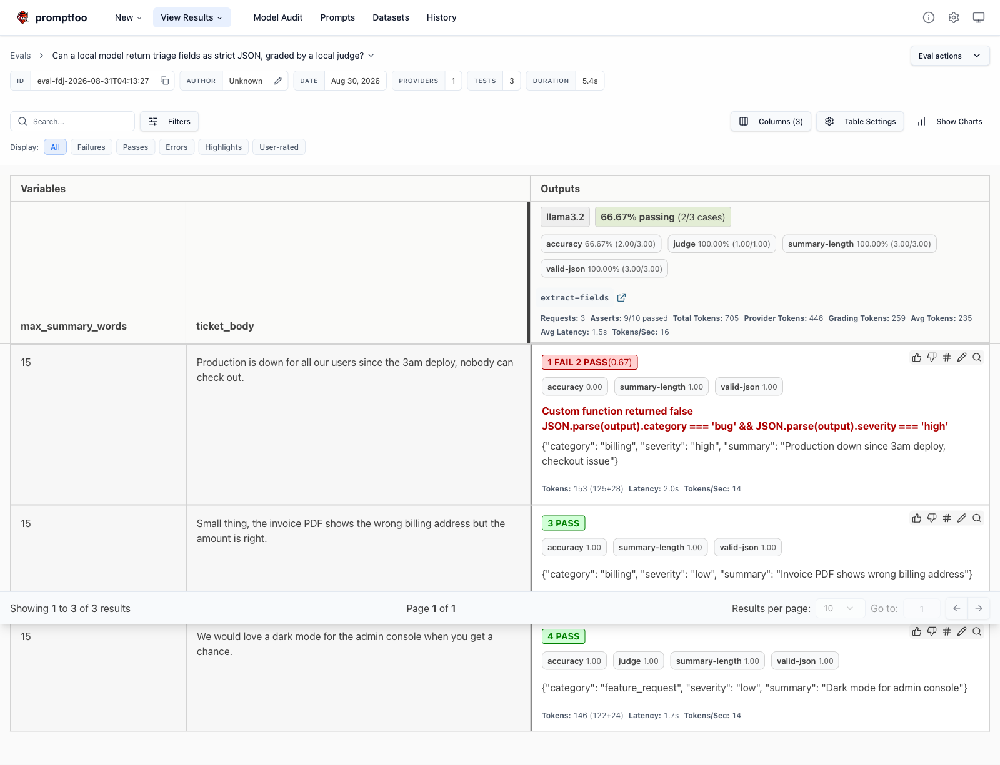

# promptfoo-poc

A local prompt evaluation harness built on [promptfoo](https://github.com/promptfoo/promptfoo).
It scores a support-ticket triage assistant on two jobs, classifying a ticket and extracting
structured JSON from it, and turns the scores into a build verdict.

Everything runs on your machine. No account, no signup, no API key, no card. Every model call
goes to Ollama on `localhost:11434`, and the judge that grades the fuzzy assertions is a local
model too.

## How it Works

Prompts live in `prompts/` as markdown files with a `$parameter` header. `src/prompt-loader.js`
reads a prompt, checks that every parameter used is declared and every declared parameter has a
value, then substitutes them. A missing value throws instead of sending the literal string
`undefined` to a model.

`evals/*.yaml` describe the matrix: which prompts, which models, which tickets, and what a good
answer looks like. promptfoo runs the cartesian product and scores each cell with assertions
that range from exact (`equals`, `is-json` with a JSON schema) to fuzzy (`llm-rubric`, graded by
llama3.2 running locally).

promptfoo reports pass rates, but a report is not a build signal. `evals/gate.js` reads the
results and asserts the claims this POC actually makes, for example that the guided prompt beats
the terse one. `test.sh` fails when a claim stops holding, so a prompt regression breaks the
build rather than quietly lowering a number in a table.

## Architecture


## Features

* **Prompts as data.** Prompts are markdown files, not string literals, so editing a prompt is
  never a code change and never needs a rebuild.
* **Loud parameter binding.** An undeclared or unfilled `$parameter` throws at render time,
  because a prompt containing the word `undefined` is a silent, expensive bug.
* **Prompt A/B against multiple models.** The same tickets run through two prompt variants and
  two local models, which separates "the prompt is bad" from "the model is bad".
* **Deterministic and fuzzy assertions together.** JSON schema and word budgets are checked
  exactly, tone and faithfulness by a local LLM judge, so neither style of check is a bottleneck.
* **A gate, not just a dashboard.** `evals/gate.js` converts pass rates into exit code 0 or 1,
  which is what lets an eval live in CI.
* **Zero cost, fully offline.** Ollama serves every completion and every grading call, so the
  eval can run on a plane and cannot leak a ticket to a vendor.

## Stack

* **promptfoo 0.122** - MIT licensed eval runner, runs entirely local, no telemetry account needed.
* **Ollama** - serves `llama3.2` and `qwen2.5-coder` on localhost, which makes the whole POC free.
* **Node 24 + `node --test`** - the built-in test runner, so the loader has unit tests without
  adding a test framework.
* **Bash** - `build.sh`, `test.sh`, `run.sh`, because three scripts do not need a task runner.

No other dependencies. `promptfoo` is the only entry in `package.json`.

## Contracts

There is no REST API. The POC has three contracts instead.

### Prompt file contract

Every file in `prompts/` is markdown with a header. The header is the contract, and the loader
enforces it.

```
---
name: classify-ticket-guided
params: $ticket_body
---

Ticket:
$ticket_body
```

* `name` must equal the filename without `.md`.
* `params` lists every parameter the template may use.
* Using `$foo` without declaring it is an error. Declaring `$foo` without passing a value is an error.
* A `$` inside a parameter *value* is never re-expanded, so ticket text cannot inject parameters.

### Eval config contract

`evals/classify.yaml` and `evals/extract.yaml` are standard promptfoo configs. Prompts are
loaded through `evals/prompts.js`, which exports one function per prompt file:

```yaml
prompts:
  - id: file://prompts.js:classifyGuided
    label: guided
```

Assertions carry a `metric` name so `gate.js` can address them individually.

### Ollama endpoint

`POST http://localhost:11434/api/chat` for completions and grading. Set `OLLAMA_BASE_URL` to
point elsewhere.

## Design Decisions

**`$parameter` instead of promptfoo's native `{{nunjucks}}`.** promptfoo templates with nunjucks
out of the box, which would have been less code. The project convention in `prompts/README.md`
mandates `$parameter`, so the POC keeps the convention and pays for it with a 40 line loader
wired in through promptfoo's prompt-function hook. The upside is that the loader can fail loud on
a missing parameter, which nunjucks does not do: it renders an empty string and the eval silently
scores a truncated prompt.

**The gate is separate from the eval.** `promptfoo eval` exits `100` whenever any assertion fails.
That is correct for promptfoo but wrong here, because failures are the data. The scripts treat
`0` and `100` as success, any other code as a real error, and let `gate.js` decide the verdict.

**The gate asserts a relationship, not a threshold.** `guided > terse` fails when the prompt
regresses. A bare threshold like `>= 70%` would also drift green as models change underneath it.

**Known failing case, kept on purpose.** llama3.2 tags "production is down, nobody can check out"
as `billing`, misled by the words "check out". It is left in the suite as an honest failure rather
than deleted to make the report green.

## How to Run

```bash
./build.sh
```

Installs dependencies, starts Ollama if it is not running, and pulls `llama3.2` and
`qwen2.5-coder` if they are missing.

```bash
./test.sh
```

Runs the loader unit tests, both evals, and the gate. Exit code 0 means every claim holds.

```bash
./run.sh
```

Runs both evals and opens the promptfoo report on <http://localhost:15500>.

## Results

Measured on this machine, `llama3.2` and `qwen2.5-coder` at temperature 0.

| Eval | Metric | Result |
| --- | --- | --- |
| classify | terse prompt, both models | 0/12 |
| classify | guided prompt, llama3.2 | 4/6 |
| classify | guided prompt, qwen2.5-coder | 5/6 |
| extract | schema-valid JSON | 3/3 |
| extract | summary within word budget | 3/3 |
| extract | local LLM judge | 1/1 |
| extract | category and severity correct | 2/3 |

The headline: prompt wording moved accuracy from 0% to 75%, while swapping the model moved it by
one ticket. The prompt was the bug, not the model.

## Printscreens

### Eval history



Every run promptfoo has stored, newest first, with the pass rate per run. The two descriptions
map to the two configs in `evals/`. The `0.00%` row is a deliberate regression run, made by
degrading the guided prompt to prove the gate actually fails instead of always reporting green.

### Classification matrix



The core of the POC. Columns are prompt and model combinations, rows are tickets. The `terse`
column with llama3.2 is `0.00% passing (0/6 cases)`; the `guided` column with the same model is
`66.67% passing (4/6)`. The reason is visible in the cells: asked tersely, the model answers "i
would classify this support ticket as: **payment issue**", which fails both the `label-only` and
the `accuracy` assertions. Asked with the guided prompt, the same model on the same ticket answers
`billing` and passes. Same model, same ticket, different wording.

### JSON extraction



The second eval. The header chips show `valid-json 100%`, `summary-length 100%` and `judge 100%`,
so the prompt reliably produces schema-valid JSON inside the word budget, and the local judge
agrees the summary is faithful. `accuracy` sits at `66.67%` because of the first row: the outage
ticket comes back as `{"category": "billing", ...}` when it should be `bug`. That single red cell
is the finding this eval exists to surface.
