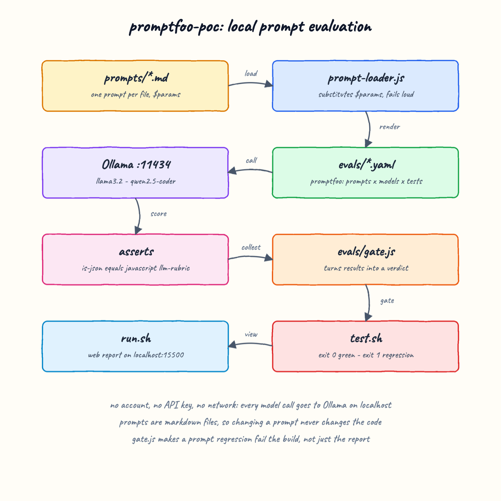

# Design Doc

## Architecture Principles

* Prompts are data, not code. They live in `prompts/` and are versioned as markdown.
* Fail loud. A missing prompt parameter throws rather than rendering `undefined` into a model call.
* Local by default. No account, no API key, no outbound network call.
* An eval is only useful if it can fail the build, so the verdict is separate from the report.

## Features

* Markdown prompt files with a declared `$parameter` header.
* A loader that validates the header against the template and against the runtime values.
* Two promptfoo evals: prompt-variant classification and strict JSON extraction.
* Deterministic assertions (`equals`, `is-json` with schema, `javascript`) and a fuzzy one
  (`llm-rubric`) graded by a local model.
* A gate that converts pass rates into an exit code.

## Overall Diagram



## TradeOffs

**`$parameter` over nunjucks.** promptfoo templates natively with `{{var}}`. Using it would have
removed `src/prompt-loader.js` entirely. The project convention mandates `$parameter`, and
nunjucks renders a missing variable as an empty string, which silently corrupts an eval. Cost is
40 lines of loader plus a small indirection file, `evals/prompts.js`.

**Two configs instead of one.** promptfoo runs the cartesian product of prompts and tests, so
prompts with different parameters cannot share one config cleanly. Two files keep each matrix
honest at the cost of two eval invocations.

**Local models over frontier models.** llama3.2 and qwen2.5-coder are weaker, so absolute
accuracy is low. That is acceptable because the POC measures relative movement between prompts,
which is what an eval harness is for, and it keeps the cost at zero.

**`--no-cache` everywhere.** Slower, but a cached eval hides a prompt regression, which defeats
the purpose of the gate.

## Decisions

* promptfoo exit code `100` means "assertions failed" and is treated as success by the scripts.
  Any other non-zero code is a real failure and stops the script.
* The gate asserts `guided > terse` rather than a fixed threshold, so it stays meaningful when
  models change.
* The outage ticket that llama3.2 misclassifies as `billing` stays in the suite. Deleting a
  failing case to get a green report is the failure mode this POC argues against.
* `node --test` over a test framework, to keep the dependency list at one entry.

## How to Run

```bash
./build.sh
./run.sh
```

`run.sh` ends by serving the promptfoo report on <http://localhost:15500>.

## How to Test

```bash
./test.sh
```

Runs `node --test src/prompt-loader.test.js`, then both evals, then `evals/gate.js` over each
result file. Exit code 0 means every claim in the gate holds.

To confirm the gate can fail, degrade `prompts/classify-ticket-guided.md` into a vague prompt and
run `./test.sh` again. It reports `FAIL the guided prompt beats the terse one` and exits 1.

## All REST Endpoints

The POC exposes no REST API. It consumes one endpoint:

| Method | Endpoint | Purpose |
| --- | --- | --- |
| POST | `http://localhost:11434/api/chat` | Ollama completions and LLM-judge grading |

`promptfoo view` serves the report UI on <http://localhost:15500>.
