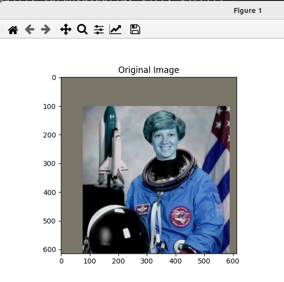

### Result
* Pytorch
* Vision
* Detect Objects in Images
* Uses the Faster R-CNN model
* Trained on the COCO dataset
* Detects 80 different objects
* The model is pre-trained
* The model is loaded from the torchvision library
* The model is used to detect objects in an image

