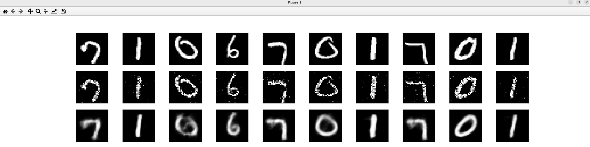

### Result
* Stacked Denoising Autoencoder (SDAE)
* SDAE is a type of autoencoder that adds noise to the input data and tries to reconstruct the original data
* Pytorch
* Vision
* Neural Networks
* MNIST Dataset
* Image Recognition - digit classification

