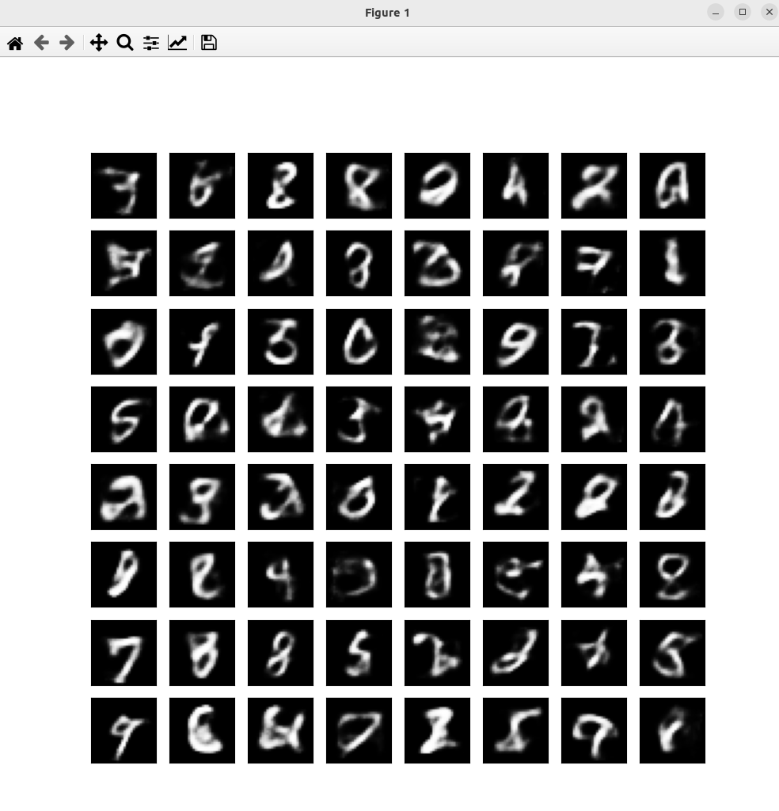

### Result
* Tranformers
* PyTorch
* Neural Networks
* MNIST Dataset
* VAE = Variational Autoencoder
* Digits Classification
* Variational Autoencoder (VAE) - A Variational Autoencoder (VAE) is a type of autoencoder with added constraints on the encoded representations being learned. More specifically, it is an autoencoder that learns a latent variable model for its input data.

