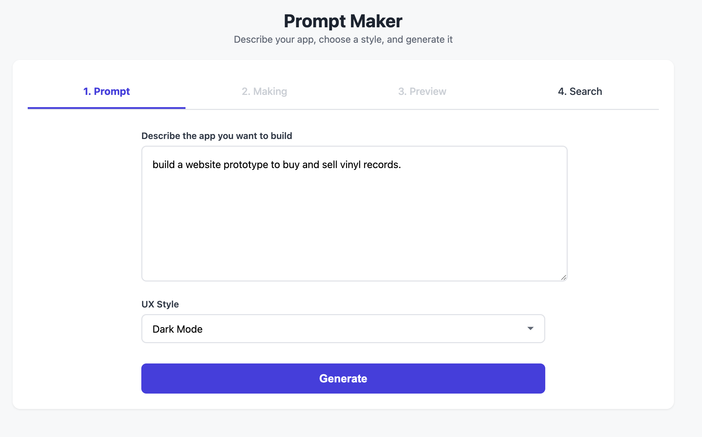
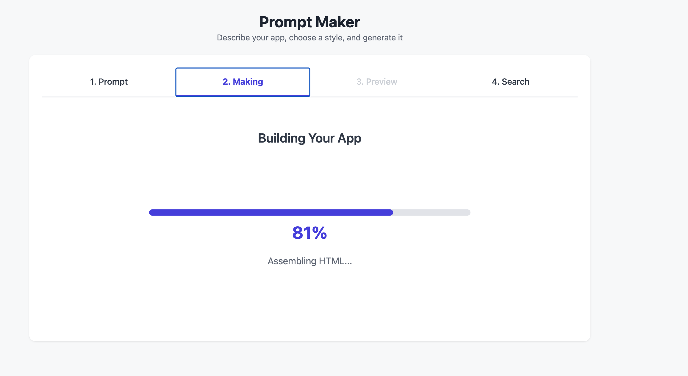
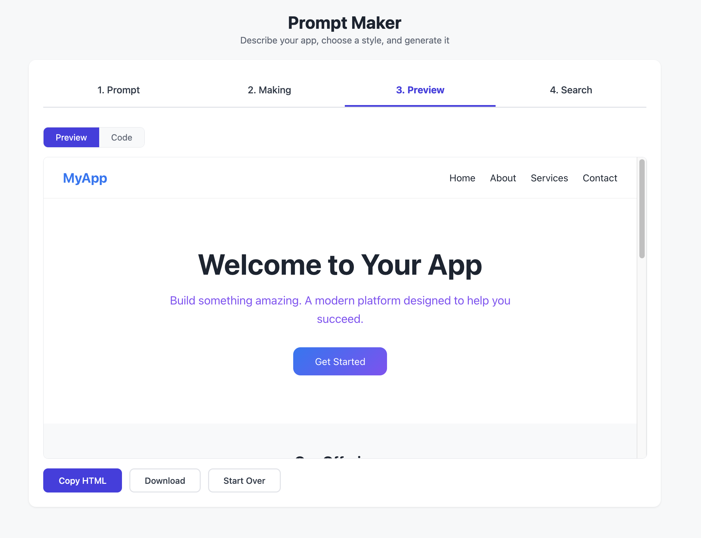
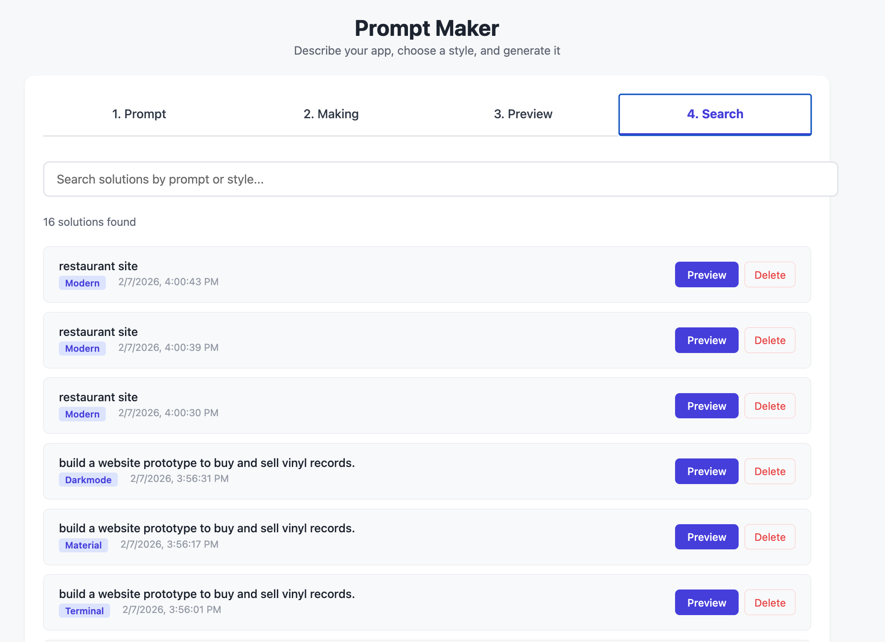

# Prompt Maker

A React application inspired by Figma Make, but entirely prompt-driven with no visual drag and drop. Users walk through a 4-step wizard to describe what they want, watch it being built, preview the generated frontend app, and search through all saved solutions.

## Tech Stack

- **React 19** - UI framework
- **Bun** - Runtime and package manager
- **Vite 6** - Build tool and dev server
- **TypeScript 5.x** - Type safety
- **TanStack Store** - State management
- **TanStack Form** - Form handling
- **CSS Modules** - Scoped styling

## Getting Started

```bash
./run.sh
```

This will install dependencies and start the dev server at `http://localhost:5173`

## How It Works

### Step 1: Prompt

Enter a description of the frontend app you want to build and select a UX style from 13 available options.



---

### Step 2: Making

Watch the progress bar as your app is being assembled with real-time status updates.



---

### Step 3: Preview

View the generated HTML/CSS in a live iframe preview or toggle to code view. Copy, download, or start over.



---

### Step 4: Search

Search and browse all previously generated apps. Filter by prompt text or style, then load any solution for preview.



## Available UX Styles

1. **Terminal** - Dark background, monospace font, green/amber text, CLI aesthetic
2. **Modern** - Clean lines, rounded corners, gradients, sans-serif, whitespace-heavy
3. **Traditional** - Classic layout, serif fonts, muted colors, newspaper-like structure
4. **Brutalist** - Raw, bold typography, high contrast, intentionally rough edges
5. **Glassmorphism** - Frosted glass effects, transparency, blur backgrounds, soft borders
6. **Neomorphism** - Soft shadows, extruded look, muted pastels, embossed elements
7. **Retro** - Pixel fonts, neon colors, 80s/90s vibe, grid patterns
8. **Minimalist** - Ultra-clean, lots of whitespace, black and white, subtle accents
9. **Corporate** - Professional blue tones, structured grid, standard UI patterns
10. **Playful** - Bright colors, rounded shapes, fun animations, handwritten fonts
11. **Dark Mode** - Dark backgrounds, light text, accent colors, reduced eye strain
12. **Material** - Material Design inspired, elevation shadows, bold colors, ripple feel
13. **Flat** - No shadows, no gradients, solid colors, crisp edges, simple shapes

## Features

- **Keyword Parser** - Maps prompt keywords to HTML fragments (navbar, hero, cardGrid, footer, features, contactForm, sidebar, table, gallery, stats, pricing, cta)
- **13 Style Modules** - Each with unique CSS variables, body styles, and component overrides
- **12 HTML Fragments** - Reusable components styled with CSS variables
- **Auto-Save** - Every generated app is automatically saved to localStorage
- **Search & Filter** - Find solutions by prompt text or style name
- **Live Preview** - View generated apps in an iframe with toggle to code view
- **Download** - Export as standalone `index.html` with inlined CSS

## Project Structure

```
react-galery-design/
├── design-doc.md           # Full design specification
├── run.sh                  # Start script
├── solutions/              # Reserved for future file exports
└── frontend/
    └── src/
        ├── App.tsx
        ├── types/index.ts
        ├── store/wizard.ts
        ├── components/
        │   ├── TabBar.tsx
        │   ├── PromptStep.tsx
        │   ├── MakingStep.tsx
        │   ├── PreviewStep.tsx
        │   ├── SearchStep.tsx
        │   ├── ProgressBar.tsx
        │   └── CodeViewer.tsx
        └── engine/
            ├── parser.ts
            ├── generator.ts
            ├── styles/          # 13 style modules
            ├── fragments/       # 12 HTML fragment generators
            └── css/             # Base and responsive CSS
```

## License

Unlicensed - free to use and modify for any purpose.
