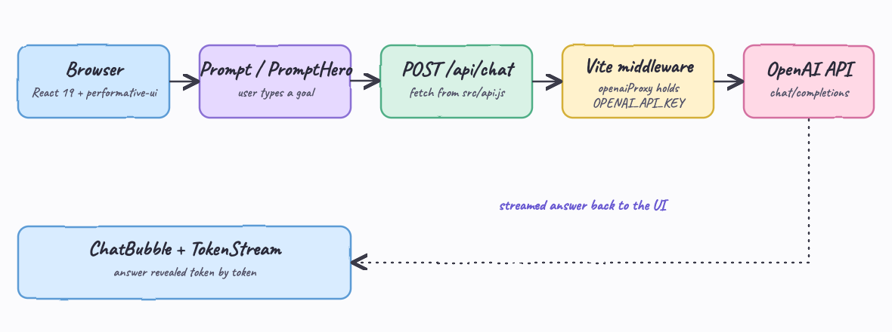
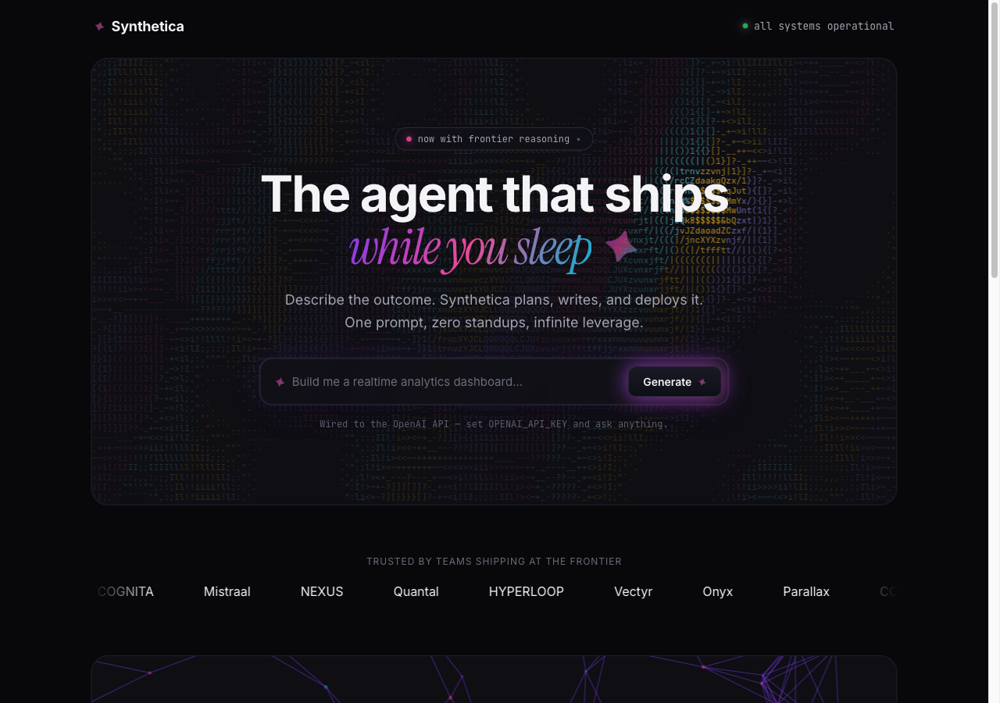
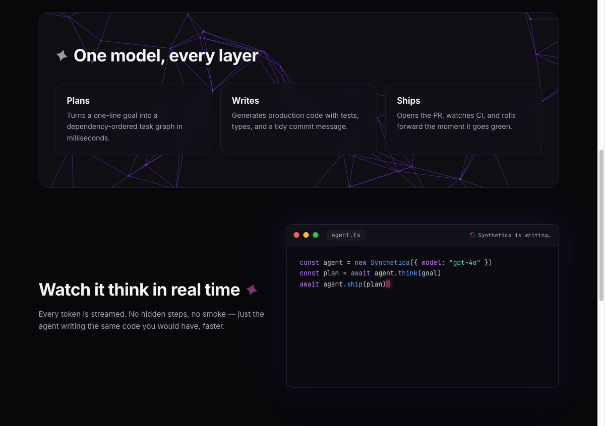
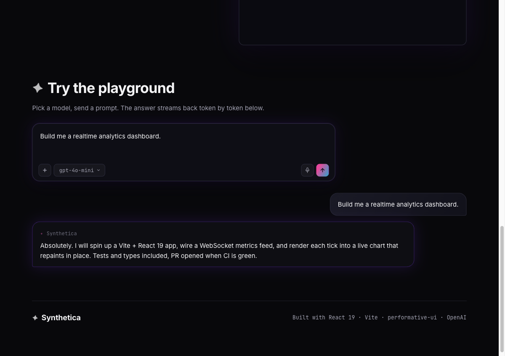
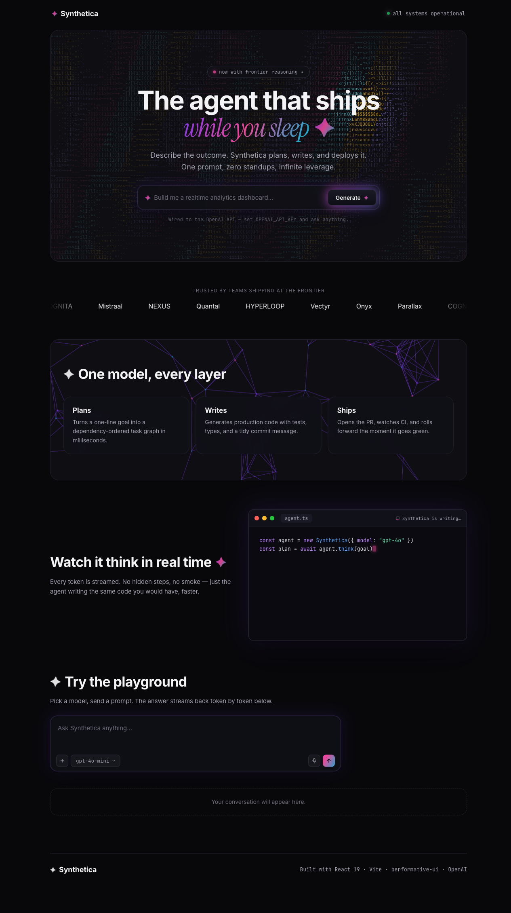

# Synthetica — React 19 + performative-ui + OpenAI

A single-page React 19 app that showcases ten components from
[`performative-ui`](https://vorpus.github.io/performativeUI/) and wires the prompt
inputs to a real OpenAI backend. Type a goal, the app calls OpenAI, and the answer
streams back into a chat bubble token by token.

Built with **React 19**, **Vite**, **performative-ui**, and the **OpenAI API**.

## Architecture



The browser never sees the API key. The React app posts to its own `/api/chat`
endpoint, which is a tiny Vite dev-server middleware running in Node. That middleware
reads `OPENAI_API_KEY` from the environment, forwards the request to OpenAI, and
returns only the completion text. See [`design-doc.md`](design-doc.md) for the full
design.

## The ten components

Every component from the brief has a real job on the page:

| Component             | Role on the page                                        |
| --------------------- | ------------------------------------------------------- |
| `Sparkle`             | Brand mark, section titles, eyebrow                     |
| `StatusDot`           | Nav status, hero eyebrow                                |
| `PromptHero`          | Hero call-to-action input (calls OpenAI)                |
| `AsciiHero`           | Cursor-reactive ASCII field behind the hero             |
| `LogoMarquee`         | Infinite "trusted by" logo wall                         |
| `NodeGraphBackground` | Drifting node graph behind the platform section         |
| `MockIDE`             | "Watch it think" panel typing out `agent.ts`            |
| `Prompt`             | Playground input with model dropdown (calls OpenAI)     |
| `ChatBubble`          | User and AI turns in the conversation                   |
| `TokenStream`         | Reveals the AI answer token by token inside the bubble  |

## Quick start

```bash
export OPENAI_API_KEY=sk-...   # your OpenAI key
./start.sh                     # installs deps if needed, runs Vite on :5173
```

Open http://localhost:5173. Stop it with:

```bash
./stop.sh
```

The UI renders fully without a key — only the AI calls need one. Without a key, the
prompt shows a clear error and the rest of the page works.

### Smoke test

```bash
./test.sh
```

`test.sh` checks the page returns HTTP 200 and that `/api/chat` is wired (it reports
a real completion when a key is set, or confirms the proxy is reachable when not).

## Screenshots

### Hero

ASCII field background (`AsciiHero`), gradient serif headline with `Sparkle`, the
`PromptHero` input, a `StatusDot` in the nav and eyebrow, and the `LogoMarquee` below.



### Platform + Mock IDE

`NodeGraphBackground` drifts behind the "One model, every layer" section. The
`MockIDE` types out `agent.ts` with syntax highlighting and an "is writing…" caret.



### Playground

The `Prompt` component (textarea, `+` context, model dropdown, mic, gradient send).
Submitting calls OpenAI; the answer appears as a user `ChatBubble` and an AI
`ChatBubble` whose text is revealed by `TokenStream`.



> The conversation above was captured with a stubbed `/api/chat` response because the
> screenshot environment had no API key. The rendering path (`ChatBubble` +
> `TokenStream`) is the real app code; with `OPENAI_API_KEY` set, the same flow shows
> live OpenAI completions.

### Full page



## How the AI call works

1. You submit a prompt from the hero (`PromptHero`) or the playground (`Prompt`).
2. `src/api.js` posts `{ prompt, model }` to `/api/chat`.
3. The `openaiProxy` middleware in `vite.config.js` adds the key and calls
   `https://api.openai.com/v1/chat/completions`.
4. The completion text comes back and is revealed token by token with `TokenStream`
   inside an AI `ChatBubble`.

Model is chosen in the `Prompt` toolbar dropdown (`gpt-4o-mini`, `gpt-4o`,
`gpt-4.1-mini`) and passed straight through to OpenAI.

## Project layout

```
src/main.jsx        mounts the app, imports performative-ui/styles.css
src/App.jsx         the page, uses all ten components
src/api.js          fetch wrapper for /api/chat
src/styles.css      layout, reuses performative-ui CSS variables
vite.config.js      React plugin + the OpenAI proxy middleware
index.html          entry, fonts, sparkle favicon
start.sh / stop.sh  run / stop the dev server
test.sh             smoke-check page + proxy
```

## Notes

- Runtime dependencies are only `react`, `react-dom`, and `performative-ui`. The proxy
  uses Node's built-in `fetch` — no server framework.
- The key lives only in the server process. It is never bundled or sent to the browser.
