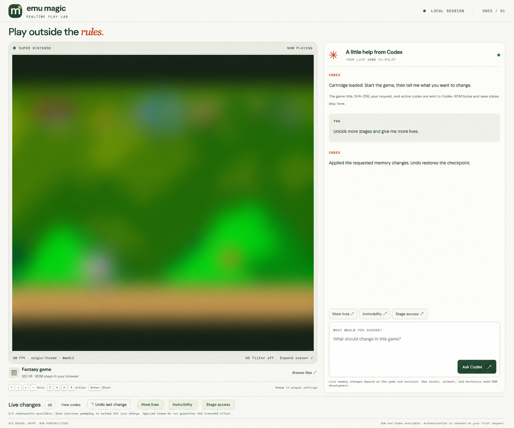
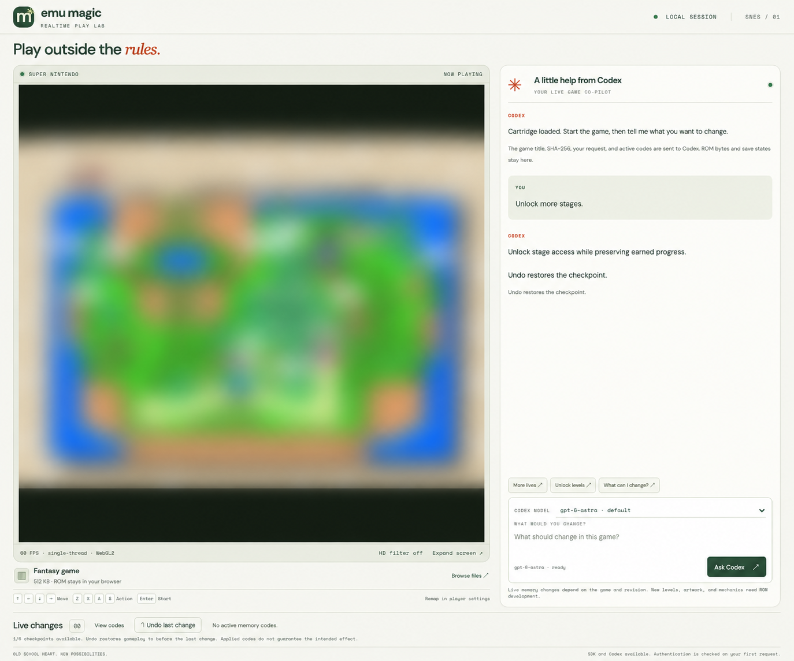
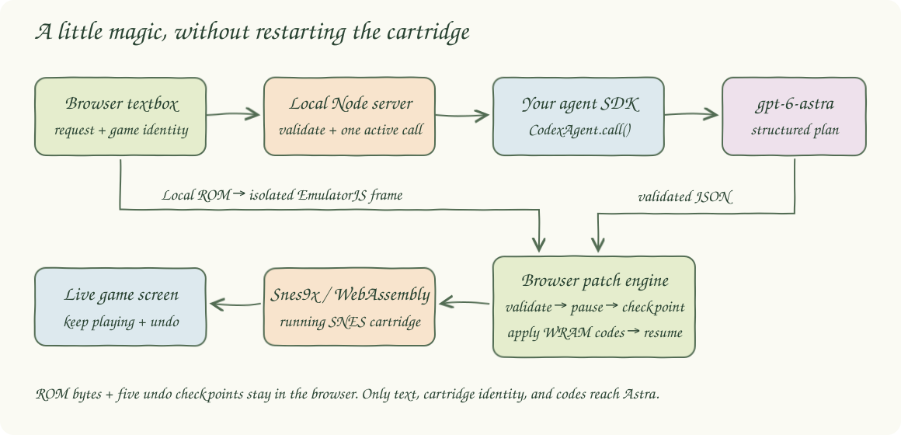
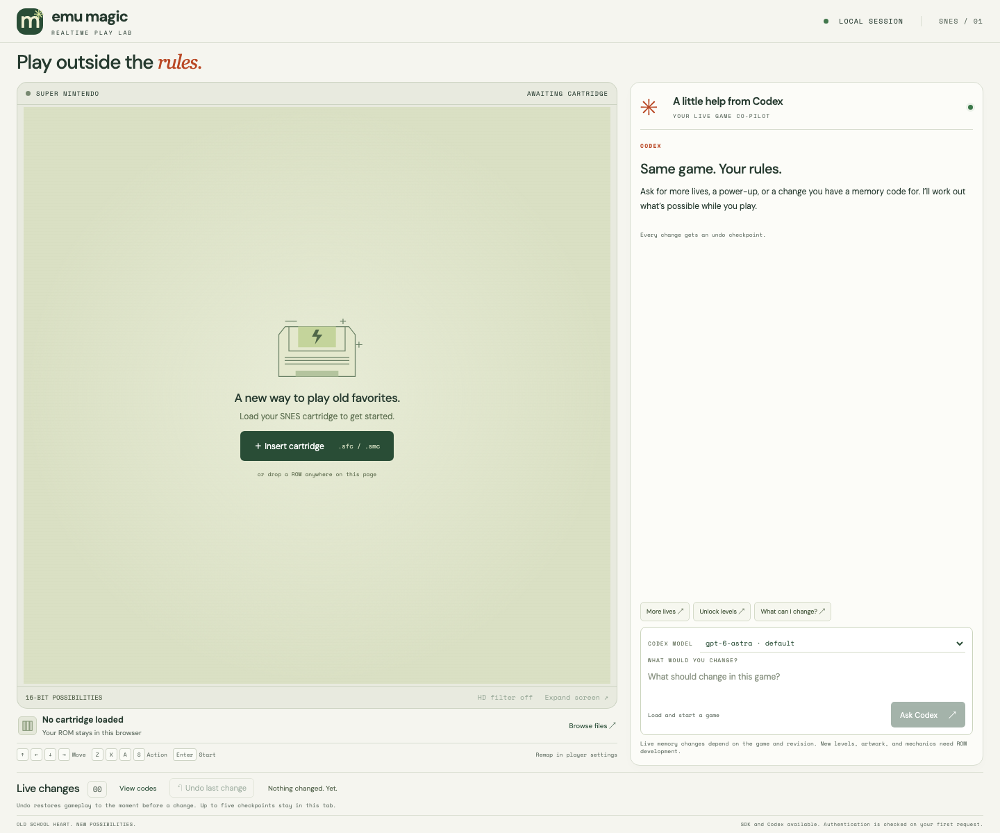
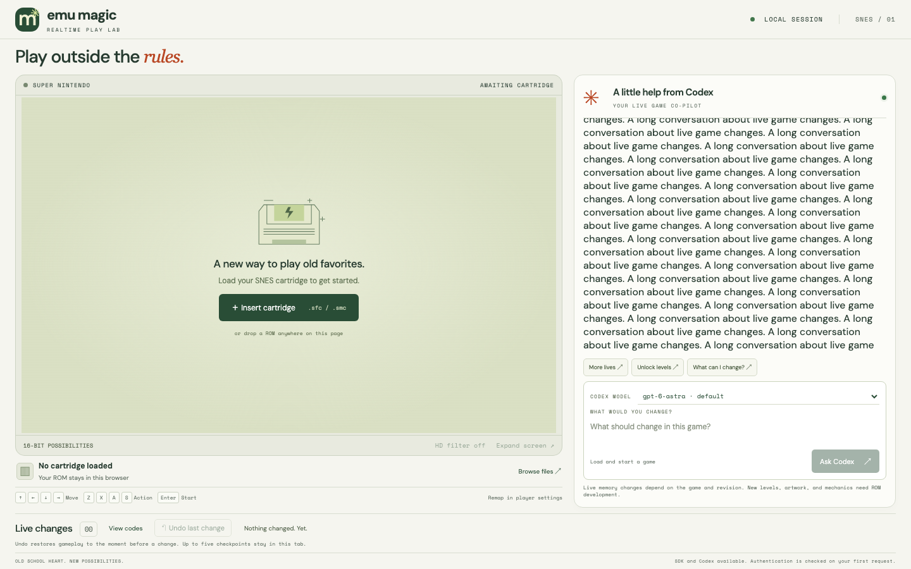
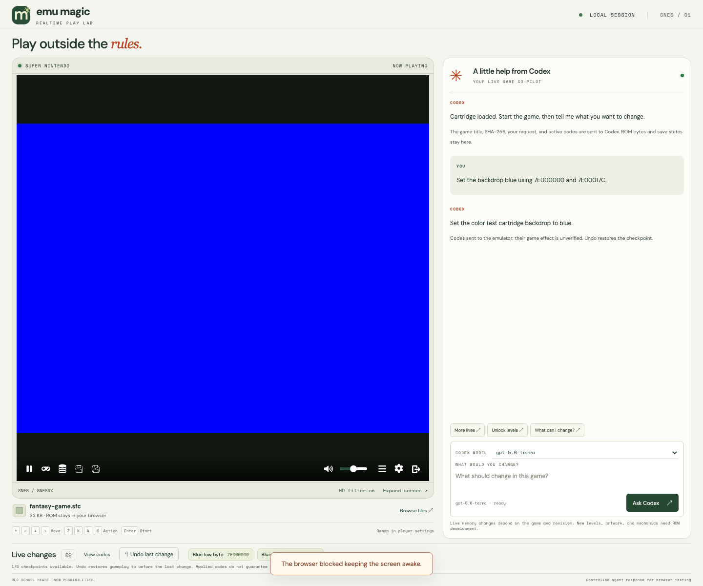
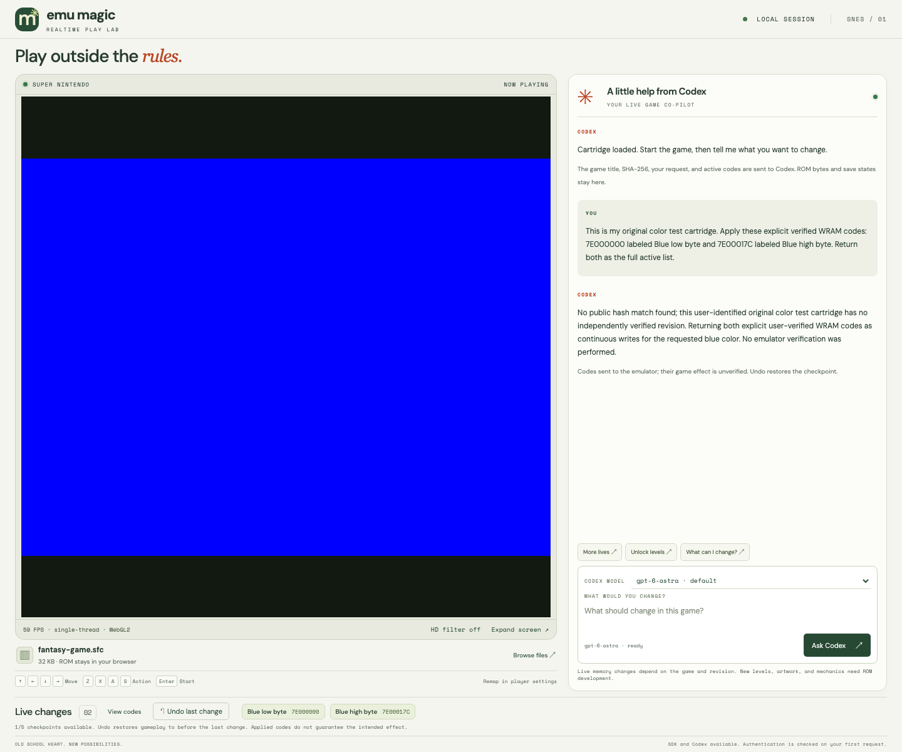
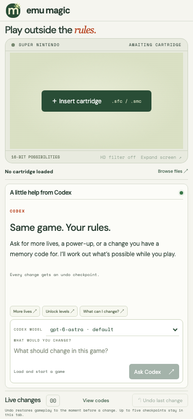

# Realtime Emu Magic

Load a local SNES cartridge, ask Codex for a change, and apply researched memory codes while playing. The application has no built-in game profiles, fixed cartridge fingerprints, preset cheats, or bundled commercial ROMs. The agent researches the cartridge you load using its metadata and your request.



**Fantasy game** is a neutral documentation label. These two captures were edited with image generation to blur the game viewport and remove identifying text. They are anonymized illustrations of the interface, not unedited test evidence. Blurring does not establish permission to publish underlying imagery.



The console fits the browser viewport. Only the conversation scrolls; game controls, the composer, and Undo remain visible. Arrow keys reach the game without scrolling the page and remain normal editing keys inside the composer. The favicon is embedded SVG. The HD filter toggles smoothing while playing.

## What can change live?

Counters, health, inventory, timers, and progression can change using documented WRAM codes for the identified base game. Codex researches public cartridge records, RAM maps, disassemblies, and cheat databases, then returns sources, prerequisites, and a bounded plan. Explicit user-supplied WRAM codes are also supported.

Research follows source links, raw cheat tables, alternate terminology, regional titles, and patch-author notes. The request authorizes trying the best-supported documented base-game code with a checkpoint. A translation, unknown patch version, missing public hash match, or uncertain revision alone does not block application or require another confirmation. The agent briefly discloses uncertain compatibility and rejects candidates with concrete conflicting evidence. This does not guarantee that a code works on every patch. Compound requests are researched per effect: independently supported changes can apply while unresolved parts are explained, unless the request requires all parts together. A related effect is never silently substituted. Appearance changes and repeated actions need documented mechanisms; removing a cooldown does not generate automatic input.

This version supports SNES through the pinned Snes9x core. It cannot create artwork or levels, rewrite game mechanics, scan a ROM, or inspect live memory through the agent. Unknown revisions and modified cartridges may require an external debugger. Memory-code validation checks format and allowed addresses; it cannot prove that a researched address means what the agent claims.

One-time writes release their values after application. Continuous cheats keep values pinned. The research prompt separates level access from earned completion and event history: unlocking access must allow the game to record future exits and redraw paths normally. Pinning timers or completion fields can prevent transitions. There is no universal unlock plan that is safe for every cartridge.

Each change captures a checkpoint after the emulator finishes pausing. Capturing before pause completes can produce an inconsistent state that freezes gameplay when restored. One-time writes are read back after the core advances; a mismatch restores the checkpoint. Undo restores both gameplay state and the previous continuous codes. Previously damaged checkpoints require reloading a healthy save or cartridge.

## How to run the app/tests

Requirements: Node.js 24+, npm, `rg`, `curl`, `lsof`, a JavaScript agent SDK providing `CodexAgent` and `commandPath`, and a signed-in Codex CLI. Internet access is needed for agent research and the emulator runtime.

```bash
cp .env.template .env.local
```

Set `AGENT_SDK_PATH` in `.env.local` to your SDK's JavaScript entry point, then run:

```bash
./scripts/setup.sh
./scripts/start-all.sh
```

Open [the local app](http://127.0.0.1:9012), load an `.sfc` or `.smc` file, press **Start Game**, and submit a request. `Cmd+Enter` or `Ctrl+Enter` also submits. Extract compressed cartridges before loading them. Personal paths belong in the ignored `.env.local`; the source has no default SDK or ROM location.

The model selector supports the models declared in `public/contracts.js`. SDK availability checks installation, not authentication or remaining usage. Every researched request requires a working account. A cancelled request or changed cartridge aborts the corresponding agent process.

```bash
npm test
npx playwright test
```

The standard checks run 24 unit/HTTP tests and seven browser tests. They cover validation, masks, access flags preserving earned progress, checkpoints, rollback, cancellation, local HTTP boundaries, viewport layout, keyboard behavior, frame timing, and actual cartridge execution after applying a batch and undoing it.

The browser suite generates an original 32 KB cartridge from [test/color-rom.mjs](test/color-rom.mjs). Its display reads two color bytes; its execution loop advances a separate counter. Tests assert red → blue → red rendered pixels and continued cartridge execution. Its fixed addresses belong only to this original test fixture. No third-party cartridge is required. Browser agent responses are controlled so these checks do not consume account usage.

```bash
npm run test:live
```

The optional live test makes a real agent call, consumes account usage, applies returned codes to the original cartridge, and checks Undo. It requires available account usage and model access; a successful controlled test does not establish that the live service is available.

## Architecture



The browser owns the cartridge bytes, emulator, active codes, and checkpoints. A same-origin iframe contains the player. The local Node server validates requests and invokes the SDK in an isolated temporary directory. The diagram uses pastel boxes, solid paths, a wobble filter, and an embedded Caveat font.

## Stack

- Native HTML, CSS, and JavaScript keep the interface free of framework and build dependencies.
- Node.js 24 built-ins provide HTTP serving, subprocess control, validation, and unit tests.
- A locally configured JavaScript agent SDK connects structured requests to Codex.
- EmulatorJS 4.2.3 and Snes9x provide SNES emulation, live cheats, and save states.
- Playwright provides browser checks and screenshots through `npx playwright`.

## Contracts/APIs

| Endpoint | Contract |
|---|---|
| `GET /health` | Returns the application name and `ok: true`. |
| `GET /api/status` | Returns SDK availability, supported models, a setup message, and request activity. |
| `POST /api/change` | Accepts `{ prompt, model?, game: { name, internalTitle, sha256, size }, cheats }`; returns `{ message, unsupported, cheats }`. |

A cheat contains `label`, `code`, `once`, `mask`, and `count`. Codes contain a six-digit SNES WRAM address followed by a one-byte value. The hardware range is `7E0000`–`7FFFFF`; ROM patches and Game Genie codes are rejected. A consecutive `count` expands into individual writes. Requests are limited to 64 KB and 256 distinct expanded addresses, with overlaps rejected.

Continuous codes use `once: false`. One-time writes use `once: true` and may preserve bits with a hexadecimal mask: `newByte = (oldByte & mask) | codeValue`. An omitted or null mask replaces the byte. Masks are rejected for continuous cheats.

A supported response contains the complete desired continuous list and any one-time writes. One-time writes leave the active list after application. `unsupported: true` requires an empty list and leaves gameplay unchanged. A supported empty list disables continuous writes; Undo restores prior memory and gameplay.

POST requests require a matching local Origin and JSON content type. Invalid input returns `400`, cross-origin access `403`, concurrent requests `409`, oversized requests `413`, and agent failures `502`. Malformed URLs return `400` without stopping the server. The app binds to loopback and serves only an explicit public-file allowlist.

## Key data structures and software design decisions

- `game` carries filename, internal header title, SHA-256, and size. ROM bytes and save states stay in the browser; this metadata, your request, and active codes reach Codex.
- `cheats` is the complete validated list, keeping active changes inspectable and preventing duplicate addresses.
- `PatchEngine.history` holds up to five copied states with their previous code lists. Changes wait for pause completion, advance the core for verification, and restore its prior play/pause state.
- `memory.js` reads the pinned Snes9x state format for generic one-time writes and readback. Hardware ranges and state-format markers are platform constants, not cartridge-specific mappings.
- `buildPrompt` directs revision research, value encoding, backup/HUD synchronization, prerequisites, and preservation of earned progress. It contains no game-specific code table.
- Player messages check origin, source, cartridge session, and command correlation IDs. Stale replies cannot patch a newly loaded cartridge.
- Agent output is validated structured data, never evaluated JavaScript or shell text. Calls use a read-only sandbox, an isolated directory, ephemeral execution, and a three-minute deadline.

Checkpoints exist only in the current tab and clear on reload or cartridge replacement. Undo also rewinds progress since capture. Memory readback confirms bytes, not successful movement or level completion. Inspect the running game after each change.

The player disables VSync, slow motion, fast forward, and rewind for stable timing. The browser regression slows display callbacks to 30 Hz while checking that the emulator remains above 50 FPS. Actual performance depends on the device and browser.

## How it works?

1. Load and start a local SNES cartridge.
2. The browser reads its title and computes its hash locally.
3. Submit a request while the game runs.
4. Codex researches documented base-game mappings and returns a sourced plan, noting uncertain compatibility when needed.
5. The server and player validate the plan against the memory contract.
6. The player waits for pause completion and captures a checkpoint.
7. It applies changes, verifies one-time writes, and restores the prior play/pause state.
8. Inspect the result, view active codes, or undo the last change.

## Browser captures





These unedited Playwright captures show the loader and viewport constraints. The viewport check covers desktop, mobile, and short landscape sizes.



| Before | After change | After Undo |
|---|---|---|
|  |  |  |

These captures show the original test cartridge running in the real emulator. The agent response is controlled to isolate application behavior.



The optional live integration check also passed: Codex returned the supplied WRAM codes through the configured SDK, the emulator applied them, and Undo restored the previous code list. This checks the integration, not discovery of codes for an undocumented cartridge. Live web retrieval uses the documented [Codex web search setting](https://learn.chatgpt.com/docs/config-file/config-reference#web_search).



On narrow screens, the player and conversation stack. Complete code lists appear in the scrolling conversation. Browser captures are saved to `printscreens/` by `npx playwright test`; the two blurred Fantasy game images are separately edited documentation assets.

## Local configuration and publication

Environment files, ROMs, saves, private keys, credentials, logs, and test reports are ignored by Git. `.env.template` contains only the empty SDK setting. Keep credentials and personal paths out of source and screenshots. The server is intended for local use.

## Scripts

| Script | Purpose |
|---|---|
| `./scripts/setup.sh` | Install development dependencies and Chromium; check the SDK and CLI. |
| `./scripts/start-all.sh` | Start the local server and check its health. |
| `./scripts/status.sh` | Show port, process ownership, and availability. |
| `./scripts/test-all.sh` | Run unit, HTTP, and browser checks. |
| `./scripts/ui.sh` | Open the running interface. |
| `./scripts/stop-all.sh` | Stop the process owned by these scripts. |

The default port is in `scripts/ports.env`; `PORT` can override it. Logs and process IDs live in `.run/`. If the emulator cannot load, check access to `cdn.emulatorjs.org`. If an agent request fails, check the local server log, SDK configuration, CLI sign-in, and account usage.
