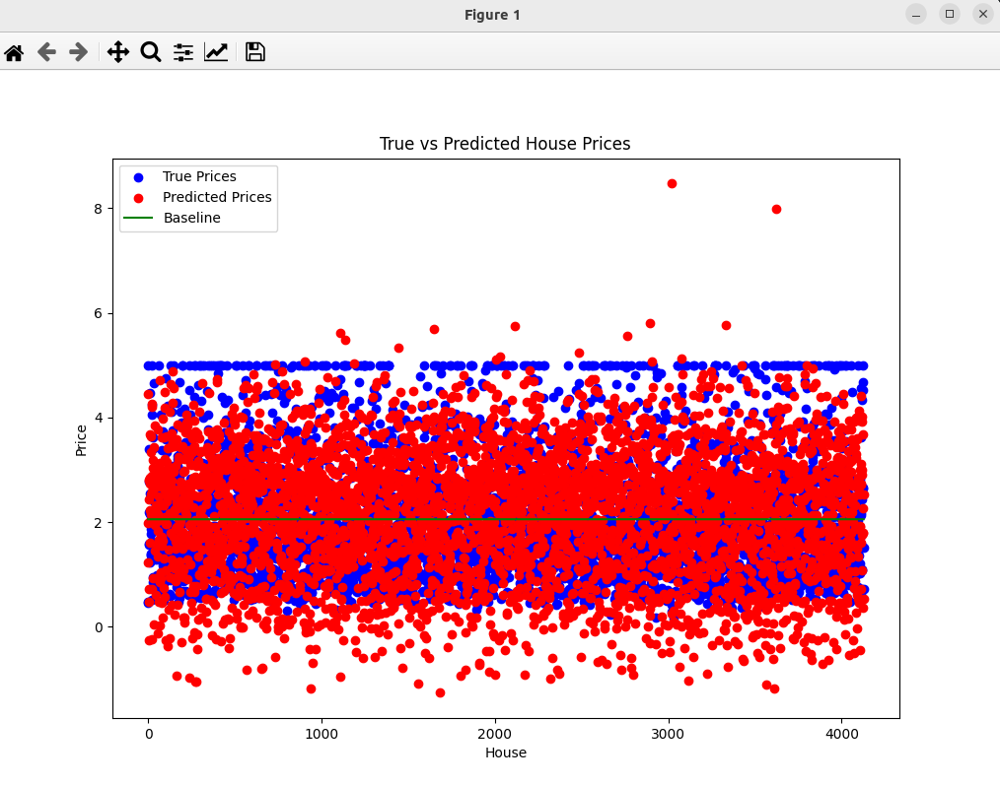

### Result
* Regression using Neural Network with PyTorch
* Dataset: California Housing Price
* Model
```
model = nn.Sequential(
    nn.Linear(X_train.shape[1], 64),
    nn.ReLU(),
    nn.Linear(64, 1)
)
```
* Sequentional means that the model is a sequence of layers
* Linear means that the model is a linear transformation
* ReLU means that the model is a rectified linear unit
* The model has 2 layers
* The first layer has 64 neurons
* The second layer has 1 neuron
* Loss function: Mean Squared Error

