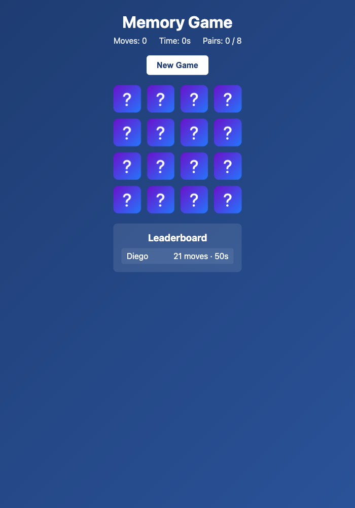

# rtk

https://github.com/rtk-ai/rtk

## install
```
brew install rtk
rtk init -g
```

```
❯ claude
           Claude Code v2.1.143
 ▐▛███▜▌   Opus 4.7 with high effort · Claude Pro
▝▜█████▛▘  ~/git/diegopacheco/ai-playground/pocs/rtk-poc
  ▘▘ ▝▝    [✻] [✻] [✻] · Share Claude Code and earn $10 of extra usage · /passes

❯ is RTK on here?

⏺ Bash(which rtk && rtk --version)
  ⎿  /opt/homebrew/bin/rtk
     rtk 0.40.0

⏺ Yes — RTK 0.40.0 is installed at /opt/homebrew/bin/rtk.

✻ Cogitated for 14s
```

## Memory Game

A card-matching memory game built with a React + TypeScript frontend served by Deno and a Rust (edition 2024, 1.94) backend on actix-web + tokio.



### How it works

- A 4×4 board hides 8 pairs of fruit symbols.
- Click a card to flip it. Flip a second card — if the symbols match the pair stays revealed, otherwise both flip back after a short delay.
- The header tracks moves, elapsed seconds and pairs found.
- When all 8 pairs are matched, the game offers to save your score (name + moves + seconds). Saved scores are sorted by fewest moves (ties broken by fastest time) and capped at the top 10.

### Stack

- **Frontend**: React 18 + TypeScript, bundled by `esbuild` via the Deno loader plugin, served as static files by Deno on `:8000`.
- **Backend**: Rust 1.94, edition 2024, `actix-web` 4 on top of `tokio`, with `actix-cors` for browser access and an in-memory `Mutex<Vec<Score>>` store. Listens on `:8080`.
- **API**: `GET /api/health`, `POST /api/games` (returns shuffled deck), `GET /api/scores`, `POST /api/scores`.

### Run

```
./start.sh   # builds + starts backend (8080) then frontend (8000)
./stop.sh    # stops both via pid files, falls back to port lookup
./test.sh    # cargo test (33 tests) + frontend build + live API smoke check
```

### Tests

33 tests across three suites:

- `backend/tests/game_tests.rs` — 8 tests for deck generation (size, pairs, unique ids, shuffle).
- `backend/tests/scores_tests.rs` — 13 tests for score validation, sorting, tie-breaking and top-10 truncation.
- `backend/tests/http_tests.rs` — 12 actix integration tests covering every endpoint and error case.

### Layout

```
backend/             Rust backend (actix-web + tokio)
  src/{lib,main,routes,game,scores}.rs
  tests/{game,scores,http}_tests.rs
src/                 React + TypeScript app (main.tsx, App.tsx, api.ts)
public/              served by Deno (index.html, styles.css, bundle.js)
deno.json, build.ts, server.ts
start.sh, stop.sh, test.sh
docs/memory-game.png
```