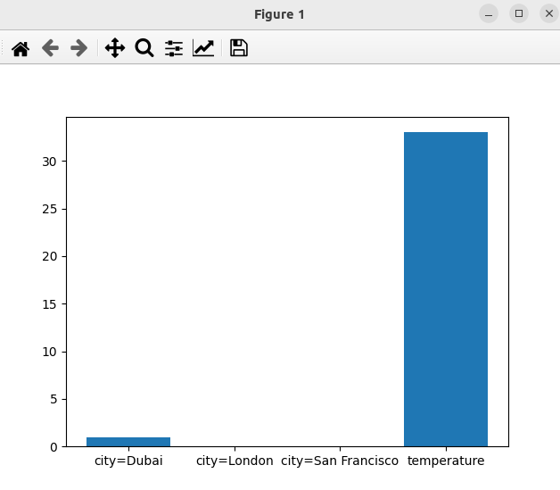

### Result
Data:
```
measurements = [
     {'city': 'Dubai', 'temperature': 33.},
     {'city': 'London', 'temperature': 12.},
     {'city': 'San Francisco', 'temperature': 18.},
]
```
* The code auto extract the features from the data
* The code auto plot the features
```
['city=Dubai' 'city=London' 'city=San Francisco' 'temperature']
```

