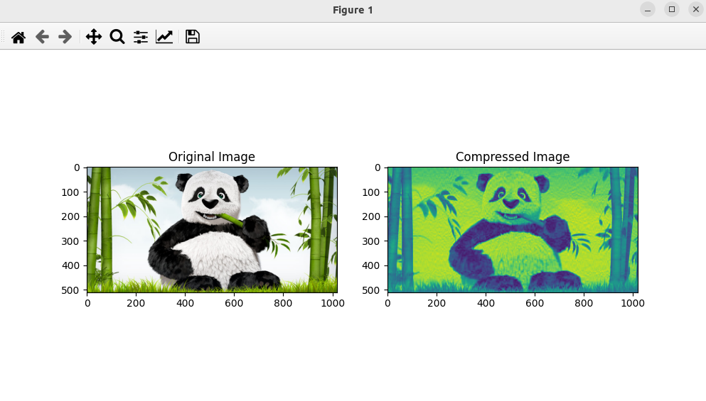

### Result
* Using Linear Algebra from scipy
* A image is read and them converted to a numpy array
* The array is then converted to a matrix
* Image is converted into grayscale
* Perform SVD on the grayscale image
* Program recontruct a new image where is compressed and gray save as compressed_image.jpg

