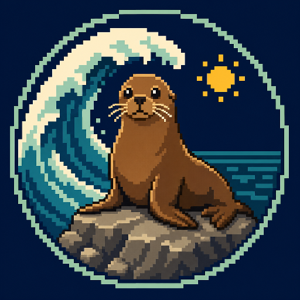
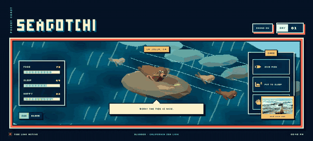

<p align="center">
  
</p>

<h1 align="center">Seagotchi</h1>

A 16-bit style virtual pet built with Three.js and WebGL. Care for Blubber, a California sea lion resting on a rocky Pacific cove while waves roll and nearby sea lions swim past.

## Render



The five-second GIF records the running WebGL application. The ocean waves and nearby sea lions remain in motion while a fish is thrown directly into Blubber's open mouth. After eating, Blubber grows into the fat-fat stage and receives a pet with an animated reaction.

[Open the compact five-second MP4](assets/seagotchi-5s.mp4)

## Features

- Animated low-poly WebGL ocean and coastal scene
- Food, sleep, and happiness meters
- Fish feeding, sleeping, and petting actions
- Synthesized sea-lion barks, honks, and snores
- Six-note sea-lion song with a sound on/off control
- Persistent game days that advance every 60 seconds
- Fat-fat, super-fat, uber-fat, and chonkers growth stages
- Rival rock-climbing, pooping, and loud stinky burp events
- Chonkers achievement for dedicated feeding
- Mouse and touch scene rotation
- Responsive handheld-console interface

## Requirements

- Node.js 20.19 or newer
- npm

## Run

```bash
./start.sh
```

Seagotchi starts at [http://localhost:4242](http://localhost:4242). If that port is occupied, the script selects the next available port and prints the address.

## Stop

```bash
./stop.sh
```

The stop script terminates the Seagotchi process running on the selected port.

## Production build

```bash
npm install
npm run build
```

The optimized files are written to `dist`.
