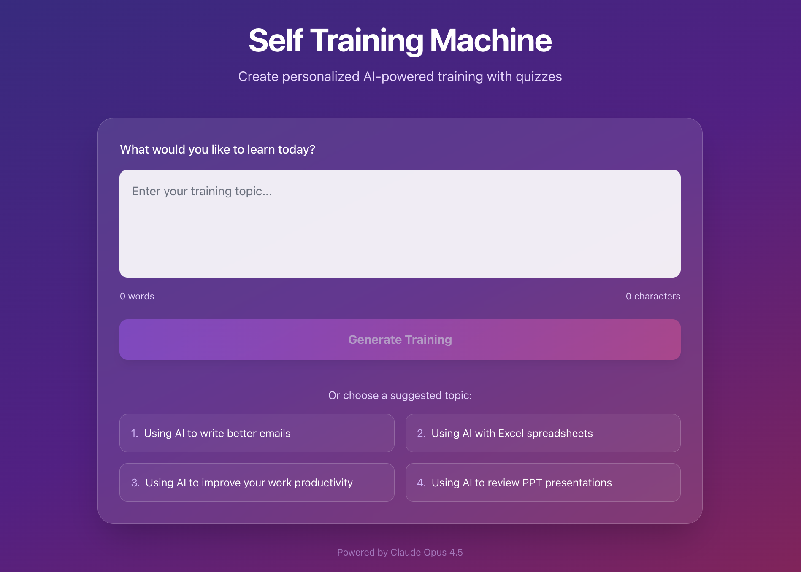
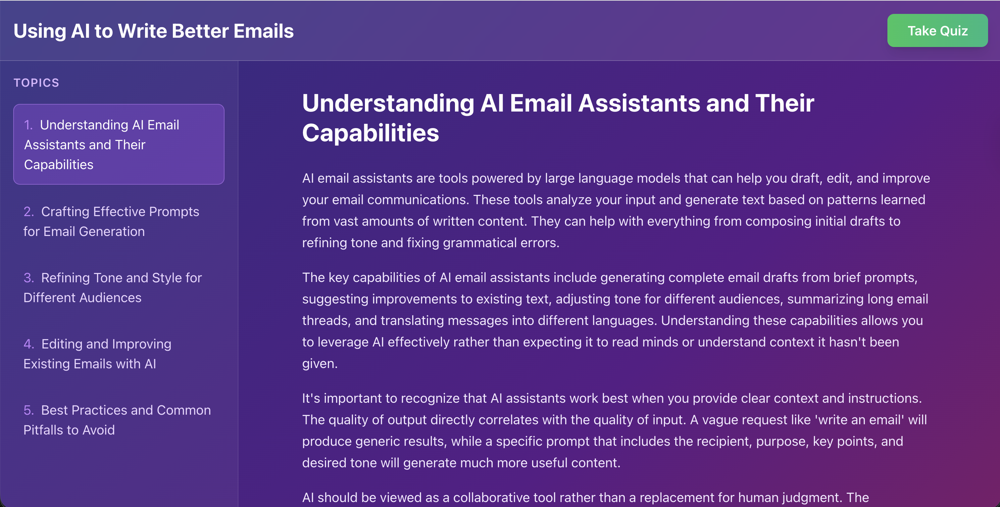
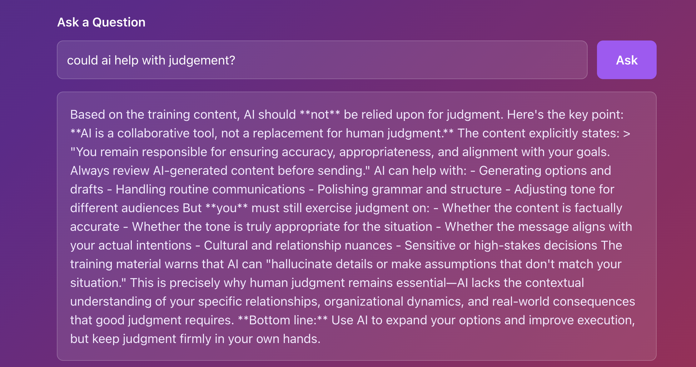
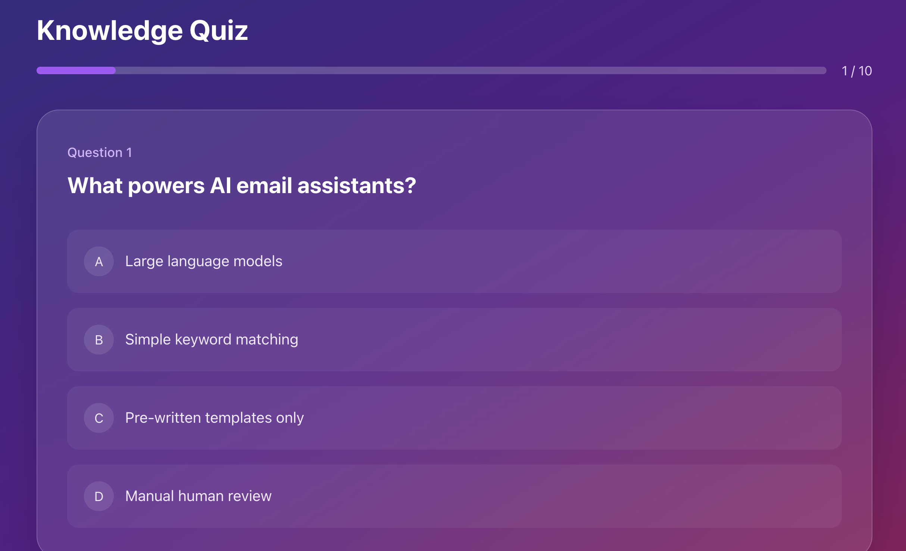
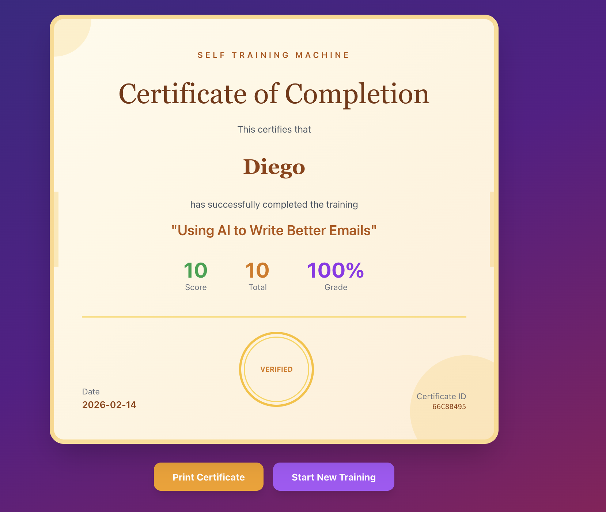

# Self Training Machine

AI-powered training and quiz generation system using Claude Opus 4.5.

1 - Chose a pre-baked training or enter your own topic. <br/>
 <br/>

2 - AI generates training content and quiz. <br/>
 <br/>

3 - Read and ask questions to LLMs.  <br/>
 <br/>

4 - Take the Quiz.  <br/>
 <br/>

5 - Get a certificate <br/>
 <br/>

## Stack

**Backend**
- Rust Edition 2024 (v1.93)
- Tokio + Axum
- SSE for real-time updates

**Frontend**
- React 19
- TailwindCSS
- TanStack Router
- TypeScript
- Vite + Bun

## Features

1. **Prompt Input** - Type custom training topic or choose from suggestions
2. **Training Content** - AI-generated educational material with 5 topics
3. **Q&A** - Ask questions about the training content
4. **Quiz** - 10 questions with scoring (70% to pass)
5. **Certificate** - Printable completion certificate

## Requirements

- Rust 1.85+
- Bun
- Claude CLI with API access

## Run

```bash
./run.sh
```

- Backend: http://localhost:8080
- Frontend: http://localhost:3000

## API

- `POST /api/generate` - Generate training and quiz (SSE)
- `POST /api/ask` - Ask questions about content
- `POST /api/submit-quiz` - Submit quiz answers
- `POST /api/certificate` - Generate certificate
- `GET /api/health` - Health check

## Test

```bash
curl -X POST http://localhost:8080/api/generate \
  -H "Content-Type: application/json" \
  -d '{"prompt": "Using AI to write better emails"}'
```
