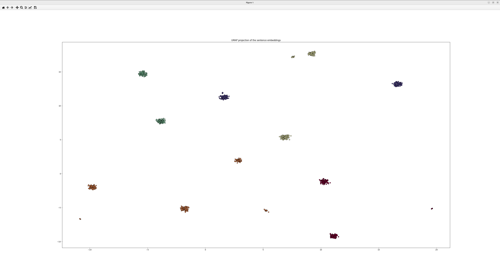

### Result
```
Cluster  1
['A man is riding a horse.', 'A man is riding a white horse on an enclosed ground.']

Cluster  2
['A cheetah is running behind its prey.', 'A cheetah chases prey on across a field.']

Cluster  3
['A man is eating food.', 'A man is eating a piece of bread.', 'A man is eating pasta.']

Cluster  4
['A monkey is playing drums.', 'Someone in a gorilla costume is playing a set of drums.']

Cluster  5
['The girl is carrying a baby.', 'The baby is carried by the woman']
```
