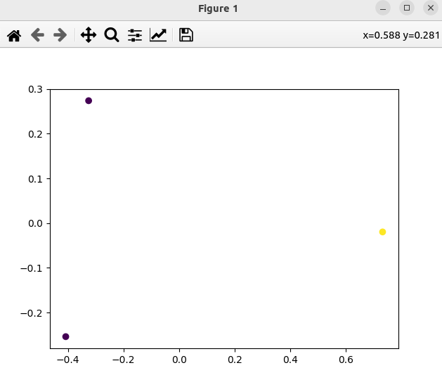

### Result
```
❯ ./run.sh
Magic The Gathering Cards
Sentence: Magic The Gathering Cards
Embedding: [-3.87020856e-02  7.49375075e-02 -3.31302471e-02  2.49027498e-02
 -7.62772113e-02  1.20864520e-02  1.01069905e-01 -6.37049899e-02
  1.60523579e-02 -4.10673283e-02 -7.74202198e-02 -2.87488364e-02
 -4.98296507e-02 -4.92609181e-02 -6.92297705e-04  1.98986176e-02
  2.71014441e-02  3.79481986e-02  3.17983143e-02  4.05340679e-02
 -2.22820905e-03 -3.58425155e-02 -8.63324702e-02  4.68955822e-02
 -3.91916148e-02  5.37184104e-02 -7.37083033e-02 -5.93821798e-03
  1.29944896e-02 -4.12709899e-02  6.85847178e-02  1.48199394e-01
  3.00308969e-02  9.27332789e-03 -5.28783053e-02 -3.44615392e-02
 -3.10582072e-02  4.19370085e-02 -2.55709141e-02 -2.98854969e-02
 -2.10128911e-03 -3.57237458e-02 -3.58894169e-02  1.32025359e-02
  3.23946262e-03 -2.51228325e-02 -3.18813836e-03  5.25113791e-02
 -2.15499885e-02  6.08560853e-02 -1.29627753e-02  1.79017801e-02
 -2.91497037e-02  1.76143404e-02  3.76588404e-02 -6.37234189e-03
 -4.34606150e-02 -9.00203660e-02  3.33085731e-02 -6.92720264e-02
 -1.20011438e-03 -4.04917225e-02 -2.41199858e-03  8.14283118e-02
 -3.04303430e-02 -4.15322818e-02  6.21031113e-02  9.54630077e-02
  4.39902730e-02 -6.98020384e-02  1.99591886e-04  5.12796901e-02
 -2.37685745e-03 -7.30272382e-03  8.90044570e-02  1.19467884e-01
 -5.43043315e-02 -1.33009896e-01  4.03105207e-02 -3.51155885e-02
 -3.88252810e-02 -4.72840257e-02  3.42815518e-02  2.92113200e-02
  2.12556310e-02 -1.98607612e-02  2.60960497e-02  7.27151185e-02
  2.80205277e-03 -1.17024526e-01 -2.81538293e-02  7.06976578e-02
  9.02859552e-04  3.88522372e-02 -4.33922037e-02  4.76840585e-02
 -3.13911922e-02 -1.10909566e-01 -2.79555582e-02  1.45027816e-01
  4.97608930e-02  5.93139715e-02 -2.07475368e-02  1.32819696e-03
  3.01282797e-02  5.43184858e-03  3.04648047e-03  3.22222076e-02
 -1.28870104e-02 -1.78794768e-02 -2.68110670e-02 -7.23381806e-03
 -7.11295754e-02 -5.94906434e-02 -3.80809940e-02  6.30992278e-02
 -3.66585446e-03  8.21863264e-02 -2.52019726e-02  2.19931733e-02
  1.27931293e-02 -3.42266075e-02  1.80570018e-02  2.07860526e-02
 -3.79160009e-02 -2.29755938e-02  1.29625192e-02 -3.20435976e-33
  4.95396480e-02 -5.42793125e-02  8.52089934e-03 -1.75870825e-02
  6.50362819e-02 -1.51212914e-02 -8.74561816e-03 -6.90236166e-02
 -7.61212595e-03 -2.48264950e-02  3.87719236e-02  4.29522172e-02
  1.23898230e-01  5.99944368e-02  4.68648858e-02 -7.68160596e-02
 -5.91264069e-02  1.41878808e-02  2.88108997e-02 -6.15704954e-02
 -4.59067710e-02  3.81855667e-02  5.00672013e-02  1.29553853e-02
 -1.93651374e-02  7.95947462e-02 -9.52679366e-02 -5.38844522e-03
  1.08377367e-01  4.24386077e-02  1.61805023e-02 -2.66454611e-02
  1.41884880e-02 -4.87881713e-02 -6.68563601e-03  5.63013852e-02
 -2.48435023e-03 -4.37825881e-02  2.82319356e-02 -1.19292280e-02
 -5.13623618e-02  1.66140180e-02 -4.02816013e-02 -7.64649436e-02
 -2.36095618e-02  3.23229171e-02  3.73831205e-03 -9.31921974e-03
 -1.01494320e-01  5.04306071e-02 -5.85266436e-03 -3.93570662e-02
 -3.28144580e-02  5.82188775e-04  3.50883193e-02 -6.29046708e-02
 -8.74023698e-03  7.28171226e-03  4.87643741e-02  2.59666070e-02
  3.26325477e-04 -2.06990726e-02 -6.12602346e-02  7.90339559e-02
 -1.07095055e-01 -1.53697398e-03  5.19300997e-02 -4.26567644e-02
 -2.11548731e-02  6.99798111e-03  1.05330851e-02  1.89010929e-02
 -3.08181234e-02  2.67304201e-02 -1.86825432e-02  4.74340486e-05
  2.93007325e-02  4.17447314e-02 -1.22218743e-01  2.22168155e-02
 -7.32910410e-02  7.55350618e-03 -6.34538010e-02  4.87681776e-02
 -3.07662357e-02 -2.11673211e-02 -8.14559218e-03 -6.05788548e-03
 -6.35598414e-03  5.72009012e-03 -6.94621280e-02 -1.42059736e-02
  1.59325674e-01 -9.07199383e-02  6.29957486e-03  2.47337364e-33
  8.38780869e-03  5.49693708e-04  4.22105901e-02  4.68226150e-02
  3.71974446e-02 -9.68244150e-02  4.61564213e-02  5.26211411e-02
  8.10744986e-02 -2.82468498e-02 -3.24241593e-02  9.41203535e-02
  1.33132860e-02 -2.47117449e-02  3.24719399e-02 -9.03229713e-02
  8.29600319e-02  7.89073259e-02  5.88503629e-02  5.70965074e-02
  5.14754802e-02 -1.45441247e-02 -5.58854677e-02 -7.66868368e-02
  2.78770318e-03  7.51040354e-02 -3.00009524e-05 -1.04234122e-01
 -1.35353403e-02 -2.64430940e-02  4.36160117e-02 -3.98139432e-02
 -1.09190103e-02  1.43440152e-02 -2.08490472e-02  6.02690019e-02
  2.09965347e-03  7.54304901e-02 -5.33758476e-02 -9.41385478e-02
 -1.82876468e-03  4.98632491e-02  2.94310786e-02  2.20086370e-02
 -2.32498273e-02 -1.03419088e-02  3.75420228e-02  9.38051641e-02
  3.46083343e-02 -3.28865536e-02 -7.26044253e-02 -3.91325690e-02
 -6.52736425e-02 -5.45148365e-02 -3.75126898e-02 -5.04358730e-04
 -1.08141014e-02 -2.62101069e-02  2.27293558e-02  5.40338282e-04
 -2.86746547e-02 -1.88808572e-02 -1.99714061e-02 -1.90607850e-02
  7.24881887e-03  5.54280207e-02 -2.46485956e-02  1.62889510e-02
 -2.05376223e-02 -1.80856436e-02 -2.14345418e-02  1.30208969e-01
 -1.25201628e-01  3.70665938e-02 -1.40747745e-02  6.73062056e-02
 -2.88345329e-02  5.64795732e-02  5.65856583e-02 -6.03551008e-02
 -1.65072419e-02 -4.67150919e-02 -5.71203195e-02 -1.92762353e-02
 -8.04032199e-04  2.58522425e-02  6.20440170e-02 -6.47044554e-02
 -4.93239686e-02 -8.59755650e-02 -2.28683976e-03  9.90517158e-03
  1.67227417e-01 -2.48664804e-03 -4.65293378e-02 -1.30125031e-08
  1.56716630e-02  2.43998710e-02  3.25620850e-03  2.88384743e-02
  3.87160368e-02  3.66464667e-02  4.69721928e-02 -2.93063484e-02
  1.83415022e-02  1.39424168e-02  1.41645953e-01  9.37390886e-03
  6.27488494e-02 -2.23979335e-02  9.50461179e-02  1.48313474e-02
 -5.33046667e-04 -3.79953422e-02 -6.90046474e-02 -1.78932901e-02
  4.16090861e-02  8.50880146e-03  1.16555184e-01 -2.18830798e-02
 -6.20682128e-02  3.47155072e-02  5.78493848e-02 -8.96158814e-02
  7.21580684e-02  8.15806165e-02  7.15558082e-02 -3.75066996e-02
  7.52578303e-02  4.47694622e-02  1.12209149e-01 -2.24716160e-02
 -9.97536778e-02  5.02607226e-03  6.40870705e-02 -1.66000109e-02
  6.16506999e-03  2.60101911e-03  3.28259133e-02 -5.90001568e-02
 -5.27882315e-02 -9.08832178e-02 -3.14982906e-02 -1.34979570e-02
 -4.54945154e-02 -6.22721538e-02 -3.99435684e-03 -2.01219469e-02
  1.64795779e-02  7.20022386e-03  2.86805145e-02 -3.50951031e-02
  3.85059491e-02  2.54705120e-02  2.67218240e-02 -5.38700968e-02
  5.51713295e-02  1.40549215e-02 -6.26448989e-02  4.09315974e-02]

The similarity between 'Magic Cards' and 'Magic The Gathering Cards' is 0.857381284236908
The similarity between 'Blue car is not a card' and 'Magic The Gathering Cards' is 0.3206788897514343
```


```
Topic 3: [ 0  1  2  3  4  5  6  7  8  9 10 11 12 13 14 15 16 17 18 19]
Number of topics: 19
Topic 1: [['collectors' 'collectible' 'cards' 'magicians' 'magic' 'wizards'
  'collecting' 'card' 'tournaments' 'fun' 'traded' 'gathering' 'tricks'
  'popular' 'play' 'played' 'cars' 'expensive' 'valuablered' 'millions'
  'sold' 'sets' 'stores' 'available' 'released' 'performers' 'extinct'
  'skilled' 'are' 'many' 'dinosaurs' 'all' 'world' 'years' 'used' 'made'
  'not' 'is' 'online' 'car' 'by' 'to' 'perform' 'lived' 'faster' 'ago'
  'the' 'than' 'means' 'blue']
 ['magicians' 'cards' 'magic' 'wizards' 'tournaments' 'card' 'popular'
  'collectors' 'tricks' 'collectible' 'fun' 'play' 'used' 'collecting'
  'played' 'cars' 'skilled' 'gathering' 'performers' 'expensive'
  'available' 'traded' 'years' 'world' 'are' 'online' 'stores' 'millions'
  'extinct' 'many' 'valuablered' 'all' 'dinosaurs' 'perform' 'faster'
  'is' 'sold' 'released' 'sets' 'not' 'ago' 'made' 'by' 'car' 'to'
  'lived' 'than' 'the' 'means' 'of']
 ['cards' 'magicians' 'magic' 'card' 'wizards' 'tricks' 'cars'
  'tournaments' 'collectors' 'stores' 'play' 'fun' 'collecting' 'played'
  'collectible' 'performers' 'dinosaurs' 'car' 'sets' 'world' 'popular'
  'online' 'traded' 'gathering' 'expensive' 'used' 'available' 'skilled'
  'all' 'perform' 'valuablered' 'blue' 'faster' 'are' 'many' 'years'
  'ago' 'made' 'extinct' 'released' 'coast' 'millions' 'sold' 'the'
  'lived' 'to' 'means' 'of' 'is' 'not']
 ['cards' 'magicians' 'wizards' 'magic' 'collectors' 'collectible' 'card'
  'sets' 'tournaments' 'collecting' 'released' 'gathering' 'tricks' 'fun'
  'played' 'play' 'traded' 'available' 'extinct' 'are' 'performers'
  'made' 'stores' 'cars' 'all' 'popular' 'is' 'sold' 'years' 'millions'
  'many' 'not' 'dinosaurs' 'expensive' 'perform' 'used' 'by' 'skilled'
  'the' 'ago' 'to' 'world' 'in' 'valuablered' 'over' 'means' 'online'
  'of' 'car' 'coast']
 ['magicians' 'magic' 'wizards' 'tricks' 'fun' 'cards' 'skilled'
  'tournaments' 'performers' 'dinosaurs' 'perform' 'popular' 'play'
  'collectors' 'played' 'world' 'card' 'faster' 'cars' 'stores'
  'collectible' 'traded' 'millions' 'expensive' 'valuablered'
  'collecting' 'online' 'years' 'used' 'gathering' 'extinct' 'made'
  'released' 'ago' 'all' 'blue' 'available' 'sets' 'lived' 'many' 'are'
  'not' 'by' 'coast' 'car' 'means' 'is' 'sold' 'to' 'the']
 ['wizards' 'magicians' 'magic' 'tricks' 'tournaments' 'collectors'
  'skilled' 'dinosaurs' 'cards' 'performers' 'fun' 'world' 'are' 'traded'
  'played' 'extinct' 'play' 'popular' 'cars' 'collectible' 'expensive'
  'millions' 'faster' 'perform' 'sets' 'card' 'stores' 'is' 'online'
  'collecting' 'not' 'released' 'made' 'years' 'means' 'used'
  'valuablered' 'the' 'all' 'gathering' 'by' 'car' 'many' 'ago' 'blue'
  'lived' 'to' 'sold' 'of' 'available']
 ['collecting' 'collectible' 'gathering' 'collectors' 'means' 'sets'
  'tournaments' 'play' 'traded' 'released' 'played' 'cards' 'fun' 'used'
  'cars' 'valuablered' 'performers' 'extinct' 'sold' 'popular'
  'expensive' 'perform' 'wizards' 'stores' 'made' 'card' 'car' 'to'
  'magic' 'magicians' 'available' 'tricks' 'coast' 'are' 'over' 'lived'
  'skilled' 'millions' 'is' 'many' 'of' 'the' 'world' 'years' 'online'
  'by' 'in' 'not' 'faster' 'dinosaurs']
 ['dinosaurs' 'extinct' 'millions' 'years' 'lived' 'magicians' 'ago'
  'many' 'world' 'wizards' 'all' 'popular' 'than' 'expensive' 'are' 'is'
  'not' 'by' 'magic' 'collectors' 'valuablered' 'tournaments' 'used'
  'sold' 'the' 'traded' 'released' 'collectible' 'made' 'skilled'
  'tricks' 'available' 'of' 'cars' 'blue' 'online' 'in' 'stores' 'faster'
  'performers' 'sets' 'played' 'over' 'collecting' 'to' 'fun' 'gathering'
  'coast' 'means' 'car']
 ['dinosaurs' 'extinct' 'magicians' 'world' 'wizards' 'millions'
  'collectors' 'not' 'lived' 'released' 'collectible' 'all' 'tournaments'
  'valuablered' 'expensive' 'are' 'ago' 'many' 'traded' 'online' 'magic'
  'stores' 'sold' 'years' 'is' 'faster' 'tricks' 'available' 'cars'
  'blue' 'popular' 'performers' 'collecting' 'skilled' 'sets' 'the'
  'made' 'than' 'cards' 'used' 'played' 'by' 'coast' 'means' 'in' 'over'
  'fun' 'of' 'play' 'car']
 ['cars' 'faster' 'cards' 'car' 'blue' 'valuablered' 'magicians' 'card'
  'magic' 'wizards' 'fun' 'expensive' 'collectors' 'than' 'are'
  'collectible' 'tricks' 'dinosaurs' 'popular' 'is' 'collecting'
  'millions' 'many' 'the' 'not' 'tournaments' 'all' 'world' 'play' 'to'
  'over' 'extinct' 'skilled' 'of' 'coast' 'sets' 'years' 'made' 'played'
  'traded' 'ago' 'stores' 'means' 'by' 'in' 'lived' 'performers'
  'gathering' 'perform' 'available']
 ['cards' 'magicians' 'online' 'magic' 'wizards' 'available' 'card'
  'tournaments' 'collectors' 'collectible' 'tricks' 'popular' 'fun'
  'play' 'stores' 'collecting' 'are' 'played' 'traded' 'cars' 'expensive'
  'is' 'world' 'skilled' 'by' 'released' 'used' 'years' 'all' 'gathering'
  'extinct' 'ago' 'performers' 'in' 'to' 'sold' 'not' 'many' 'perform'
  'made' 'millions' 'dinosaurs' 'the' 'lived' 'than' 'faster' 'of' 'sets'
  'car' 'over']
 ['wizards' 'magicians' 'magic' 'cards' 'card' 'tricks' 'collectors'
  'tournaments' 'coast' 'fun' 'collectible' 'made' 'collecting' 'skilled'
  'played' 'are' 'expensive' 'play' 'cars' 'is' 'performers' 'by' 'sets'
  'millions' 'gathering' 'to' 'the' 'dinosaurs' 'not' 'popular' 'traded'
  'world' 'all' 'perform' 'of' 'released' 'years' 'stores' 'extinct'
  'car' 'than' 'many' 'over' 'used' 'faster' 'in' 'ago' 'means'
  'valuablered' 'online']
 ['magicians' 'cards' 'magic' 'wizards' 'card' 'tournaments' 'collectors'
  'tricks' 'collectible' 'collecting' 'play' 'fun' 'cars' 'played'
  'gathering' 'popular' 'stores' 'performers' 'dinosaurs' 'world' 'sets'
  'online' 'traded' 'perform' 'skilled' 'car' 'expensive' 'used' 'faster'
  'valuablered' 'years' 'millions' 'all' 'extinct' 'many' 'blue'
  'released' 'available' 'sold' 'made' 'coast' 'are' 'ago' 'means' 'to'
  'by' 'lived' 'not' 'the' 'of']
 ['cards' 'magicians' 'magic' 'card' 'stores' 'wizards' 'collectors'
  'collectible' 'many' 'tricks' 'tournaments' 'collecting' 'sold'
  'popular' 'millions' 'expensive' 'available' 'traded' 'fun' 'all'
  'cars' 'years' 'gathering' 'extinct' 'played' 'are' 'play' 'released'
  'used' 'online' 'is' 'skilled' 'sets' 'not' 'made' 'than' 'dinosaurs'
  'ago' 'world' 'faster' 'over' 'in' 'performers' 'car' 'by' 'coast'
  'the' 'of' 'to' 'valuablered']
 ['magicians' 'magic' 'wizards' 'cards' 'world' 'tournaments' 'card'
  'all' 'tricks' 'fun' 'played' 'play' 'collectors' 'popular'
  'collectible' 'collecting' 'millions' 'gathering' 'cars' 'extinct'
  'are' 'years' 'dinosaurs' 'performers' 'traded' 'skilled' 'perform'
  'made' 'is' 'the' 'not' 'many' 'faster' 'of' 'expensive' 'over' 'to'
  'released' 'lived' 'sets' 'online' 'used' 'by' 'ago' 'car' 'stores'
  'in' 'than' 'available' 'means']
 ['magicians' 'magic' 'cards' 'wizards' 'expensive' 'card' 'collectors'
  'collectible' 'tournaments' 'fun' 'popular' 'tricks' 'collecting'
  'millions' 'valuablered' 'play' 'skilled' 'cars' 'played' 'faster'
  'gathering' 'extinct' 'performers' 'available' 'sold' 'dinosaurs'
  'many' 'traded' 'stores' 'are' 'years' 'world' 'used' 'is' 'online'
  'sets' 'all' 'not' 'car' 'made' 'released' 'than' 'coast' 'perform'
  'blue' 'to' 'the' 'by' 'means' 'ago']
 ['magicians' 'magic' 'fun' 'cards' 'wizards' 'card' 'tournaments' 'play'
  'played' 'tricks' 'collectors' 'collectible' 'popular' 'collecting'
  'skilled' 'gathering' 'cars' 'expensive' 'perform' 'are' 'used' 'all'
  'performers' 'traded' 'sets' 'faster' 'made' 'millions' 'is'
  'valuablered' 'many' 'years' 'car' 'world' 'to' 'the' 'dinosaurs'
  'released' 'available' 'not' 'than' 'sold' 'online' 'extinct' 'by' 'of'
  'stores' 'means' 'coast' 'lived']
 ['blue' 'card' 'cards' 'car' 'cars' 'not' 'is' 'than' 'available'
  'extinct' 'means' 'collectible' 'expensive' 'traded' 'valuablered'
  'faster' 'are' 'world' 'by' 'released' 'sold' 'online' 'ago' 'stores'
  'magic' 'the' 'played' 'dinosaurs' 'play' 'millions' 'collectors' 'to'
  'of' 'wizards' 'used' 'made' 'tournaments' 'popular' 'magicians'
  'years' 'fun' 'in' 'collecting' 'performers' 'tricks' 'coast' 'skilled'
  'many' 'lived' 'all']
 ['magicians' 'magic' 'wizards' 'performers' 'skilled' 'tricks'
  'tournaments' 'fun' 'dinosaurs' 'popular' 'perform' 'cards'
  'collectors' 'expensive' 'valuablered' 'world' 'played' 'millions'
  'play' 'are' 'extinct' 'years' 'traded' 'faster' 'cars' 'used'
  'collectible' 'not' 'is' 'card' 'online' 'available' 'many' 'stores'
  'lived' 'all' 'by' 'means' 'made' 'ago' 'sets' 'collecting' 'released'
  'than' 'to' 'the' 'blue' 'coast' 'sold' 'gathering']]
```