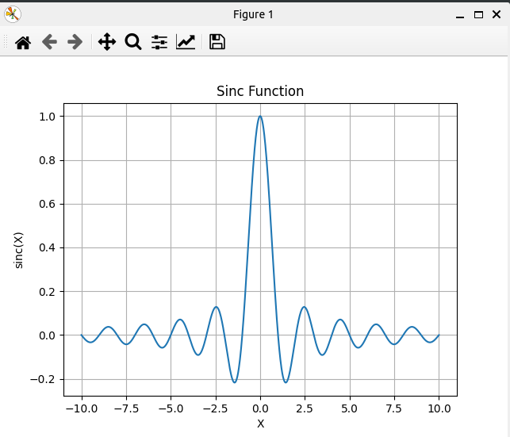

### Result
* Matplotlib
* Sinc
* Sinc - Computes the sine of the input divided by the input. Use case: Signal processing.
* Sinc us used for:
  * Signal Processing
  * Physics
  * Communication Systems
  * Image Processing
  * Statistics

