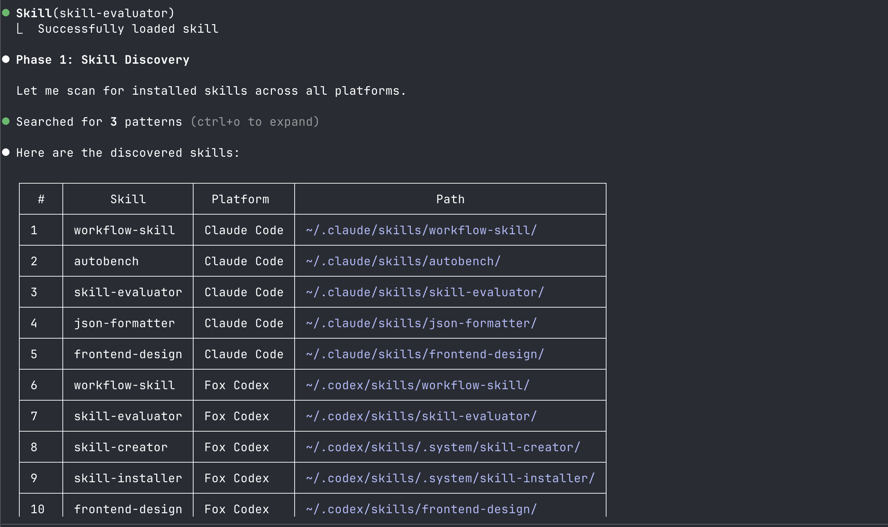
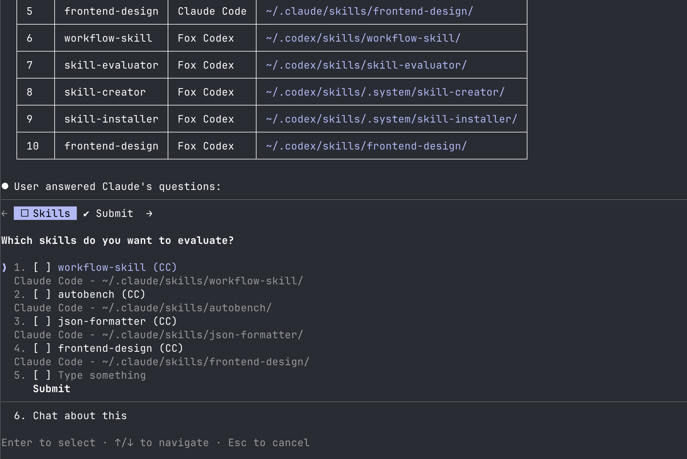
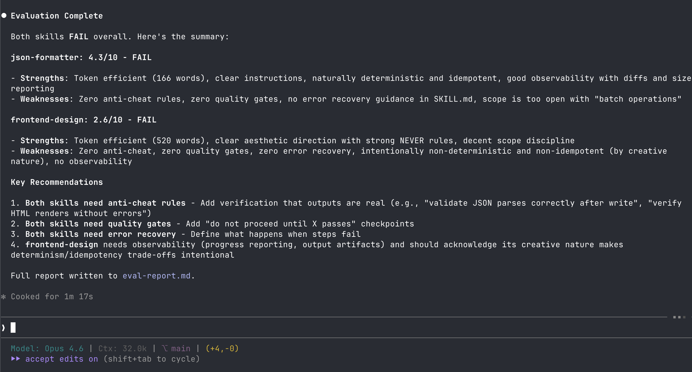

# Skill Evaluator

A skill for Claude Code and Fox Codex that evaluates other skills across 9 quality criteria, producing a scored pass/fail report.

# Result

| Step | Screenshot |
|---|---|
| List Skills |  |
| Selection |  |
| Results |  |

## Evaluation Criteria

| Criteria | Pass Condition | What It Measures |
|---|---|---|
| Direct and Clear | >= 6 | Precision, clarity, no filler or vague language |
| Token Efficiency | <= 5 | Context window efficiency (lower is better) |
| Anti-Cheating | >= 6 | Guardrails against BS, hallucinations, fake results |
| Quality Gates | >= 6 | Enforced checkpoints that block progress until met |
| Determinism | >= 6 | Reproducible results across runs |
| Scope Discipline | >= 6 | Stays in lane, no unsolicited changes |
| Error Recovery | >= 6 | Graceful failure handling, rollback, retry |
| Observability | >= 6 | Evidence production (logs, diffs, reports) |
| Idempotency | >= 6 | Safe to re-run without breaking things |

A skill PASSES only if ALL 9 criteria pass.

## Install

```bash
./install.sh
```

Installs to `~/.claude/skills/skill-evaluator/` and `~/.codex/skills/skill-evaluator/`.

## Uninstall

```bash
./uninstall.sh
```

## Usage

```
/skill-evaluator
```

The skill will:
1. Scan all installed skills from Claude Code and Fox Codex
2. List them and ask: evaluate ALL or select specific ones
3. Run `scripts/evaluate.sh` for static analysis
4. Score each skill across 9 criteria (0-10 each)
5. Produce a pass/fail table with short summaries per criteria

### Output

```
| Criteria             | Score | Result | Summary                                       |
|----------------------|-------|--------|-----------------------------------------------|
| Direct and Clear     | 8/10  | PASS   | Clear instructions, minor verbosity in phase 3 |
| Token Efficiency     | 3/10  | PASS   | Lean SKILL.md, good use of references/         |
| Anti-Cheating        | 4/10  | FAIL   | No verification steps, outputs not validated    |
| ...                  |       |        |                                                 |

Overall: 6.3/10 | FAIL (Anti-Cheating below threshold)
```

## Evaluation Report

See [eval-report.md](eval-report.md) for the latest skill evaluation results.

## Project Structure

```
skill-evaluator/
├── design-doc.md
├── install.sh
├── uninstall.sh
├── README.md
└── skill-evaluator/
    ├── SKILL.md
    ├── scripts/
    │   └── evaluate.sh
    └── references/
        ├── scoring-rubric.md
        └── best-practices-checklist.md
```
