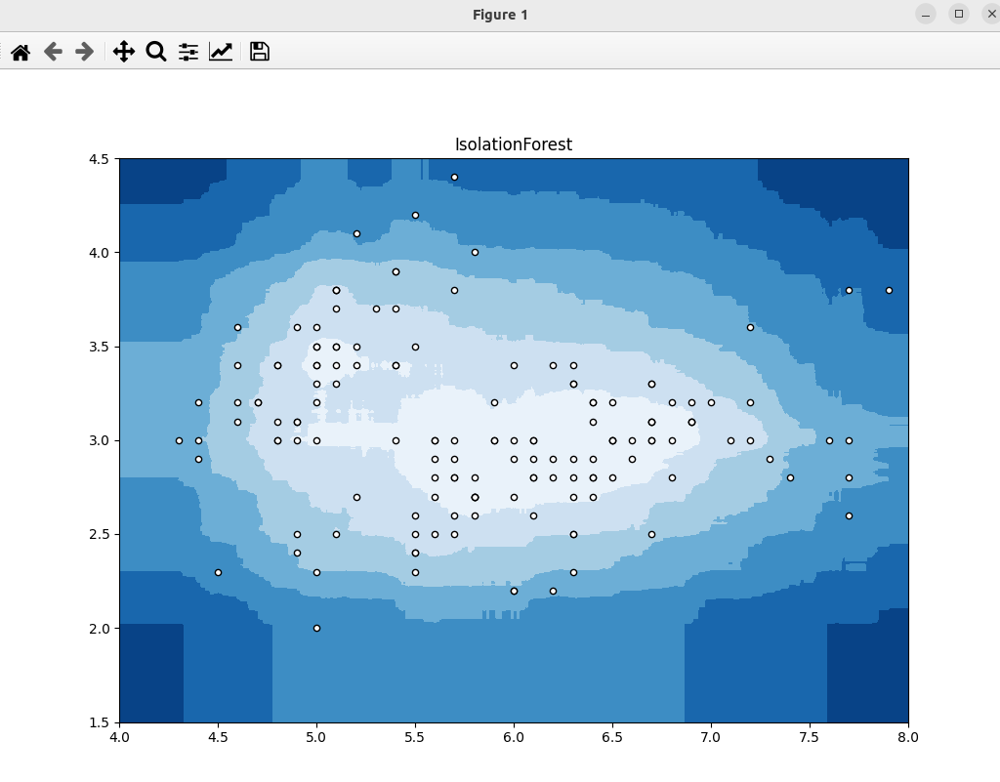

### Result
* Anomaly detection
* Isolation Forest
* Isolation Forest works by isolating observations by randomly selecting a feature and then randomly selecting a split value between the maximum and minimum values of the selected feature.

