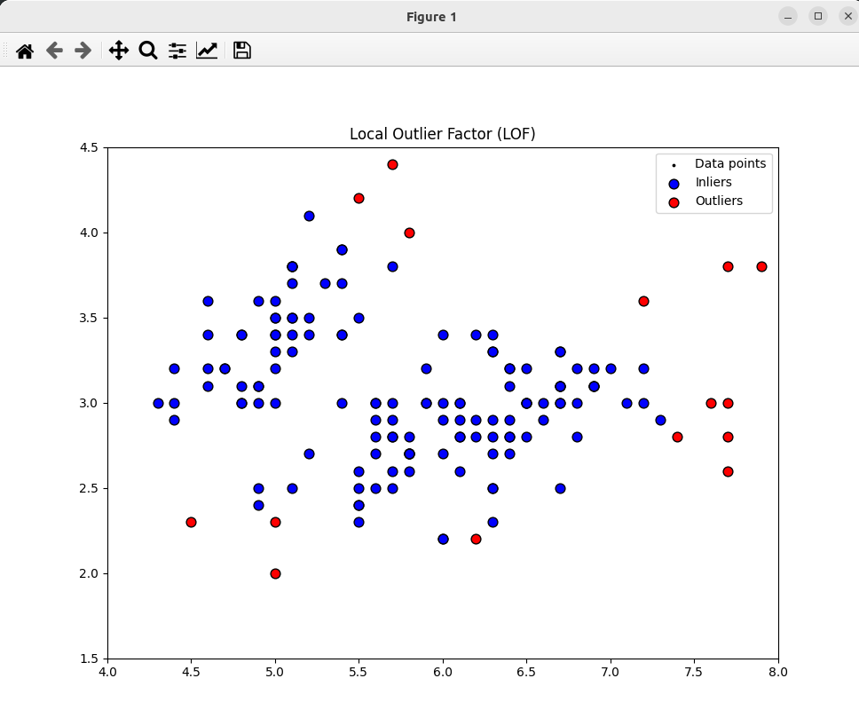

### Result
* Anomaly detection
* Local Outlier Factor (LOF)
* LOF works by calculating the local density deviation of a given data point with respect to its neighbors. It is local in that it calculates the anomaly score with respect to the local neighborhood of a data point.

