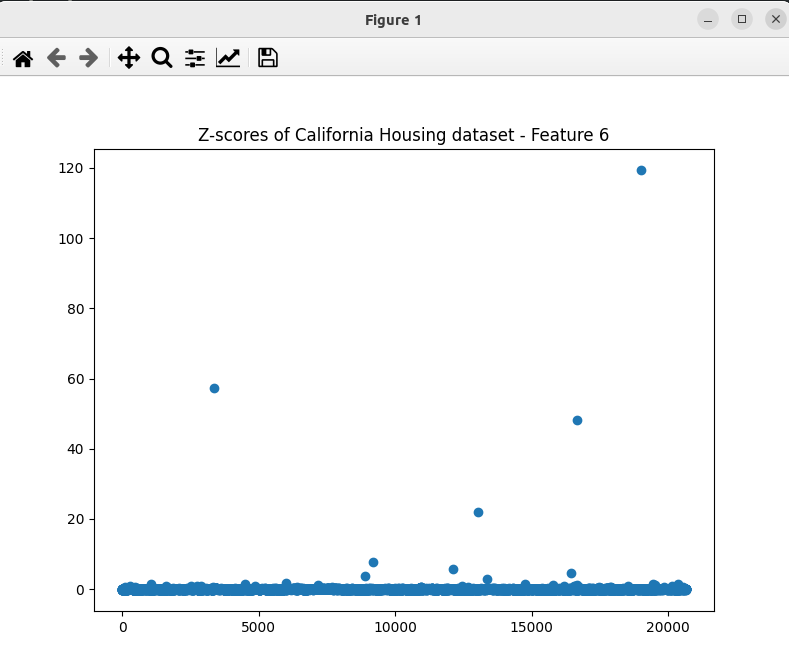

### Result
* Anomaly detection
* Z-score
* Z-score works by calculating the standard deviation of the data and then calculating the distance between each data point and the mean in terms of standard deviations.

