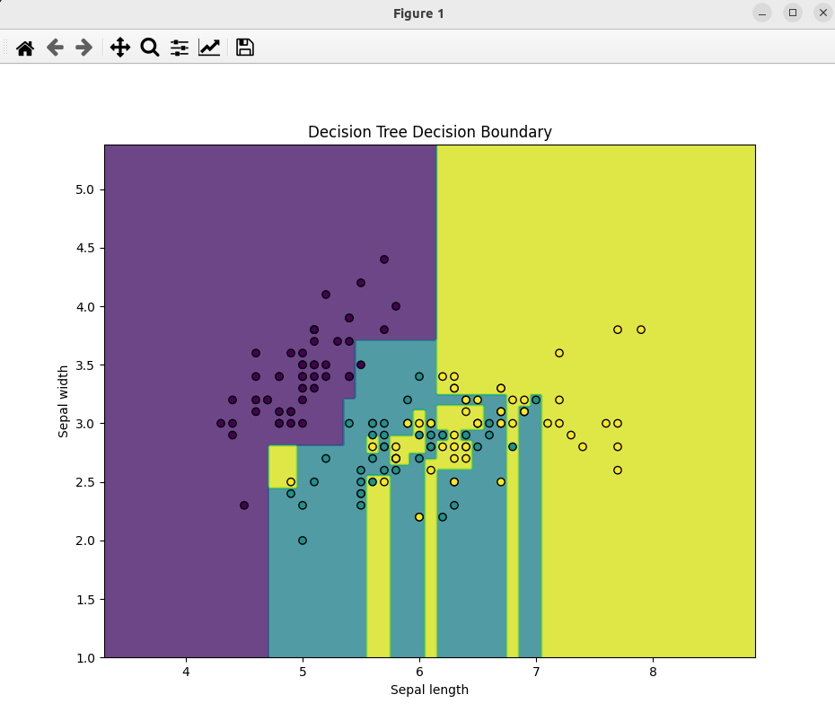

### Result
* Classification
* Decision Trees
* Decision Tree works by splitting the dataset into subsets based on the value of a feature.
* In this technique, we split the population or sample into two or more homogeneous sets (or sub-populations) based on the most significant splitter/differentiator in input variables.

