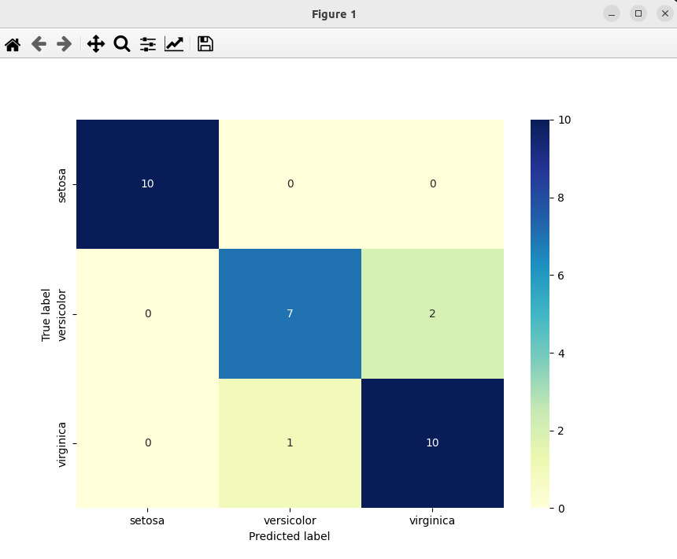

### Result
* Classification
* Logistic Regression
* Logisti Regression works by finding the best fitting curve that fits the data points in the dataset.
* The fundamental idea behind logistic regression is the logistic function, also called the sigmoid function. The sigmoid function is an S-shaped curve that can take any real-valued number and map it into a value between 0 and 1, but never exactly at those limits. This property makes it useful for creating probability models

