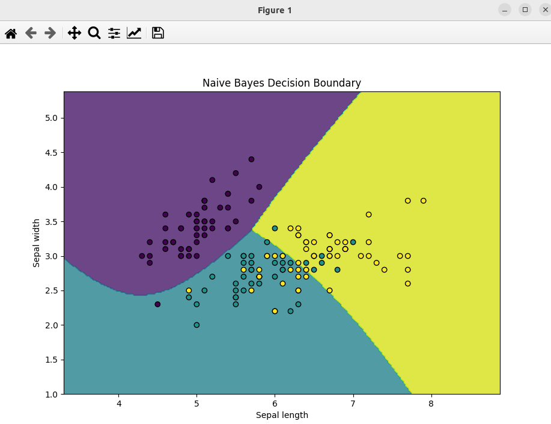

### Result
* Classification
* Naive Bayes
* Naive Bayes with GaussianNB
* Naive Bayes is a classification algorithm based on applying Bayes' theorem with strong (naive) independence assumptions between the features

