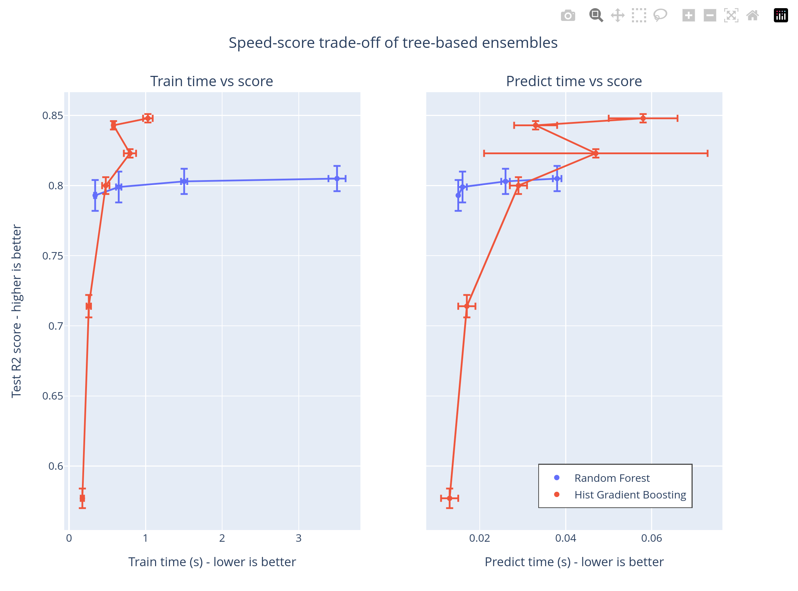

### Result
* Classification
* Random Forrest Algo
* The program uses California husing dataset
* Defines two machine learning models: a Random Forest Regressor and a Histogram-based Gradient Boosting Regressor. These models are stored in a dictionary with their names as keys

