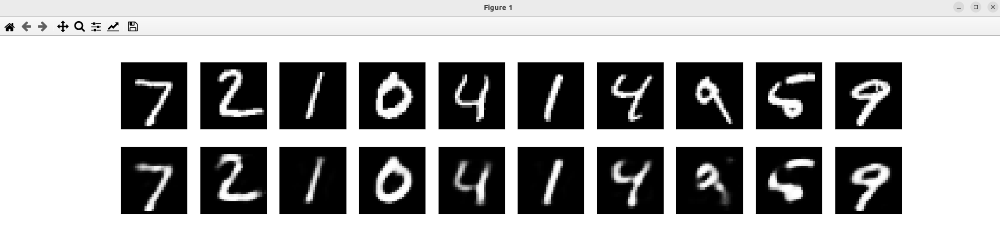
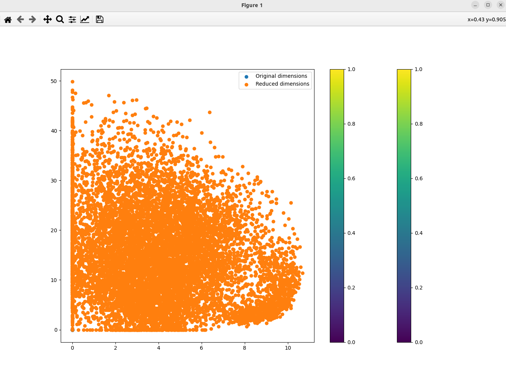

### Result
* Dimensionality Reduction
* Autoencoders
* Autoencoders are a type of artificial neural network used to learn efficient data codings in an unsupervised manner. The aim of an autoencoder is to learn a representation (encoding) for a set of data, typically for the purpose of dimensionality reduction.

