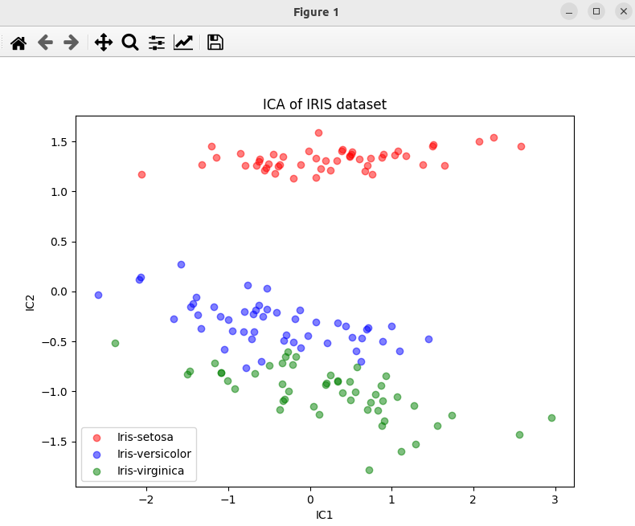

### Result
* Dimensionality reduction
* ICA (Independent Component Analysis)
* ICA works by maximizing the independence of the components (i.e. the components are as statistically independent as possible)

