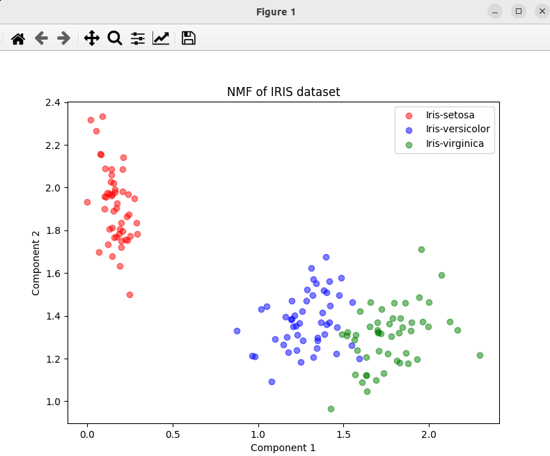

### Result
* Dimnsionality reduction
* Non-negative Matrix Factorization (NMF)
* NMF works by factorizing the input data matrix into two non-negative matrices (W, H) such that the product of the two matrices approximates the input matrix as closely as possible.

