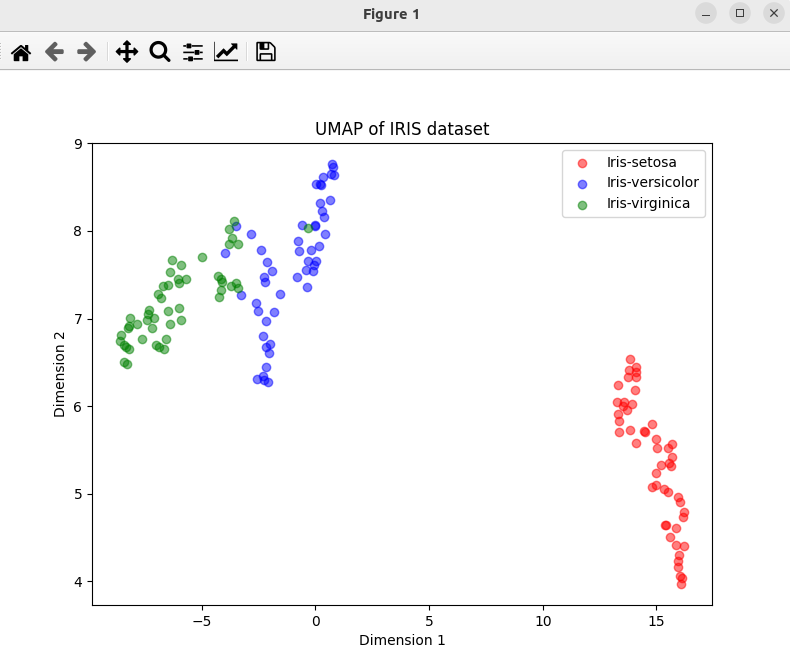

### Result
* Dimnsionality Reduction
* Uniform Manifold Approximation and Projection (UMAP) 
* UMAP is a non-linear dimensionality reduction technique that can be used for visualisation similarly to t-SNE, but also for general non-linear dimension reduction.

