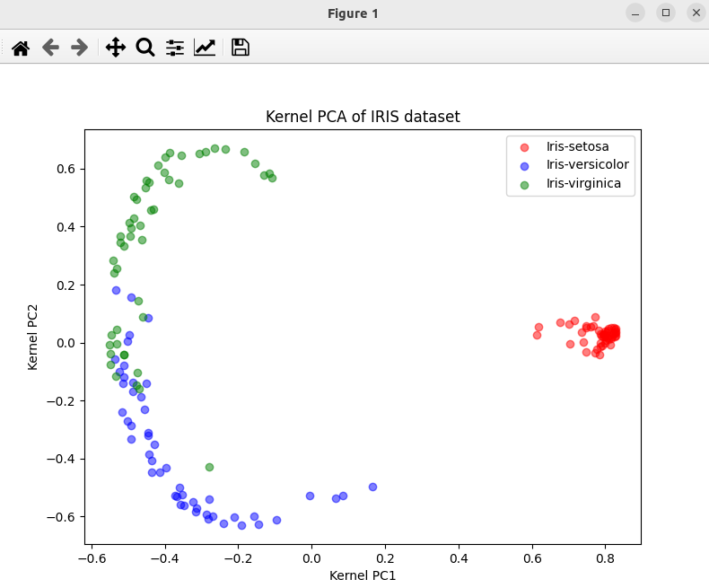

### Result
* Dimnetionality reduction using GDA-like
* Kernel PCA is a technique for reducing the dimentionality of such datasets, increasing interpretability but at the same time minimizing information loss.

