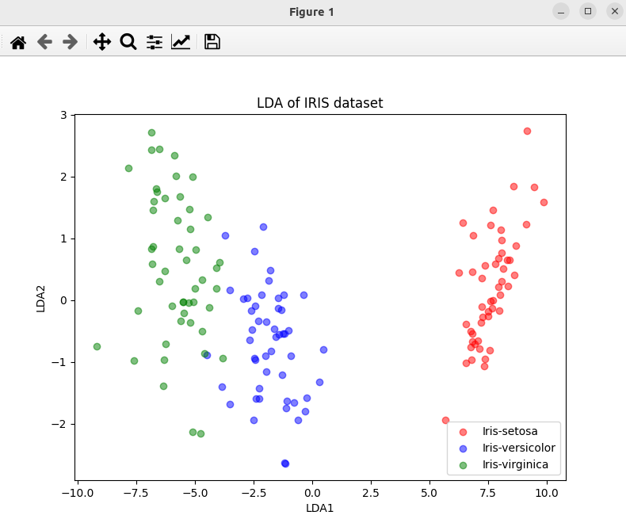

### Result
* Dimnetionality reduction using LDA
* LDA means Linear Discriminant Analysis
* LDA is a technique for reducing the dimentionality of such datasets, increasing interpretability but at the same time minimizing information loss.

