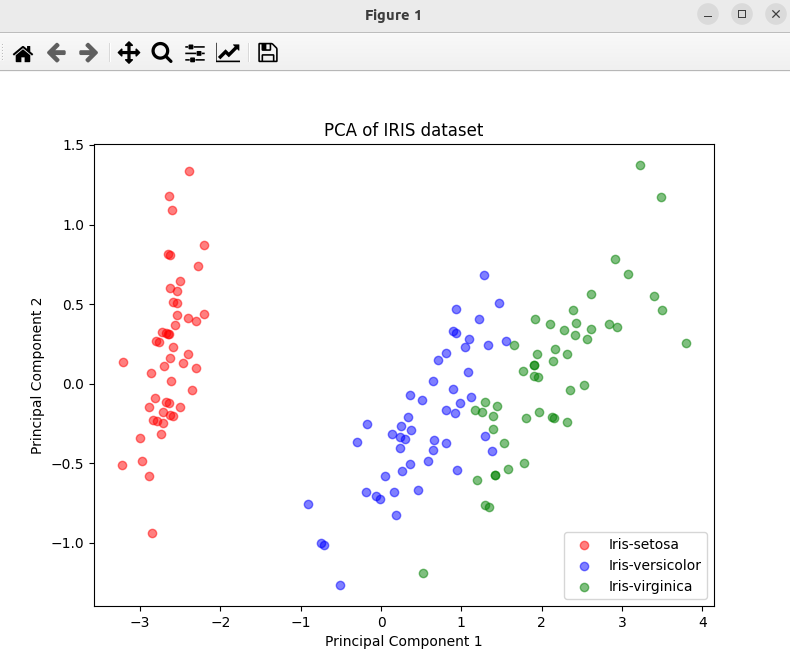

### Result
* Dimnetionality reduction using PCA
* PCA means Principal Component Analysis
* PCA is a technique for reducing the dimentionality of such datasets, increasing interpretability but at the same time minimizing information loss.

