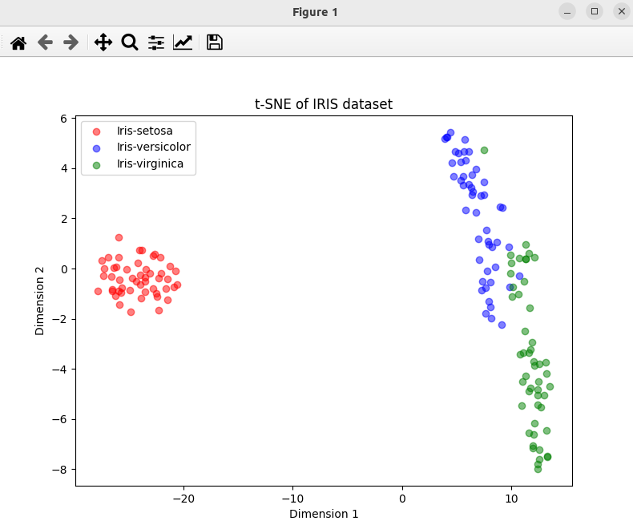

### Result
* Dimensionality reduction
* t-SNE (t-distributed Stochastic Neighbor Embedding)
* T-SNE is good for visualization of high-dimensional data because it preserves the local structure of the data. The local structure is the relationship between the data points that are close to each other in the high-dimensional space.

