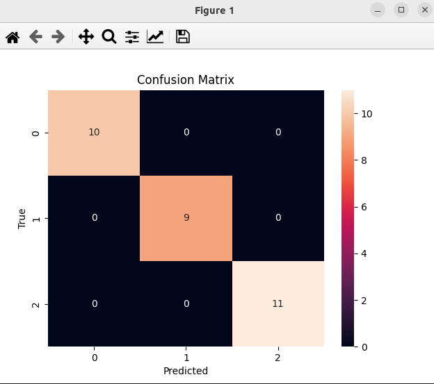

### Result
* Model Selection
* Random Search
* Iris dataset
* Random Search is a technique to find the best hyperparameters for a model.



```
Fitting 5 folds for each of 100 candidates, totalling 500 fits
[CV] END C=2.1738069179804325, gamma=0.8032069841284636, kernel=rbf; total time=   0.0s
[CV] END C=2.1738069179804325, gamma=0.8032069841284636, kernel=rbf; total time=   0.0s
[CV] END C=2.1738069179804325, gamma=0.8032069841284636, kernel=rbf; total time=   0.0s
[CV] END C=2.1738069179804325, gamma=0.8032069841284636, kernel=rbf; total time=   0.0s
[CV] END C=2.1738069179804325, gamma=0.8032069841284636, kernel=rbf; total time=   0.0s
[CV] END C=0.6464274040491489, gamma=0.8566959038581187, kernel=rbf; total time=   0.0s
[CV] END C=0.6464274040491489, gamma=0.8566959038581187, kernel=rbf; total time=   0.0s
[CV] END C=0.6464274040491489, gamma=0.8566959038581187, kernel=rbf; total time=   0.0s
[CV] END C=0.6464274040491489, gamma=0.8566959038581187, kernel=rbf; total time=   0.0s
[CV] END C=0.6464274040491489, gamma=0.8566959038581187, kernel=rbf; total time=   0.0s
[CV] END C=1.4625367636089375, gamma=0.6893788359949881, kernel=rbf; total time=   0.0s
[CV] END C=1.4625367636089375, gamma=0.6893788359949881, kernel=rbf; total time=   0.0s
[CV] END C=1.4625367636089375, gamma=0.6893788359949881, kernel=rbf; total time=   0.0s
[CV] END C=1.4625367636089375, gamma=0.6893788359949881, kernel=rbf; total time=   0.0s
[CV] END C=1.4625367636089375, gamma=0.6893788359949881, kernel=rbf; total time=   0.0s
[CV] END C=2.4200388095194687, gamma=0.7836830921758546, kernel=rbf; total time=   0.0s
[CV] END C=2.4200388095194687, gamma=0.7836830921758546, kernel=rbf; total time=   0.0s
[CV] END C=2.4200388095194687, gamma=0.7836830921758546, kernel=rbf; total time=   0.0s
[CV] END C=2.4200388095194687, gamma=0.7836830921758546, kernel=rbf; total time=   0.0s
[CV] END C=2.4200388095194687, gamma=0.7836830921758546, kernel=rbf; total time=   0.0s
[CV] END C=3.705035011615267, gamma=0.2102825782734984, kernel=rbf; total time=   0.0s
[CV] END C=3.705035011615267, gamma=0.2102825782734984, kernel=rbf; total time=   0.0s
[CV] END C=3.705035011615267, gamma=0.2102825782734984, kernel=rbf; total time=   0.0s
[CV] END C=3.705035011615267, gamma=0.2102825782734984, kernel=rbf; total time=   0.0s
[CV] END C=3.705035011615267, gamma=0.2102825782734984, kernel=rbf; total time=   0.0s
[CV] END C=1.878004261650137, gamma=0.4545297283724584, kernel=rbf; total time=   0.0s
[CV] END C=1.878004261650137, gamma=0.4545297283724584, kernel=rbf; total time=   0.0s
[CV] END C=1.878004261650137, gamma=0.4545297283724584, kernel=rbf; total time=   0.0s
[CV] END C=1.878004261650137, gamma=0.4545297283724584, kernel=rbf; total time=   0.0s
[CV] END C=1.878004261650137, gamma=0.4545297283724584, kernel=rbf; total time=   0.0s
[CV] END C=2.799452221811095, gamma=0.40510729995865424, kernel=rbf; total time=   0.0s
[CV] END C=2.799452221811095, gamma=0.40510729995865424, kernel=rbf; total time=   0.0s
[CV] END C=2.799452221811095, gamma=0.40510729995865424, kernel=rbf; total time=   0.0s
[CV] END C=2.799452221811095, gamma=0.40510729995865424, kernel=rbf; total time=   0.0s
[CV] END C=2.799452221811095, gamma=0.40510729995865424, kernel=rbf; total time=   0.0s
[CV] END C=1.217346390305226, gamma=0.14987249786211532, kernel=rbf; total time=   0.0s
[CV] END C=1.217346390305226, gamma=0.14987249786211532, kernel=rbf; total time=   0.0s
[CV] END C=1.217346390305226, gamma=0.14987249786211532, kernel=rbf; total time=   0.0s
[CV] END C=1.217346390305226, gamma=0.14987249786211532, kernel=rbf; total time=   0.0s
[CV] END C=1.217346390305226, gamma=0.14987249786211532, kernel=rbf; total time=   0.0s
[CV] END C=2.528230199141038, gamma=0.21757503887510665, kernel=rbf; total time=   0.0s
[CV] END C=2.528230199141038, gamma=0.21757503887510665, kernel=rbf; total time=   0.0s
[CV] END C=2.528230199141038, gamma=0.21757503887510665, kernel=rbf; total time=   0.0s
[CV] END C=2.528230199141038, gamma=0.21757503887510665, kernel=rbf; total time=   0.0s
[CV] END C=2.528230199141038, gamma=0.21757503887510665, kernel=rbf; total time=   0.0s
[CV] END C=0.663081118677149, gamma=0.6204549104463728, kernel=rbf; total time=   0.0s
[CV] END C=0.663081118677149, gamma=0.6204549104463728, kernel=rbf; total time=   0.0s
[CV] END C=0.663081118677149, gamma=0.6204549104463728, kernel=rbf; total time=   0.0s
[CV] END C=0.663081118677149, gamma=0.6204549104463728, kernel=rbf; total time=   0.0s
[CV] END C=0.663081118677149, gamma=0.6204549104463728, kernel=rbf; total time=   0.0s
[CV] END C=3.970844813855135, gamma=0.07421260002544161, kernel=rbf; total time=   0.0s
[CV] END C=3.970844813855135, gamma=0.07421260002544161, kernel=rbf; total time=   0.0s
[CV] END C=3.970844813855135, gamma=0.07421260002544161, kernel=rbf; total time=   0.0s
[CV] END C=3.970844813855135, gamma=0.07421260002544161, kernel=rbf; total time=   0.0s
[CV] END C=3.970844813855135, gamma=0.07421260002544161, kernel=rbf; total time=   0.0s
[CV] END C=0.2992490567119499, gamma=0.19831859788462525, kernel=rbf; total time=   0.0s
[CV] END C=0.2992490567119499, gamma=0.19831859788462525, kernel=rbf; total time=   0.0s
[CV] END C=0.2992490567119499, gamma=0.19831859788462525, kernel=rbf; total time=   0.0s
[CV] END C=0.2992490567119499, gamma=0.19831859788462525, kernel=rbf; total time=   0.0s
[CV] END C=0.2992490567119499, gamma=0.19831859788462525, kernel=rbf; total time=   0.0s
[CV] END C=0.6409601957012909, gamma=0.6496962751603734, kernel=rbf; total time=   0.0s
[CV] END C=0.6409601957012909, gamma=0.6496962751603734, kernel=rbf; total time=   0.0s
[CV] END C=0.6409601957012909, gamma=0.6496962751603734, kernel=rbf; total time=   0.0s
[CV] END C=0.6409601957012909, gamma=0.6496962751603734, kernel=rbf; total time=   0.0s
[CV] END C=0.6409601957012909, gamma=0.6496962751603734, kernel=rbf; total time=   0.0s
[CV] END C=1.3298232531110683, gamma=0.5942539534557788, kernel=rbf; total time=   0.0s
[CV] END C=1.3298232531110683, gamma=0.5942539534557788, kernel=rbf; total time=   0.0s
[CV] END C=1.3298232531110683, gamma=0.5942539534557788, kernel=rbf; total time=   0.0s
[CV] END C=1.3298232531110683, gamma=0.5942539534557788, kernel=rbf; total time=   0.0s
[CV] END C=1.3298232531110683, gamma=0.5942539534557788, kernel=rbf; total time=   0.0s
[CV] END C=3.038162771355984, gamma=0.711937052756734, kernel=rbf; total time=   0.0s
[CV] END C=3.038162771355984, gamma=0.711937052756734, kernel=rbf; total time=   0.0s
[CV] END C=3.038162771355984, gamma=0.711937052756734, kernel=rbf; total time=   0.0s
[CV] END C=3.038162771355984, gamma=0.711937052756734, kernel=rbf; total time=   0.0s
[CV] END C=3.038162771355984, gamma=0.711937052756734, kernel=rbf; total time=   0.0s
[CV] END C=0.3561948635468064, gamma=0.6937267499100387, kernel=rbf; total time=   0.0s
[CV] END C=0.3561948635468064, gamma=0.6937267499100387, kernel=rbf; total time=   0.0s
[CV] END C=0.3561948635468064, gamma=0.6937267499100387, kernel=rbf; total time=   0.0s
[CV] END C=0.3561948635468064, gamma=0.6937267499100387, kernel=rbf; total time=   0.0s
[CV] END C=0.3561948635468064, gamma=0.6937267499100387, kernel=rbf; total time=   0.0s
[CV] END C=0.742870836993216, gamma=0.45277357795190243, kernel=rbf; total time=   0.0s
[CV] END C=0.742870836993216, gamma=0.45277357795190243, kernel=rbf; total time=   0.0s
[CV] END C=0.742870836993216, gamma=0.45277357795190243, kernel=rbf; total time=   0.0s
[CV] END C=0.742870836993216, gamma=0.45277357795190243, kernel=rbf; total time=   0.0s
[CV] END C=0.742870836993216, gamma=0.45277357795190243, kernel=rbf; total time=   0.0s
[CV] END C=3.5391522962881385, gamma=0.5806498390041858, kernel=rbf; total time=   0.0s
[CV] END C=3.5391522962881385, gamma=0.5806498390041858, kernel=rbf; total time=   0.0s
[CV] END C=3.5391522962881385, gamma=0.5806498390041858, kernel=rbf; total time=   0.0s
[CV] END C=3.5391522962881385, gamma=0.5806498390041858, kernel=rbf; total time=   0.0s
[CV] END C=3.5391522962881385, gamma=0.5806498390041858, kernel=rbf; total time=   0.0s
[CV] END C=1.1026547323182911, gamma=0.2821519689320827, kernel=rbf; total time=   0.0s
[CV] END C=1.1026547323182911, gamma=0.2821519689320827, kernel=rbf; total time=   0.0s
[CV] END C=1.1026547323182911, gamma=0.2821519689320827, kernel=rbf; total time=   0.0s
[CV] END C=1.1026547323182911, gamma=0.2821519689320827, kernel=rbf; total time=   0.0s
[CV] END C=1.1026547323182911, gamma=0.2821519689320827, kernel=rbf; total time=   0.0s
[CV] END C=3.606294473090921, gamma=0.8399571617489969, kernel=rbf; total time=   0.0s
[CV] END C=3.606294473090921, gamma=0.8399571617489969, kernel=rbf; total time=   0.0s
[CV] END C=3.606294473090921, gamma=0.8399571617489969, kernel=rbf; total time=   0.0s
[CV] END C=3.606294473090921, gamma=0.8399571617489969, kernel=rbf; total time=   0.0s
[CV] END C=3.606294473090921, gamma=0.8399571617489969, kernel=rbf; total time=   0.0s
[CV] END C=1.7961877856000013, gamma=0.014959022026228008, kernel=rbf; total time=   0.0s
[CV] END C=1.7961877856000013, gamma=0.014959022026228008, kernel=rbf; total time=   0.0s
[CV] END C=1.7961877856000013, gamma=0.014959022026228008, kernel=rbf; total time=   0.0s
[CV] END C=1.7961877856000013, gamma=0.014959022026228008, kernel=rbf; total time=   0.0s
[CV] END C=1.7961877856000013, gamma=0.014959022026228008, kernel=rbf; total time=   0.0s
[CV] END C=3.2706551988596826, gamma=0.06168556882181786, kernel=rbf; total time=   0.0s
[CV] END C=3.2706551988596826, gamma=0.06168556882181786, kernel=rbf; total time=   0.0s
[CV] END C=3.2706551988596826, gamma=0.06168556882181786, kernel=rbf; total time=   0.0s
[CV] END C=3.2706551988596826, gamma=0.06168556882181786, kernel=rbf; total time=   0.0s
[CV] END C=3.2706551988596826, gamma=0.06168556882181786, kernel=rbf; total time=   0.0s
[CV] END C=1.624309829115829, gamma=0.13839341986024667, kernel=rbf; total time=   0.0s
[CV] END C=1.624309829115829, gamma=0.13839341986024667, kernel=rbf; total time=   0.0s
[CV] END C=1.624309829115829, gamma=0.13839341986024667, kernel=rbf; total time=   0.0s
[CV] END C=1.624309829115829, gamma=0.13839341986024667, kernel=rbf; total time=   0.0s
[CV] END C=1.624309829115829, gamma=0.13839341986024667, kernel=rbf; total time=   0.0s
[CV] END C=3.979509808462667, gamma=0.06596833797683999, kernel=rbf; total time=   0.0s
[CV] END C=3.979509808462667, gamma=0.06596833797683999, kernel=rbf; total time=   0.0s
[CV] END C=3.979509808462667, gamma=0.06596833797683999, kernel=rbf; total time=   0.0s
[CV] END C=3.979509808462667, gamma=0.06596833797683999, kernel=rbf; total time=   0.0s
[CV] END C=3.979509808462667, gamma=0.06596833797683999, kernel=rbf; total time=   0.0s
[CV] END C=1.815496165931635, gamma=0.1438851986223929, kernel=rbf; total time=   0.0s
[CV] END C=1.815496165931635, gamma=0.1438851986223929, kernel=rbf; total time=   0.0s
[CV] END C=1.815496165931635, gamma=0.1438851986223929, kernel=rbf; total time=   0.0s
[CV] END C=1.815496165931635, gamma=0.1438851986223929, kernel=rbf; total time=   0.0s
[CV] END C=1.815496165931635, gamma=0.1438851986223929, kernel=rbf; total time=   0.0s
[CV] END C=1.6825675377452147, gamma=0.9194354284893371, kernel=rbf; total time=   0.0s
[CV] END C=1.6825675377452147, gamma=0.9194354284893371, kernel=rbf; total time=   0.0s
[CV] END C=1.6825675377452147, gamma=0.9194354284893371, kernel=rbf; total time=   0.0s
[CV] END C=1.6825675377452147, gamma=0.9194354284893371, kernel=rbf; total time=   0.0s
[CV] END C=1.6825675377452147, gamma=0.9194354284893371, kernel=rbf; total time=   0.0s
[CV] END C=0.15861003117854322, gamma=0.8653462195540266, kernel=rbf; total time=   0.0s
[CV] END C=0.15861003117854322, gamma=0.8653462195540266, kernel=rbf; total time=   0.0s
[CV] END C=0.15861003117854322, gamma=0.8653462195540266, kernel=rbf; total time=   0.0s
[CV] END C=0.15861003117854322, gamma=0.8653462195540266, kernel=rbf; total time=   0.0s
[CV] END C=0.15861003117854322, gamma=0.8653462195540266, kernel=rbf; total time=   0.0s
[CV] END C=0.23095346903559522, gamma=0.5423654441557516, kernel=rbf; total time=   0.0s
[CV] END C=0.23095346903559522, gamma=0.5423654441557516, kernel=rbf; total time=   0.0s
[CV] END C=0.23095346903559522, gamma=0.5423654441557516, kernel=rbf; total time=   0.0s
[CV] END C=0.23095346903559522, gamma=0.5423654441557516, kernel=rbf; total time=   0.0s
[CV] END C=0.23095346903559522, gamma=0.5423654441557516, kernel=rbf; total time=   0.0s
[CV] END C=3.5671083677560285, gamma=0.6464827509423615, kernel=rbf; total time=   0.0s
[CV] END C=3.5671083677560285, gamma=0.6464827509423615, kernel=rbf; total time=   0.0s
[CV] END C=3.5671083677560285, gamma=0.6464827509423615, kernel=rbf; total time=   0.0s
[CV] END C=3.5671083677560285, gamma=0.6464827509423615, kernel=rbf; total time=   0.0s
[CV] END C=3.5671083677560285, gamma=0.6464827509423615, kernel=rbf; total time=   0.0s
[CV] END C=0.011883175291488968, gamma=0.3388961238320146, kernel=rbf; total time=   0.0s
[CV] END C=0.011883175291488968, gamma=0.3388961238320146, kernel=rbf; total time=   0.0s
[CV] END C=0.011883175291488968, gamma=0.3388961238320146, kernel=rbf; total time=   0.0s
[CV] END C=0.011883175291488968, gamma=0.3388961238320146, kernel=rbf; total time=   0.0s
[CV] END C=0.011883175291488968, gamma=0.3388961238320146, kernel=rbf; total time=   0.0s
[CV] END C=1.0612296578707467, gamma=0.7826257597419919, kernel=rbf; total time=   0.0s
[CV] END C=1.0612296578707467, gamma=0.7826257597419919, kernel=rbf; total time=   0.0s
[CV] END C=1.0612296578707467, gamma=0.7826257597419919, kernel=rbf; total time=   0.0s
[CV] END C=1.0612296578707467, gamma=0.7826257597419919, kernel=rbf; total time=   0.0s
[CV] END C=1.0612296578707467, gamma=0.7826257597419919, kernel=rbf; total time=   0.0s
[CV] END C=1.1113613074072664, gamma=0.9852904848100706, kernel=rbf; total time=   0.0s
[CV] END C=1.1113613074072664, gamma=0.9852904848100706, kernel=rbf; total time=   0.0s
[CV] END C=1.1113613074072664, gamma=0.9852904848100706, kernel=rbf; total time=   0.0s
[CV] END C=1.1113613074072664, gamma=0.9852904848100706, kernel=rbf; total time=   0.0s
[CV] END C=1.1113613074072664, gamma=0.9852904848100706, kernel=rbf; total time=   0.0s
[CV] END C=3.028492475290673, gamma=0.1562589920279166, kernel=rbf; total time=   0.0s
[CV] END C=3.028492475290673, gamma=0.1562589920279166, kernel=rbf; total time=   0.0s
[CV] END C=3.028492475290673, gamma=0.1562589920279166, kernel=rbf; total time=   0.0s
[CV] END C=3.028492475290673, gamma=0.1562589920279166, kernel=rbf; total time=   0.0s
[CV] END C=3.028492475290673, gamma=0.1562589920279166, kernel=rbf; total time=   0.0s
[CV] END C=0.041814285500257675, gamma=0.004120164475075239, kernel=rbf; total time=   0.0s
[CV] END C=0.041814285500257675, gamma=0.004120164475075239, kernel=rbf; total time=   0.0s
[CV] END C=0.041814285500257675, gamma=0.004120164475075239, kernel=rbf; total time=   0.0s
[CV] END C=0.041814285500257675, gamma=0.004120164475075239, kernel=rbf; total time=   0.0s
[CV] END C=0.041814285500257675, gamma=0.004120164475075239, kernel=rbf; total time=   0.0s
[CV] END C=3.482961130586373, gamma=0.6945506163013306, kernel=rbf; total time=   0.0s
[CV] END C=3.482961130586373, gamma=0.6945506163013306, kernel=rbf; total time=   0.0s
[CV] END C=3.482961130586373, gamma=0.6945506163013306, kernel=rbf; total time=   0.0s
[CV] END C=3.482961130586373, gamma=0.6945506163013306, kernel=rbf; total time=   0.0s
[CV] END C=3.482961130586373, gamma=0.6945506163013306, kernel=rbf; total time=   0.0s
[CV] END C=3.6756984147831493, gamma=0.15778404508436372, kernel=rbf; total time=   0.0s
[CV] END C=3.6756984147831493, gamma=0.15778404508436372, kernel=rbf; total time=   0.0s
[CV] END C=3.6756984147831493, gamma=0.15778404508436372, kernel=rbf; total time=   0.0s
[CV] END C=3.6756984147831493, gamma=0.15778404508436372, kernel=rbf; total time=   0.0s
[CV] END C=3.6756984147831493, gamma=0.15778404508436372, kernel=rbf; total time=   0.0s
[CV] END C=2.9003726441873567, gamma=0.20250468252983145, kernel=rbf; total time=   0.0s
[CV] END C=2.9003726441873567, gamma=0.20250468252983145, kernel=rbf; total time=   0.0s
[CV] END C=2.9003726441873567, gamma=0.20250468252983145, kernel=rbf; total time=   0.0s
[CV] END C=2.9003726441873567, gamma=0.20250468252983145, kernel=rbf; total time=   0.0s
[CV] END C=2.9003726441873567, gamma=0.20250468252983145, kernel=rbf; total time=   0.0s
[CV] END C=1.0238180465664506, gamma=0.6475364342792163, kernel=rbf; total time=   0.0s
[CV] END C=1.0238180465664506, gamma=0.6475364342792163, kernel=rbf; total time=   0.0s
[CV] END C=1.0238180465664506, gamma=0.6475364342792163, kernel=rbf; total time=   0.0s
[CV] END C=1.0238180465664506, gamma=0.6475364342792163, kernel=rbf; total time=   0.0s
[CV] END C=1.0238180465664506, gamma=0.6475364342792163, kernel=rbf; total time=   0.0s
[CV] END C=0.711628430099156, gamma=0.31140031379119526, kernel=rbf; total time=   0.0s
[CV] END C=0.711628430099156, gamma=0.31140031379119526, kernel=rbf; total time=   0.0s
[CV] END C=0.711628430099156, gamma=0.31140031379119526, kernel=rbf; total time=   0.0s
[CV] END C=0.711628430099156, gamma=0.31140031379119526, kernel=rbf; total time=   0.0s
[CV] END C=0.711628430099156, gamma=0.31140031379119526, kernel=rbf; total time=   0.0s
[CV] END C=1.6410723086447794, gamma=0.0879125575037909, kernel=rbf; total time=   0.0s
[CV] END C=1.6410723086447794, gamma=0.0879125575037909, kernel=rbf; total time=   0.0s
[CV] END C=1.6410723086447794, gamma=0.0879125575037909, kernel=rbf; total time=   0.0s
[CV] END C=1.6410723086447794, gamma=0.0879125575037909, kernel=rbf; total time=   0.0s
[CV] END C=1.6410723086447794, gamma=0.0879125575037909, kernel=rbf; total time=   0.0s
[CV] END C=3.232385593102728, gamma=0.762949443965368, kernel=rbf; total time=   0.0s
[CV] END C=3.232385593102728, gamma=0.762949443965368, kernel=rbf; total time=   0.0s
[CV] END C=3.232385593102728, gamma=0.762949443965368, kernel=rbf; total time=   0.0s
[CV] END C=3.232385593102728, gamma=0.762949443965368, kernel=rbf; total time=   0.0s
[CV] END C=3.232385593102728, gamma=0.762949443965368, kernel=rbf; total time=   0.0s
[CV] END C=3.2455966929070454, gamma=0.503556847185564, kernel=rbf; total time=   0.0s
[CV] END C=3.2455966929070454, gamma=0.503556847185564, kernel=rbf; total time=   0.0s
[CV] END C=3.2455966929070454, gamma=0.503556847185564, kernel=rbf; total time=   0.0s
[CV] END C=3.2455966929070454, gamma=0.503556847185564, kernel=rbf; total time=   0.0s
[CV] END C=3.2455966929070454, gamma=0.503556847185564, kernel=rbf; total time=   0.0s
[CV] END C=3.8429128716145167, gamma=0.3388778483163801, kernel=rbf; total time=   0.0s
[CV] END C=3.8429128716145167, gamma=0.3388778483163801, kernel=rbf; total time=   0.0s
[CV] END C=3.8429128716145167, gamma=0.3388778483163801, kernel=rbf; total time=   0.0s
[CV] END C=3.8429128716145167, gamma=0.3388778483163801, kernel=rbf; total time=   0.0s
[CV] END C=3.8429128716145167, gamma=0.3388778483163801, kernel=rbf; total time=   0.0s
[CV] END C=0.3063378793127485, gamma=0.0063773866363368015, kernel=rbf; total time=   0.0s
[CV] END C=0.3063378793127485, gamma=0.0063773866363368015, kernel=rbf; total time=   0.0s
[CV] END C=0.3063378793127485, gamma=0.0063773866363368015, kernel=rbf; total time=   0.0s
[CV] END C=0.3063378793127485, gamma=0.0063773866363368015, kernel=rbf; total time=   0.0s
[CV] END C=0.3063378793127485, gamma=0.0063773866363368015, kernel=rbf; total time=   0.0s
[CV] END C=3.83969325415175, gamma=0.15977268824030488, kernel=rbf; total time=   0.0s
[CV] END C=3.83969325415175, gamma=0.15977268824030488, kernel=rbf; total time=   0.0s
[CV] END C=3.83969325415175, gamma=0.15977268824030488, kernel=rbf; total time=   0.0s
[CV] END C=3.83969325415175, gamma=0.15977268824030488, kernel=rbf; total time=   0.0s
[CV] END C=3.83969325415175, gamma=0.15977268824030488, kernel=rbf; total time=   0.0s
[CV] END C=1.9569769544730224, gamma=0.4947975395288745, kernel=rbf; total time=   0.0s
[CV] END C=1.9569769544730224, gamma=0.4947975395288745, kernel=rbf; total time=   0.0s
[CV] END C=1.9569769544730224, gamma=0.4947975395288745, kernel=rbf; total time=   0.0s
[CV] END C=1.9569769544730224, gamma=0.4947975395288745, kernel=rbf; total time=   0.0s
[CV] END C=1.9569769544730224, gamma=0.4947975395288745, kernel=rbf; total time=   0.0s
[CV] END C=2.256854313514979, gamma=0.8476562964358373, kernel=rbf; total time=   0.0s
[CV] END C=2.256854313514979, gamma=0.8476562964358373, kernel=rbf; total time=   0.0s
[CV] END C=2.256854313514979, gamma=0.8476562964358373, kernel=rbf; total time=   0.0s
[CV] END C=2.256854313514979, gamma=0.8476562964358373, kernel=rbf; total time=   0.0s
[CV] END C=2.256854313514979, gamma=0.8476562964358373, kernel=rbf; total time=   0.0s
[CV] END C=0.3234614244631109, gamma=0.8589026766986366, kernel=rbf; total time=   0.0s
[CV] END C=0.3234614244631109, gamma=0.8589026766986366, kernel=rbf; total time=   0.0s
[CV] END C=0.3234614244631109, gamma=0.8589026766986366, kernel=rbf; total time=   0.0s
[CV] END C=0.3234614244631109, gamma=0.8589026766986366, kernel=rbf; total time=   0.0s
[CV] END C=0.3234614244631109, gamma=0.8589026766986366, kernel=rbf; total time=   0.0s
[CV] END C=0.2875494334978277, gamma=0.6007247796375738, kernel=rbf; total time=   0.0s
[CV] END C=0.2875494334978277, gamma=0.6007247796375738, kernel=rbf; total time=   0.0s
[CV] END C=0.2875494334978277, gamma=0.6007247796375738, kernel=rbf; total time=   0.0s
[CV] END C=0.2875494334978277, gamma=0.6007247796375738, kernel=rbf; total time=   0.0s
[CV] END C=0.2875494334978277, gamma=0.6007247796375738, kernel=rbf; total time=   0.0s
[CV] END C=1.5717860859164166, gamma=0.4649610677496365, kernel=rbf; total time=   0.0s
[CV] END C=1.5717860859164166, gamma=0.4649610677496365, kernel=rbf; total time=   0.0s
[CV] END C=1.5717860859164166, gamma=0.4649610677496365, kernel=rbf; total time=   0.0s
[CV] END C=1.5717860859164166, gamma=0.4649610677496365, kernel=rbf; total time=   0.0s
[CV] END C=1.5717860859164166, gamma=0.4649610677496365, kernel=rbf; total time=   0.0s
[CV] END C=2.20081767508621, gamma=0.31095674410148777, kernel=rbf; total time=   0.0s
[CV] END C=2.20081767508621, gamma=0.31095674410148777, kernel=rbf; total time=   0.0s
[CV] END C=2.20081767508621, gamma=0.31095674410148777, kernel=rbf; total time=   0.0s
[CV] END C=2.20081767508621, gamma=0.31095674410148777, kernel=rbf; total time=   0.0s
[CV] END C=2.20081767508621, gamma=0.31095674410148777, kernel=rbf; total time=   0.0s
[CV] END C=2.9597490023672433, gamma=0.21601878266776842, kernel=rbf; total time=   0.0s
[CV] END C=2.9597490023672433, gamma=0.21601878266776842, kernel=rbf; total time=   0.0s
[CV] END C=2.9597490023672433, gamma=0.21601878266776842, kernel=rbf; total time=   0.0s
[CV] END C=2.9597490023672433, gamma=0.21601878266776842, kernel=rbf; total time=   0.0s
[CV] END C=2.9597490023672433, gamma=0.21601878266776842, kernel=rbf; total time=   0.0s
[CV] END C=1.6037763124922675, gamma=0.4560811202480175, kernel=rbf; total time=   0.0s
[CV] END C=1.6037763124922675, gamma=0.4560811202480175, kernel=rbf; total time=   0.0s
[CV] END C=1.6037763124922675, gamma=0.4560811202480175, kernel=rbf; total time=   0.0s
[CV] END C=1.6037763124922675, gamma=0.4560811202480175, kernel=rbf; total time=   0.0s
[CV] END C=1.6037763124922675, gamma=0.4560811202480175, kernel=rbf; total time=   0.0s
[CV] END C=3.9937944892927653, gamma=0.8632943949868755, kernel=rbf; total time=   0.0s
[CV] END C=3.9937944892927653, gamma=0.8632943949868755, kernel=rbf; total time=   0.0s
[CV] END C=3.9937944892927653, gamma=0.8632943949868755, kernel=rbf; total time=   0.0s
[CV] END C=3.9937944892927653, gamma=0.8632943949868755, kernel=rbf; total time=   0.0s
[CV] END C=3.9937944892927653, gamma=0.8632943949868755, kernel=rbf; total time=   0.0s
[CV] END C=1.4723882965778947, gamma=0.581930394390727, kernel=rbf; total time=   0.0s
[CV] END C=1.4723882965778947, gamma=0.581930394390727, kernel=rbf; total time=   0.0s
[CV] END C=1.4723882965778947, gamma=0.581930394390727, kernel=rbf; total time=   0.0s
[CV] END C=1.4723882965778947, gamma=0.581930394390727, kernel=rbf; total time=   0.0s
[CV] END C=1.4723882965778947, gamma=0.581930394390727, kernel=rbf; total time=   0.0s
[CV] END C=1.3654496893604406, gamma=0.9862846890268663, kernel=rbf; total time=   0.0s
[CV] END C=1.3654496893604406, gamma=0.9862846890268663, kernel=rbf; total time=   0.0s
[CV] END C=1.3654496893604406, gamma=0.9862846890268663, kernel=rbf; total time=   0.0s
[CV] END C=1.3654496893604406, gamma=0.9862846890268663, kernel=rbf; total time=   0.0s
[CV] END C=1.3654496893604406, gamma=0.9862846890268663, kernel=rbf; total time=   0.0s
[CV] END C=0.5141618015351472, gamma=0.5396567344932406, kernel=rbf; total time=   0.0s
[CV] END C=0.5141618015351472, gamma=0.5396567344932406, kernel=rbf; total time=   0.0s
[CV] END C=0.5141618015351472, gamma=0.5396567344932406, kernel=rbf; total time=   0.0s
[CV] END C=0.5141618015351472, gamma=0.5396567344932406, kernel=rbf; total time=   0.0s
[CV] END C=0.5141618015351472, gamma=0.5396567344932406, kernel=rbf; total time=   0.0s
[CV] END C=3.8176939242345003, gamma=0.6007479921405843, kernel=rbf; total time=   0.0s
[CV] END C=3.8176939242345003, gamma=0.6007479921405843, kernel=rbf; total time=   0.0s
[CV] END C=3.8176939242345003, gamma=0.6007479921405843, kernel=rbf; total time=   0.0s
[CV] END C=3.8176939242345003, gamma=0.6007479921405843, kernel=rbf; total time=   0.0s
[CV] END C=3.8176939242345003, gamma=0.6007479921405843, kernel=rbf; total time=   0.0s
[CV] END C=3.080305320810917, gamma=0.024402967728171077, kernel=rbf; total time=   0.0s
[CV] END C=3.080305320810917, gamma=0.024402967728171077, kernel=rbf; total time=   0.0s
[CV] END C=3.080305320810917, gamma=0.024402967728171077, kernel=rbf; total time=   0.0s
[CV] END C=3.080305320810917, gamma=0.024402967728171077, kernel=rbf; total time=   0.0s
[CV] END C=3.080305320810917, gamma=0.024402967728171077, kernel=rbf; total time=   0.0s
[CV] END C=1.1851898008041886, gamma=0.8732411987035398, kernel=rbf; total time=   0.0s
[CV] END C=1.1851898008041886, gamma=0.8732411987035398, kernel=rbf; total time=   0.0s
[CV] END C=1.1851898008041886, gamma=0.8732411987035398, kernel=rbf; total time=   0.0s
[CV] END C=1.1851898008041886, gamma=0.8732411987035398, kernel=rbf; total time=   0.0s
[CV] END C=1.1851898008041886, gamma=0.8732411987035398, kernel=rbf; total time=   0.0s
[CV] END C=1.32420593721992, gamma=0.607049574259875, kernel=rbf; total time=   0.0s
[CV] END C=1.32420593721992, gamma=0.607049574259875, kernel=rbf; total time=   0.0s
[CV] END C=1.32420593721992, gamma=0.607049574259875, kernel=rbf; total time=   0.0s
[CV] END C=1.32420593721992, gamma=0.607049574259875, kernel=rbf; total time=   0.0s
[CV] END C=1.32420593721992, gamma=0.607049574259875, kernel=rbf; total time=   0.0s
[CV] END C=1.187495744495609, gamma=0.8413962792530215, kernel=rbf; total time=   0.0s
[CV] END C=1.187495744495609, gamma=0.8413962792530215, kernel=rbf; total time=   0.0s
[CV] END C=1.187495744495609, gamma=0.8413962792530215, kernel=rbf; total time=   0.0s
[CV] END C=1.187495744495609, gamma=0.8413962792530215, kernel=rbf; total time=   0.0s
[CV] END C=1.187495744495609, gamma=0.8413962792530215, kernel=rbf; total time=   0.0s
[CV] END C=3.588313734382616, gamma=0.6503667560540431, kernel=rbf; total time=   0.0s
[CV] END C=3.588313734382616, gamma=0.6503667560540431, kernel=rbf; total time=   0.0s
[CV] END C=3.588313734382616, gamma=0.6503667560540431, kernel=rbf; total time=   0.0s
[CV] END C=3.588313734382616, gamma=0.6503667560540431, kernel=rbf; total time=   0.0s
[CV] END C=3.588313734382616, gamma=0.6503667560540431, kernel=rbf; total time=   0.0s
[CV] END C=1.8298429409192507, gamma=0.5314754665232148, kernel=rbf; total time=   0.0s
[CV] END C=1.8298429409192507, gamma=0.5314754665232148, kernel=rbf; total time=   0.0s
[CV] END C=1.8298429409192507, gamma=0.5314754665232148, kernel=rbf; total time=   0.0s
[CV] END C=1.8298429409192507, gamma=0.5314754665232148, kernel=rbf; total time=   0.0s
[CV] END C=1.8298429409192507, gamma=0.5314754665232148, kernel=rbf; total time=   0.0s
[CV] END C=0.8948198561918517, gamma=0.9918141230498618, kernel=rbf; total time=   0.0s
[CV] END C=0.8948198561918517, gamma=0.9918141230498618, kernel=rbf; total time=   0.0s
[CV] END C=0.8948198561918517, gamma=0.9918141230498618, kernel=rbf; total time=   0.0s
[CV] END C=0.8948198561918517, gamma=0.9918141230498618, kernel=rbf; total time=   0.0s
[CV] END C=0.8948198561918517, gamma=0.9918141230498618, kernel=rbf; total time=   0.0s
[CV] END C=0.6999539125101455, gamma=0.7488528446543717, kernel=rbf; total time=   0.0s
[CV] END C=0.6999539125101455, gamma=0.7488528446543717, kernel=rbf; total time=   0.0s
[CV] END C=0.6999539125101455, gamma=0.7488528446543717, kernel=rbf; total time=   0.0s
[CV] END C=0.6999539125101455, gamma=0.7488528446543717, kernel=rbf; total time=   0.0s
[CV] END C=0.6999539125101455, gamma=0.7488528446543717, kernel=rbf; total time=   0.0s
[CV] END C=1.2147188957972053, gamma=0.4746776590104884, kernel=rbf; total time=   0.0s
[CV] END C=1.2147188957972053, gamma=0.4746776590104884, kernel=rbf; total time=   0.0s
[CV] END C=1.2147188957972053, gamma=0.4746776590104884, kernel=rbf; total time=   0.0s
[CV] END C=1.2147188957972053, gamma=0.4746776590104884, kernel=rbf; total time=   0.0s
[CV] END C=1.2147188957972053, gamma=0.4746776590104884, kernel=rbf; total time=   0.0s
[CV] END C=3.061689870128244, gamma=0.5187625129845671, kernel=rbf; total time=   0.0s
[CV] END C=3.061689870128244, gamma=0.5187625129845671, kernel=rbf; total time=   0.0s
[CV] END C=3.061689870128244, gamma=0.5187625129845671, kernel=rbf; total time=   0.0s
[CV] END C=3.061689870128244, gamma=0.5187625129845671, kernel=rbf; total time=   0.0s
[CV] END C=3.061689870128244, gamma=0.5187625129845671, kernel=rbf; total time=   0.0s
[CV] END C=2.5375423244192947, gamma=0.4807955594043025, kernel=rbf; total time=   0.0s
[CV] END C=2.5375423244192947, gamma=0.4807955594043025, kernel=rbf; total time=   0.0s
[CV] END C=2.5375423244192947, gamma=0.4807955594043025, kernel=rbf; total time=   0.0s
[CV] END C=2.5375423244192947, gamma=0.4807955594043025, kernel=rbf; total time=   0.0s
[CV] END C=2.5375423244192947, gamma=0.4807955594043025, kernel=rbf; total time=   0.0s
[CV] END C=2.633469170466898, gamma=0.37243773491311616, kernel=rbf; total time=   0.0s
[CV] END C=2.633469170466898, gamma=0.37243773491311616, kernel=rbf; total time=   0.0s
[CV] END C=2.633469170466898, gamma=0.37243773491311616, kernel=rbf; total time=   0.0s
[CV] END C=2.633469170466898, gamma=0.37243773491311616, kernel=rbf; total time=   0.0s
[CV] END C=2.633469170466898, gamma=0.37243773491311616, kernel=rbf; total time=   0.0s
[CV] END C=1.492979705809172, gamma=0.0933492888576658, kernel=rbf; total time=   0.0s
[CV] END C=1.492979705809172, gamma=0.0933492888576658, kernel=rbf; total time=   0.0s
[CV] END C=1.492979705809172, gamma=0.0933492888576658, kernel=rbf; total time=   0.0s
[CV] END C=1.492979705809172, gamma=0.0933492888576658, kernel=rbf; total time=   0.0s
[CV] END C=1.492979705809172, gamma=0.0933492888576658, kernel=rbf; total time=   0.0s
[CV] END C=2.2797393328010487, gamma=0.40437447220311284, kernel=rbf; total time=   0.0s
[CV] END C=2.2797393328010487, gamma=0.40437447220311284, kernel=rbf; total time=   0.0s
[CV] END C=2.2797393328010487, gamma=0.40437447220311284, kernel=rbf; total time=   0.0s
[CV] END C=2.2797393328010487, gamma=0.40437447220311284, kernel=rbf; total time=   0.0s
[CV] END C=2.2797393328010487, gamma=0.40437447220311284, kernel=rbf; total time=   0.0s
[CV] END C=3.386323822005979, gamma=0.4409144497528187, kernel=rbf; total time=   0.0s
[CV] END C=3.386323822005979, gamma=0.4409144497528187, kernel=rbf; total time=   0.0s
[CV] END C=3.386323822005979, gamma=0.4409144497528187, kernel=rbf; total time=   0.0s
[CV] END C=3.386323822005979, gamma=0.4409144497528187, kernel=rbf; total time=   0.0s
[CV] END C=3.386323822005979, gamma=0.4409144497528187, kernel=rbf; total time=   0.0s
[CV] END C=1.1341166764207427, gamma=0.4030975355385179, kernel=rbf; total time=   0.0s
[CV] END C=1.1341166764207427, gamma=0.4030975355385179, kernel=rbf; total time=   0.0s
[CV] END C=1.1341166764207427, gamma=0.4030975355385179, kernel=rbf; total time=   0.0s
[CV] END C=1.1341166764207427, gamma=0.4030975355385179, kernel=rbf; total time=   0.0s
[CV] END C=1.1341166764207427, gamma=0.4030975355385179, kernel=rbf; total time=   0.0s
[CV] END C=3.2775103724199623, gamma=0.9306632422851621, kernel=rbf; total time=   0.0s
[CV] END C=3.2775103724199623, gamma=0.9306632422851621, kernel=rbf; total time=   0.0s
[CV] END C=3.2775103724199623, gamma=0.9306632422851621, kernel=rbf; total time=   0.0s
[CV] END C=3.2775103724199623, gamma=0.9306632422851621, kernel=rbf; total time=   0.0s
[CV] END C=3.2775103724199623, gamma=0.9306632422851621, kernel=rbf; total time=   0.0s
[CV] END C=0.26313084623381533, gamma=0.13859825009425752, kernel=rbf; total time=   0.0s
[CV] END C=0.26313084623381533, gamma=0.13859825009425752, kernel=rbf; total time=   0.0s
[CV] END C=0.26313084623381533, gamma=0.13859825009425752, kernel=rbf; total time=   0.0s
[CV] END C=0.26313084623381533, gamma=0.13859825009425752, kernel=rbf; total time=   0.0s
[CV] END C=0.26313084623381533, gamma=0.13859825009425752, kernel=rbf; total time=   0.0s
[CV] END C=3.0234833190933705, gamma=0.17188514538540833, kernel=rbf; total time=   0.0s
[CV] END C=3.0234833190933705, gamma=0.17188514538540833, kernel=rbf; total time=   0.0s
[CV] END C=3.0234833190933705, gamma=0.17188514538540833, kernel=rbf; total time=   0.0s
[CV] END C=3.0234833190933705, gamma=0.17188514538540833, kernel=rbf; total time=   0.0s
[CV] END C=3.0234833190933705, gamma=0.17188514538540833, kernel=rbf; total time=   0.0s
[CV] END C=2.1945710873507682, gamma=0.018150853959463253, kernel=rbf; total time=   0.0s
[CV] END C=2.1945710873507682, gamma=0.018150853959463253, kernel=rbf; total time=   0.0s
[CV] END C=2.1945710873507682, gamma=0.018150853959463253, kernel=rbf; total time=   0.0s
[CV] END C=2.1945710873507682, gamma=0.018150853959463253, kernel=rbf; total time=   0.0s
[CV] END C=2.1945710873507682, gamma=0.018150853959463253, kernel=rbf; total time=   0.0s
[CV] END C=2.7011148145723123, gamma=0.18592227553822893, kernel=rbf; total time=   0.0s
[CV] END C=2.7011148145723123, gamma=0.18592227553822893, kernel=rbf; total time=   0.0s
[CV] END C=2.7011148145723123, gamma=0.18592227553822893, kernel=rbf; total time=   0.0s
[CV] END C=2.7011148145723123, gamma=0.18592227553822893, kernel=rbf; total time=   0.0s
[CV] END C=2.7011148145723123, gamma=0.18592227553822893, kernel=rbf; total time=   0.0s
[CV] END C=0.13129181995642458, gamma=0.631252354389722, kernel=rbf; total time=   0.0s
[CV] END C=0.13129181995642458, gamma=0.631252354389722, kernel=rbf; total time=   0.0s
[CV] END C=0.13129181995642458, gamma=0.631252354389722, kernel=rbf; total time=   0.0s
[CV] END C=0.13129181995642458, gamma=0.631252354389722, kernel=rbf; total time=   0.0s
[CV] END C=0.13129181995642458, gamma=0.631252354389722, kernel=rbf; total time=   0.0s
[CV] END C=1.5851030810590858, gamma=0.6868939500697028, kernel=rbf; total time=   0.0s
[CV] END C=1.5851030810590858, gamma=0.6868939500697028, kernel=rbf; total time=   0.0s
[CV] END C=1.5851030810590858, gamma=0.6868939500697028, kernel=rbf; total time=   0.0s
[CV] END C=1.5851030810590858, gamma=0.6868939500697028, kernel=rbf; total time=   0.0s
[CV] END C=1.5851030810590858, gamma=0.6868939500697028, kernel=rbf; total time=   0.0s
[CV] END C=2.6157122148379632, gamma=0.34964661955379406, kernel=rbf; total time=   0.0s
[CV] END C=2.6157122148379632, gamma=0.34964661955379406, kernel=rbf; total time=   0.0s
[CV] END C=2.6157122148379632, gamma=0.34964661955379406, kernel=rbf; total time=   0.0s
[CV] END C=2.6157122148379632, gamma=0.34964661955379406, kernel=rbf; total time=   0.0s
[CV] END C=2.6157122148379632, gamma=0.34964661955379406, kernel=rbf; total time=   0.0s
[CV] END C=1.6045643611403921, gamma=0.43356517727559407, kernel=rbf; total time=   0.0s
[CV] END C=1.6045643611403921, gamma=0.43356517727559407, kernel=rbf; total time=   0.0s
[CV] END C=1.6045643611403921, gamma=0.43356517727559407, kernel=rbf; total time=   0.0s
[CV] END C=1.6045643611403921, gamma=0.43356517727559407, kernel=rbf; total time=   0.0s
[CV] END C=1.6045643611403921, gamma=0.43356517727559407, kernel=rbf; total time=   0.0s
[CV] END C=2.8690617135999705, gamma=0.6917862653366915, kernel=rbf; total time=   0.0s
[CV] END C=2.8690617135999705, gamma=0.6917862653366915, kernel=rbf; total time=   0.0s
[CV] END C=2.8690617135999705, gamma=0.6917862653366915, kernel=rbf; total time=   0.0s
[CV] END C=2.8690617135999705, gamma=0.6917862653366915, kernel=rbf; total time=   0.0s
[CV] END C=2.8690617135999705, gamma=0.6917862653366915, kernel=rbf; total time=   0.0s
[CV] END C=1.8169058651554626, gamma=0.5060511616452826, kernel=rbf; total time=   0.0s
[CV] END C=1.8169058651554626, gamma=0.5060511616452826, kernel=rbf; total time=   0.0s
[CV] END C=1.8169058651554626, gamma=0.5060511616452826, kernel=rbf; total time=   0.0s
[CV] END C=1.8169058651554626, gamma=0.5060511616452826, kernel=rbf; total time=   0.0s
[CV] END C=1.8169058651554626, gamma=0.5060511616452826, kernel=rbf; total time=   0.0s
[CV] END C=2.86361279593556, gamma=0.6518646621397969, kernel=rbf; total time=   0.0s
[CV] END C=2.86361279593556, gamma=0.6518646621397969, kernel=rbf; total time=   0.0s
[CV] END C=2.86361279593556, gamma=0.6518646621397969, kernel=rbf; total time=   0.0s
[CV] END C=2.86361279593556, gamma=0.6518646621397969, kernel=rbf; total time=   0.0s
[CV] END C=2.86361279593556, gamma=0.6518646621397969, kernel=rbf; total time=   0.0s
[CV] END C=0.05211030154173768, gamma=0.2723228797580176, kernel=rbf; total time=   0.0s
[CV] END C=0.05211030154173768, gamma=0.2723228797580176, kernel=rbf; total time=   0.0s
[CV] END C=0.05211030154173768, gamma=0.2723228797580176, kernel=rbf; total time=   0.0s
[CV] END C=0.05211030154173768, gamma=0.2723228797580176, kernel=rbf; total time=   0.0s
[CV] END C=0.05211030154173768, gamma=0.2723228797580176, kernel=rbf; total time=   0.0s
[CV] END C=1.821234242164485, gamma=0.11866794393658942, kernel=rbf; total time=   0.0s
[CV] END C=1.821234242164485, gamma=0.11866794393658942, kernel=rbf; total time=   0.0s
[CV] END C=1.821234242164485, gamma=0.11866794393658942, kernel=rbf; total time=   0.0s
[CV] END C=1.821234242164485, gamma=0.11866794393658942, kernel=rbf; total time=   0.0s
[CV] END C=1.821234242164485, gamma=0.11866794393658942, kernel=rbf; total time=   0.0s
[CV] END C=2.6508257071508723, gamma=0.4396245197065055, kernel=rbf; total time=   0.0s
[CV] END C=2.6508257071508723, gamma=0.4396245197065055, kernel=rbf; total time=   0.0s
[CV] END C=2.6508257071508723, gamma=0.4396245197065055, kernel=rbf; total time=   0.0s
[CV] END C=2.6508257071508723, gamma=0.4396245197065055, kernel=rbf; total time=   0.0s
[CV] END C=2.6508257071508723, gamma=0.4396245197065055, kernel=rbf; total time=   0.0s
[CV] END C=3.904056944671543, gamma=0.9735796621219159, kernel=rbf; total time=   0.0s
[CV] END C=3.904056944671543, gamma=0.9735796621219159, kernel=rbf; total time=   0.0s
[CV] END C=3.904056944671543, gamma=0.9735796621219159, kernel=rbf; total time=   0.0s
[CV] END C=3.904056944671543, gamma=0.9735796621219159, kernel=rbf; total time=   0.0s
[CV] END C=3.904056944671543, gamma=0.9735796621219159, kernel=rbf; total time=   0.0s
[CV] END C=3.1939745815913927, gamma=0.03827999592675857, kernel=rbf; total time=   0.0s
[CV] END C=3.1939745815913927, gamma=0.03827999592675857, kernel=rbf; total time=   0.0s
[CV] END C=3.1939745815913927, gamma=0.03827999592675857, kernel=rbf; total time=   0.0s
[CV] END C=3.1939745815913927, gamma=0.03827999592675857, kernel=rbf; total time=   0.0s
[CV] END C=3.1939745815913927, gamma=0.03827999592675857, kernel=rbf; total time=   0.0s
[CV] END C=1.9790107167618451, gamma=0.7422610400299295, kernel=rbf; total time=   0.0s
[CV] END C=1.9790107167618451, gamma=0.7422610400299295, kernel=rbf; total time=   0.0s
[CV] END C=1.9790107167618451, gamma=0.7422610400299295, kernel=rbf; total time=   0.0s
[CV] END C=1.9790107167618451, gamma=0.7422610400299295, kernel=rbf; total time=   0.0s
[CV] END C=1.9790107167618451, gamma=0.7422610400299295, kernel=rbf; total time=   0.0s
[CV] END C=1.8833755238403502, gamma=0.6137750594638068, kernel=rbf; total time=   0.0s
[CV] END C=1.8833755238403502, gamma=0.6137750594638068, kernel=rbf; total time=   0.0s
[CV] END C=1.8833755238403502, gamma=0.6137750594638068, kernel=rbf; total time=   0.0s
[CV] END C=1.8833755238403502, gamma=0.6137750594638068, kernel=rbf; total time=   0.0s
[CV] END C=1.8833755238403502, gamma=0.6137750594638068, kernel=rbf; total time=   0.0s
[CV] END C=3.7788674268313494, gamma=0.09634223269746367, kernel=rbf; total time=   0.0s
[CV] END C=3.7788674268313494, gamma=0.09634223269746367, kernel=rbf; total time=   0.0s
[CV] END C=3.7788674268313494, gamma=0.09634223269746367, kernel=rbf; total time=   0.0s
[CV] END C=3.7788674268313494, gamma=0.09634223269746367, kernel=rbf; total time=   0.0s
[CV] END C=3.7788674268313494, gamma=0.09634223269746367, kernel=rbf; total time=   0.0s
[CV] END C=0.7723094211109243, gamma=0.1394912979378039, kernel=rbf; total time=   0.0s
[CV] END C=0.7723094211109243, gamma=0.1394912979378039, kernel=rbf; total time=   0.0s
[CV] END C=0.7723094211109243, gamma=0.1394912979378039, kernel=rbf; total time=   0.0s
[CV] END C=0.7723094211109243, gamma=0.1394912979378039, kernel=rbf; total time=   0.0s
[CV] END C=0.7723094211109243, gamma=0.1394912979378039, kernel=rbf; total time=   0.0s
[CV] END C=1.4196882029231142, gamma=0.701466760468186, kernel=rbf; total time=   0.0s
[CV] END C=1.4196882029231142, gamma=0.701466760468186, kernel=rbf; total time=   0.0s
[CV] END C=1.4196882029231142, gamma=0.701466760468186, kernel=rbf; total time=   0.0s
[CV] END C=1.4196882029231142, gamma=0.701466760468186, kernel=rbf; total time=   0.0s
[CV] END C=1.4196882029231142, gamma=0.701466760468186, kernel=rbf; total time=   0.0s
[CV] END C=0.7775043962832275, gamma=0.05342680079333795, kernel=rbf; total time=   0.0s
[CV] END C=0.7775043962832275, gamma=0.05342680079333795, kernel=rbf; total time=   0.0s
[CV] END C=0.7775043962832275, gamma=0.05342680079333795, kernel=rbf; total time=   0.0s
[CV] END C=0.7775043962832275, gamma=0.05342680079333795, kernel=rbf; total time=   0.0s
[CV] END C=0.7775043962832275, gamma=0.05342680079333795, kernel=rbf; total time=   0.0s
[CV] END C=0.010607087179186792, gamma=0.73772555173136, kernel=rbf; total time=   0.0s
[CV] END C=0.010607087179186792, gamma=0.73772555173136, kernel=rbf; total time=   0.0s
[CV] END C=0.010607087179186792, gamma=0.73772555173136, kernel=rbf; total time=   0.0s
[CV] END C=0.010607087179186792, gamma=0.73772555173136, kernel=rbf; total time=   0.0s
[CV] END C=0.010607087179186792, gamma=0.73772555173136, kernel=rbf; total time=   0.0s
[CV] END C=1.8827317882457288, gamma=0.23400491668160328, kernel=rbf; total time=   0.0s
[CV] END C=1.8827317882457288, gamma=0.23400491668160328, kernel=rbf; total time=   0.0s
[CV] END C=1.8827317882457288, gamma=0.23400491668160328, kernel=rbf; total time=   0.0s
[CV] END C=1.8827317882457288, gamma=0.23400491668160328, kernel=rbf; total time=   0.0s
[CV] END C=1.8827317882457288, gamma=0.23400491668160328, kernel=rbf; total time=   0.0s
[CV] END C=2.762098818380372, gamma=0.5479074474077222, kernel=rbf; total time=   0.0s
[CV] END C=2.762098818380372, gamma=0.5479074474077222, kernel=rbf; total time=   0.0s
[CV] END C=2.762098818380372, gamma=0.5479074474077222, kernel=rbf; total time=   0.0s
[CV] END C=2.762098818380372, gamma=0.5479074474077222, kernel=rbf; total time=   0.0s
[CV] END C=2.762098818380372, gamma=0.5479074474077222, kernel=rbf; total time=   0.0s
Best parameters found by random search:
{'C': 1.4625367636089375, 'gamma': 0.6893788359949881, 'kernel': 'rbf'}
              precision    recall  f1-score   support

           0       1.00      1.00      1.00        10
           1       1.00      1.00      1.00         9
           2       1.00      1.00      1.00        11

    accuracy                           1.00        30
   macro avg       1.00      1.00      1.00        30
weighted avg       1.00      1.00      1.00        30
```