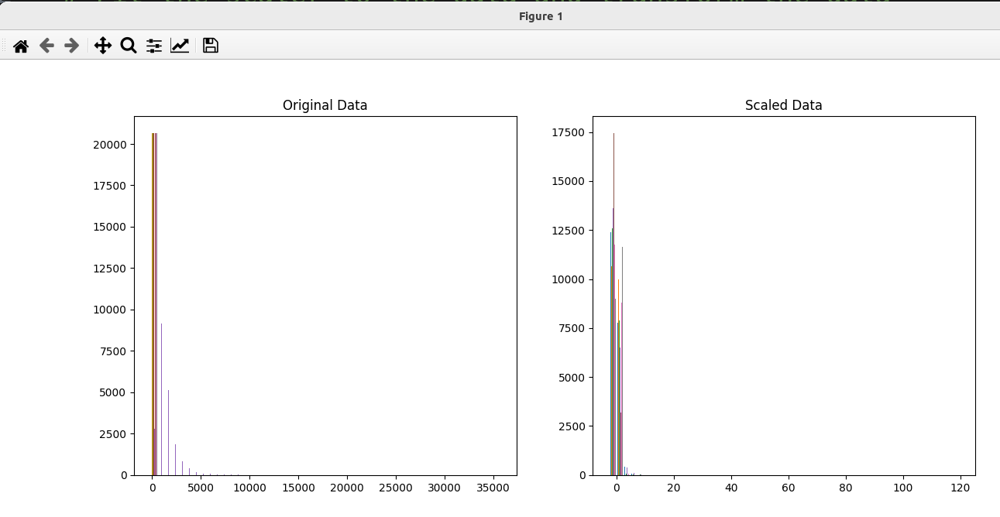

### Result
* Sklearn
* Preprocessing 
* Feature Scaling
* Feature Scaling works by normalizing the range of independent variables or features of data.
* It is generally useful to normalize the input data before feeding it to the model.

