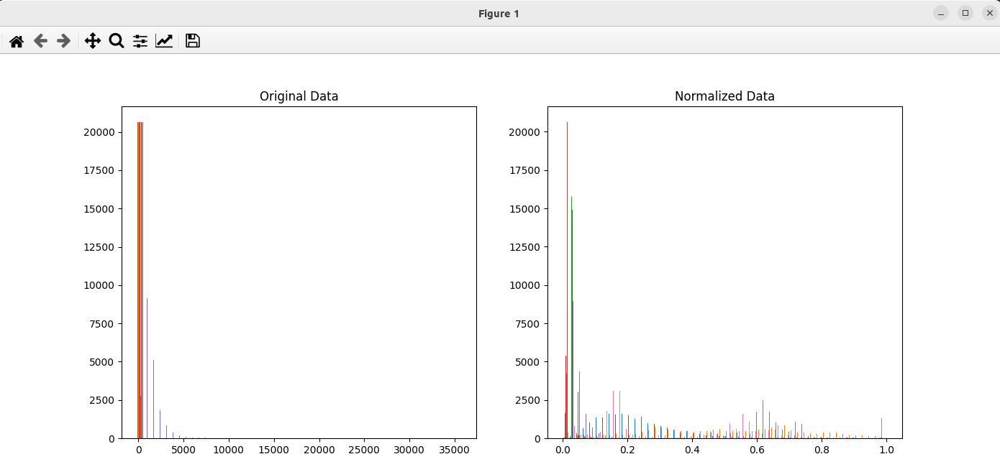

### Result
* sklearn
* Preprocessing
* Normalization
* Normalization works by scaling the data of independent variables or features of data.
* It is generally useful to normalize the input data before feeding it to the model.

