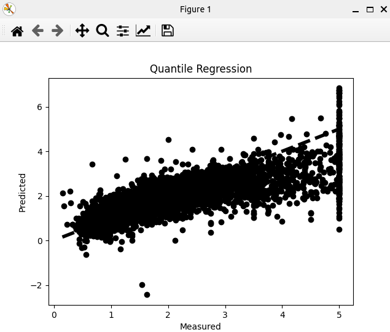

### Result
* Regressor
* Quantile Regressor
* QuantileRegressor is a linear model, aim to minimize the squared error
* Quantile regression is a type of regression analysis used in statistics and econometrics. Whereas the method of least squares results in estimates that approximate the conditional mean of the response variable given certain values of the predictor variables, quantile regression aims at estimating either the conditional median or other quantiles of the response variable.
* The main advantage of using QuantileRegressor is that it is more robust to outliers than traditional regression models
* California Housing Dataset

