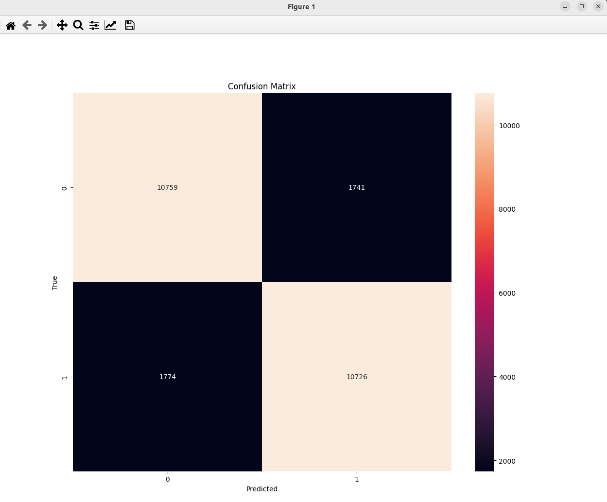

### Result
* Regression
* Logistic Regression
* IMDB dataset
* Logistic Regression works by using the sigmoid function to predict the probability of a binary outcome.

Result:
```
17464789/17464789 [==============================] - 1s 0us/step
Downloading data from https://storage.googleapis.com/tensorflow/tf-keras-datasets/imdb_word_index.json
1641221/1641221 [==============================] - 0s 0us/step
Accuracy: 0.8594
```

