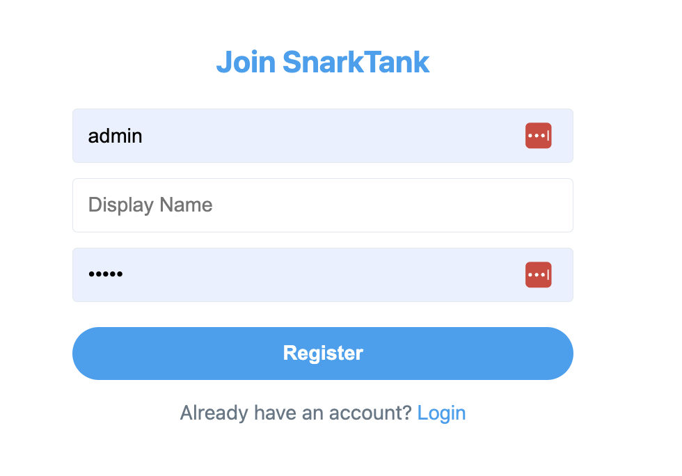
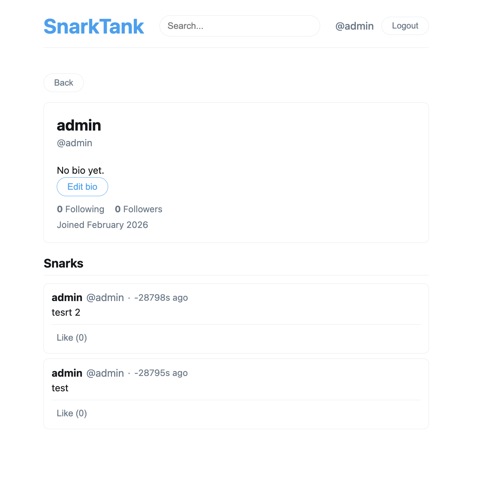
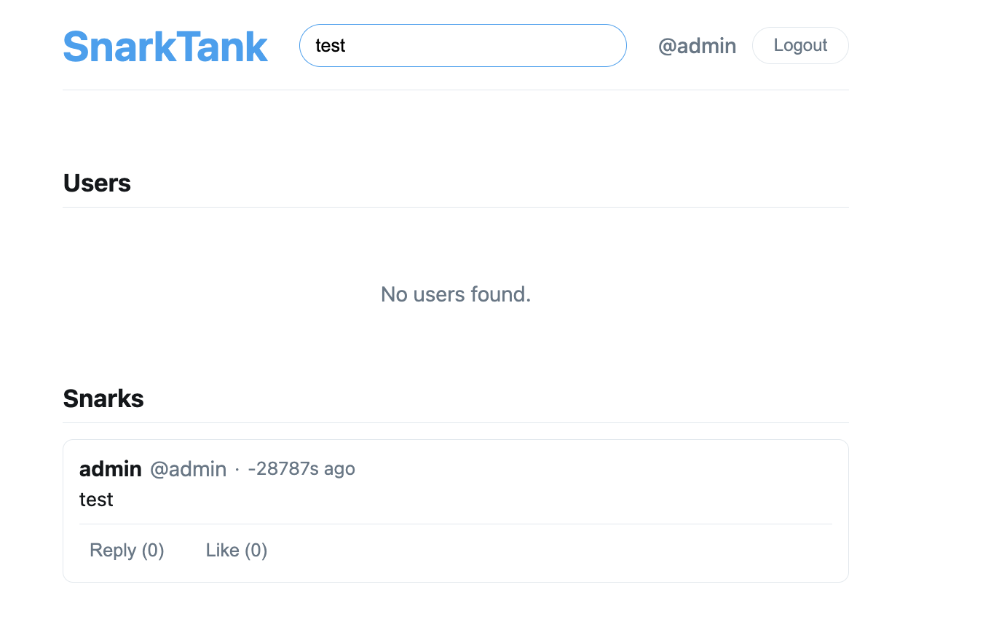
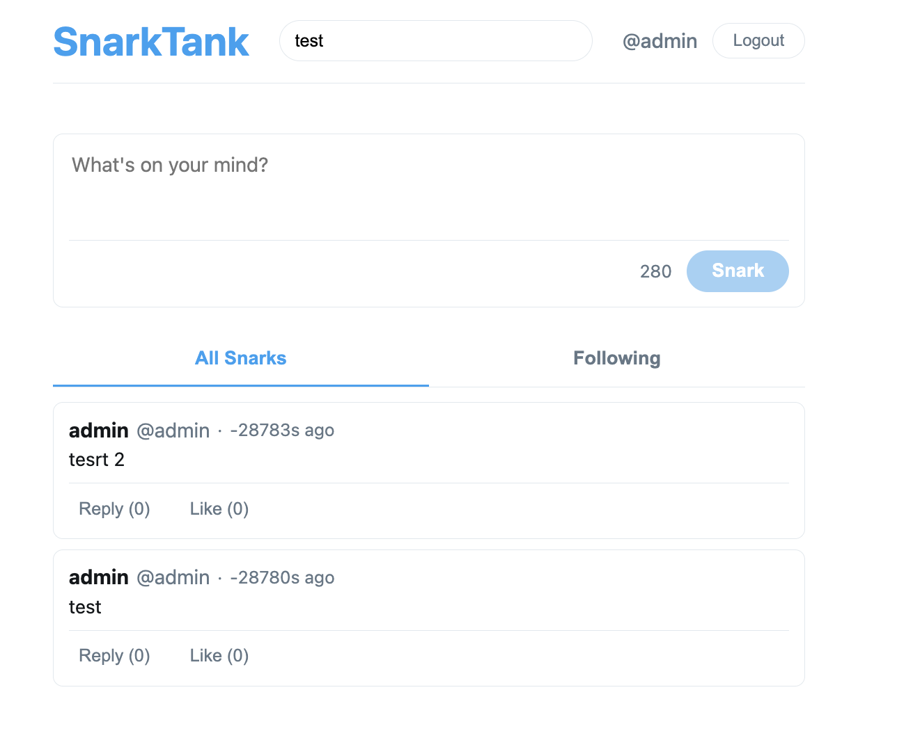

# Ralph

https://github.com/snarktank/ralph

```
Ralph will:

1. Create a feature branch (from PRD branchName)
2. Pick the highest priority story where passes: false
3. Implement that single story
4. Run quality checks (typecheck, tests)
5. Commit if checks pass
6. Update prd.json to mark story as passes: true
7. Append learnings to progress.txt
8. Repeat until all stories pass or max iterations reached
```

## Result App

Register <br/>


Profile <br/>


Search <br/>


Timeline <br/>


Ralph generated the backend code in Javascript. 

## Using Ralph

## First

```
 Load the prd skill and create a PRD for [your feature description] from @scripts/CLAUDE.md and @scripts/ralph.sh
```

Result:
```
⏺ Created all 3 files. Here's what was generated:

  scripts/prd.json - PRD for SnarkTank, a Twitter-like microblogging app with 10 user stories:

  ┌────────┬───────────────────────────────────┬──────────┐
  │   ID   │               Story               │ Priority │
  ├────────┼───────────────────────────────────┼──────────┤
  │ ST-001 │ Project Setup and Database Schema │ 1        │
  ├────────┼───────────────────────────────────┼──────────┤
  │ ST-002 │ User Registration and Login       │ 2        │
  ├────────┼───────────────────────────────────┼──────────┤
  │ ST-003 │ Post a Snark                      │ 3        │
  ├────────┼───────────────────────────────────┼──────────┤
  │ ST-004 │ Timeline Feed                     │ 4        │
  ├────────┼───────────────────────────────────┼──────────┤
  │ ST-005 │ Like a Snark                      │ 5        │
  ├────────┼───────────────────────────────────┼──────────┤
  │ ST-006 │ User Profile Page                 │ 6        │
  ├────────┼───────────────────────────────────┼──────────┤
  │ ST-007 │ Follow and Unfollow Users         │ 7        │
  ├────────┼───────────────────────────────────┼──────────┤
  │ ST-008 │ Following-Only Timeline           │ 8        │
  ├────────┼───────────────────────────────────┼──────────┤
  │ ST-009 │ Reply to Snarks                   │ 9        │
  ├────────┼───────────────────────────────────┼──────────┤
  │ ST-010 │ Search Users and Snarks           │ 10       │
  └────────┴───────────────────────────────────┴──────────┘

  Tech stack: React + TypeScript frontend, Node.js + Express backend, SQLite database, plain CSS.

  Branch: ralph/snarktank-twitter

  scripts/progress.txt - Initialized with empty Codebase Patterns section.

  scripts/prompt.md - AMP-compatible prompt matching the CLAUDE.md instructions.

  To run Ralph: ./scripts/ralph.sh --tool claude 10
```

## Second - Raplh Loop

```
❯ ./scripts/ralph.sh --tool claude 10
Starting Ralph - Tool: claude - Max iterations: 10

===============================================================
  Ralph Iteration 1 of 10 (claude)
===============================================================
ST-001 is complete. There are still 9 stories with `passes: false` (ST-002 through ST-010), so the next iteration will pick up ST-002: User Registration and Login.

**Summary of ST-001:**
- Verified all project setup was already in place from prior commits
- All 19 database schema tests pass
- npm install, frontend build, and backend start all work correctly
- Updated PRD to mark ST-001 as passing
- Documented codebase patterns in progress.txt for future iterations
Iteration 1 complete. Continuing...

===============================================================
  Ralph Iteration 2 of 10 (claude)
===============================================================
**ST-002 - User Registration and Login** is complete. Here's what was done:

**Backend:**
- `backend/src/auth.js` - Registration (POST /api/auth/register), login (POST /api/auth/login), and token validation (GET /api/auth/me) endpoints
- Passwords hashed with bcryptjs (salt rounds: 10)
- JWT tokens with 7-day expiry
- Validation for required fields, username length, password length, unique username

**Frontend:**
- `AuthContext.tsx` - React context managing auth state, token in localStorage, auto-validation on load
- `LoginPage.tsx` - Login form with error display
- `RegisterPage.tsx` - Registration form with validation
- `App.tsx` - Shows auth pages when logged out, main app when logged in
- `App.css` - Styling for auth forms, header with logout

**Tests:** All 28 tests pass (19 schema + 9 auth tests covering password hashing, JWT tokens, duplicate username rejection)

There are still 8 stories with `passes: false` (ST-003 through ST-010) remaining for future iterations.
Iteration 2 complete. Continuing...

===============================================================
  Ralph Iteration 3 of 10 (claude)
===============================================================
**ST-003: Post a Snark** is complete. Here's what was implemented:

**Backend:**
- `POST /api/snarks` - Auth-protected endpoint, validates max 280 chars and non-empty content
- `GET /api/snarks` - Paginated timeline returning snarks with author info, like/reply counts

**Frontend:**
- `ComposeSnark` component with textarea, character counter (turns warning at <20, red at 0), and submit button
- `SnarkCard` component showing author display name, @username, relative timestamp, and content
- Timeline display in App.tsx that loads snarks and prepends new ones immediately on post

**Tests:** All 38 tests pass (10 new snark-specific tests), TypeScript compiles clean, frontend builds.

There are still stories with `passes: false` (ST-004 through ST-010), so the next iteration will pick up ST-004: Timeline Feed.
Iteration 3 complete. Continuing...

===============================================================
  Ralph Iteration 4 of 10 (claude)
===============================================================
**ST-004 - Timeline Feed** is complete. Here's what was done:

- **Added stable ordering** with `id DESC` tiebreaker in the snarks query to handle same-timestamp rows
- **Made index.js test-friendly** with `require.main === module` guard so tests can import without auto-starting the server
- **Added 16 API-level tests** covering: response status, array format, ordering (newest first), author object shape, timestamp/likeCount/replyCount fields, and pagination with limit/offset
- All **54 tests pass**, TypeScript compiles clean, frontend builds successfully

There are still stories with `passes: false` (ST-005 through ST-010), so another iteration will pick up the next story.
Iteration 4 complete. Continuing...

===============================================================
  Ralph Iteration 5 of 10 (claude)
===============================================================
ST-005 is complete. There are still stories with `passes: false` (ST-006 through ST-010), so another iteration will pick up the next story.

**Summary of ST-005 - Like a Snark:**
- Added `POST /api/snarks/:id/like` and `DELETE /api/snarks/:id/like` endpoints (auth-protected)
- Updated `GET /api/snarks` to include `likedByMe` field by optionally parsing JWT
- Added like button UI to SnarkCard with toggle state and immediate count update
- Added 15 new API tests (69 total, all passing)
- TypeScript compiles clean, frontend builds successfully
Iteration 5 complete. Continuing...

===============================================================
  Ralph Iteration 6 of 10 (claude)
===============================================================
^[[120;5uST-006 is complete. There are still stories with `passes: false` (ST-007 through ST-010), so another iteration will pick up the next story.

**Summary of ST-006 - User Profile Page:**
- **Backend**: Created `users.js` router with `GET /api/users/:username` (returns profile + user's snarks) and `PUT /api/users/profile` (update bio, auth required, 160 char limit)
- **Frontend**: Created `ProfilePage.tsx` component with display name, username, bio (editable on own profile), join date, and user's snarks list. Added hash-based routing via `useRoute()` hook in App.tsx
- **Navigation**: Clickable usernames in snark cards and header link to profile pages, SnarkTank title links back to home
- **Tests**: 19 new API tests, all 88 tests pass, TypeScript clean, frontend builds
- **Files**: 6 files changed (2 new: `users.js`, `ProfilePage.tsx`)
Iteration 6 complete. Continuing...

===============================================================
  Ralph Iteration 7 of 10 (claude)
===============================================================
ST-007 is complete. There are still stories with `passes: false` (ST-008, ST-009, ST-010), so another iteration will pick up the next story.

**ST-007 Summary:**
- Added `POST /api/users/:id/follow` and `DELETE /api/users/:id/follow` endpoints (auth-protected)
- Updated profile API to return `followerCount`, `followingCount`, and `followedByMe`
- Added Follow/Unfollow button on other users' profile pages with follower/following counts display
- Added 18 new tests (106 total, all passing)
- TypeScript compiles clean, frontend builds successfully
- Committed as `feat: ST-007 - Follow and Unfollow Users`
Iteration 7 complete. Continuing...

===============================================================
  Ralph Iteration 8 of 10 (claude)
===============================================================
```

I run out of subscription tokensm, I had to run again:
```
❯ ./scripts/ralph.sh --tool claude 10
Starting Ralph - Tool: claude - Max iterations: 10

===============================================================
  Ralph Iteration 1 of 10 (claude)
===============================================================
ST-008 is complete. There are still stories with `passes: false` (ST-009 and ST-010), so another iteration will pick those up.

**Summary of ST-008 implementation:**
- Added "All Snarks" and "Following" tab buttons to the timeline UI with active state styling
- Tabs switch without page reload, loading the appropriate feed
- Following tab shows a specific empty state message when not following anyone
- Added 12 new API tests for the `/api/snarks/following` endpoint
- All 118 tests pass, TypeScript compiles clean, frontend builds successfully
Iteration 1 complete. Continuing...

===============================================================
  Ralph Iteration 2 of 10 (claude)
===============================================================
ST-009 is complete. Checking remaining stories - ST-010 (Search Users and Snarks) still has `passes: false`, so another iteration will pick it up.

**Summary of ST-009 implementation:**
- **Backend**: Updated `POST /api/snarks` to accept optional `parentId` for replies (validates parent exists). Added `GET /api/snarks/:id` endpoint returning snark detail with nested `replies` array in chronological order.
- **Frontend**: Added Reply button with reply count to `SnarkCard`. Created `SnarkDetailPage` component with reply form and replies list. Added `#/snark/:id` route in `AppContent`.
- **Tests**: 20 new tests covering reply creation, snark detail, reply ordering, 404 handling, auth requirements, and timeline exclusion of replies. All 138 tests pass.
Iteration 2 complete. Continuing...


===============================================================
  Ralph Iteration 3 of 10 (claude)
===============================================================
All 10 stories have `passes: true`. All 162 tests pass, TypeScript compiles clean, frontend builds successfully, and browser testing confirmed the search feature works correctly.

<promise>COMPLETE</promise>

Ralph completed all tasks!
Completed at iteration 3 of 10
```