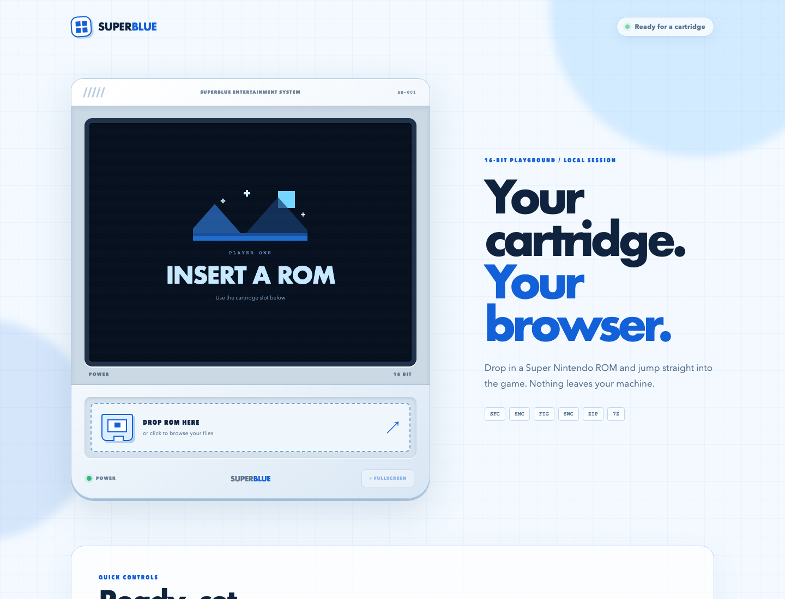
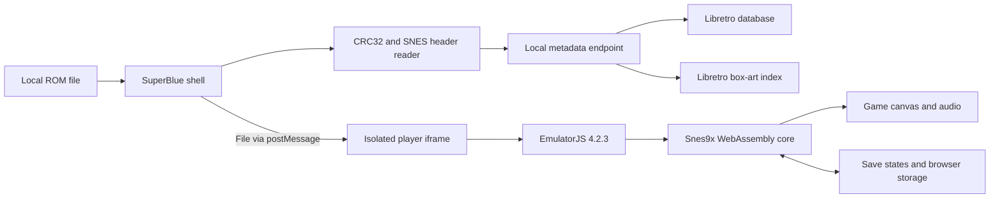

<div align="center">

# SUPERBLUE

### Your cartridge. Your browser.

[](https://emulatorjs.org/)
[](https://emulatorjs.org/docs/systems/snes/)


A focused, local-first Super Nintendo player with drag-and-drop cartridges, authentic box-art matching, save states, gamepads, fullscreen play, and a responsive light blue hardware interface.

</div>



## Start playing

Requirements:

- Node.js 20 or newer
- A current Chromium, Firefox, or Safari browser
- Internet access for the pinned emulator core and game artwork
- A SNES ROM you have the right to use

Start the server:

```bash
./start.sh
```

Open [http://127.0.0.1:9011/](http://127.0.0.1:9011/), then drop a cartridge into the slot or click it to open the file picker.

Stop the server:

```bash
./stop.sh
```

The default port is `9011`. A temporary override is available when needed:

```bash
PORT=9020 ./start.sh
```

## What it does

| Capability | Behavior |
|---|---|
| Cartridge loading | Drag a ROM anywhere on the shell or open it from the cartridge slot |
| Emulation | Runs the Snes9x Libretro core through EmulatorJS 4.2.3 |
| ROM formats | `.sfc`, `.smc`, `.fig`, `.swc`, `.gd3`, `.gd7`, `.dx2`, `.bsx`, `.zip`, `.7z` |
| Game identity | Matches CRC32, headerless SMC CRC32, internal SNES title, then filename |
| Game artwork | Resolves actual filenames from the official Libretro SNES box-art repository |
| Game facts | Shows release year and developer from the Libretro database |
| Save states | Saves and restores through the embedded EmulatorJS control bar |
| Fullscreen | Uses the browser Fullscreen API; `Escape` restores the normal shell |
| Controllers | Supports keyboard mapping and browser-compatible gamepads |
| Privacy | ROM bytes stay in the browser and are never sent to the local server |

## Architecture



The application has three deliberately small layers:

1. The shell owns file selection, validation, layout, metadata, fullscreen behavior, and user feedback.
2. The isolated player frame owns EmulatorJS configuration and keeps its DOM mutations away from the shell.
3. The Node server exposes a strict static-file allowlist, a health endpoint, and a cached metadata lookup.

No framework, package manager, build pipeline, database server, or third-party JavaScript dependency is required by the application shell.

## Cartridge flow

```text
Select ROM
    ↓
Validate extension and size
    ↓
Read CRC32 and internal SNES title in the browser
    ↓
Request metadata from the local endpoint
    ↓
Pass the original File object to the player iframe
    ↓
EmulatorJS loads the Snes9x WebAssembly core
    ↓
Play, save, restore, remap, or enter fullscreen
```

The ROM is represented by the browser `File` object throughout this flow. The server receives only checksum and title query values for metadata matching.

## How game identification works

SuperBlue uses a layered lookup because SNES libraries contain headered dumps, headerless dumps, renamed files, archives, regional releases, and modified cartridges.

1. Raw cartridges are checked with CRC32.
2. SMC files with a 512-byte copier header are checked again without that header.
3. LoROM, HiROM, and ExHiROM title locations are inspected for the internal cartridge title.
4. The filename is normalized when checksum metadata is unavailable.
5. Artwork is matched against the actual `Named_Boxarts` file index, with region-aware title fallback.

Exact checksum matches provide the strongest result. Modified ROMs and uncommon releases may show filename-derived metadata or the built-in artwork placeholder.

## EmulatorJS and Snes9x

[EmulatorJS](https://emulatorjs.org/docs/) is a browser frontend for Libretro cores compiled to WebAssembly. SuperBlue configures it inside [player.js](player.js) with the SNES system and the pinned `4.2.3` data path.

The effective stack is:

```text
SuperBlue interface
    ↓
EmulatorJS player
    ↓
Libretro runtime
    ↓
Snes9x core
    ↓
WebAssembly, WebGL, Web Audio, Gamepad API
```

The core is pinned instead of following a moving channel. Legacy WebGL mode and disabled shaders keep save-state restoration consistent across sessions and avoid corrupted dark frames after a restore.

The first cartridge load downloads the emulator runtime and Snes9x core from the official EmulatorJS CDN. Browser caching makes later loads faster.

## Save states

Use the save and load controls inside the player toolbar.

Save states capture core memory, not only the normal in-game save data. They are sensitive to the game revision, emulator core, and core configuration. A state should be restored with the same ROM revision that created it.

For long-term progress, keep the game’s normal battery-backed save data as well as any save states.

## Keyboard controls

| SNES input | Keyboard |
|---|---|
| D-pad | Arrow keys |
| A / B | `Z` / `X` |
| X / Y | `A` / `S` |
| Select / Start | `Shift` / `Enter` |

The player toolbar contains the complete mapper. Connected gamepads can be assigned there without changing application code.

## Fullscreen

The blue `FULLSCREEN` control becomes active after a cartridge is selected. It expands the entire game screen rather than the surrounding page.

Press `Escape` to return. SuperBlue handles both the browser’s native fullscreen exit and a player-frame fallback message.

## Project map

| File | Responsibility |
|---|---|
| `index.html` | Shell structure, cartridge slot, player screen, artwork rail, compact controls |
| `styles.css` | Single-screen responsive hardware interface and fullscreen layout |
| `app.js` | ROM validation, CRC32, SNES title reading, metadata, drag-and-drop, fullscreen |
| `player.html` | Isolated host for EmulatorJS |
| `player.js` | Snes9x and EmulatorJS configuration |
| `server.mjs` | Static server, health check, metadata and artwork index cache |
| `start.sh` | Persistent startup and health verification |
| `stop.sh` | Graceful process shutdown |

## Responsive view

The desktop layout keeps the emulator on the left and gives artwork a wide right-hand stage. Narrow screens prioritize the player and present the cover as a compact floating card without adding page scrolling.

## Troubleshooting

### The core does not load

Confirm that the browser can reach `cdn.emulatorjs.org`. SuperBlue reports a connection error instead of leaving the cartridge reader active indefinitely.

### Artwork is missing

Artwork depends on a matching entry in the Libretro SNES thumbnail collection. Raw SFC and SMC files have the best identification rate because they can be matched by checksum.

### A save state restores incorrectly

Use a state created by the same ROM revision and the same pinned SuperBlue core. Restart the cartridge before retrying a state that came from another emulator or another game revision.

### Port 9011 is busy

Stop the existing process with `./stop.sh` or start on a temporary port through the `PORT` environment variable.

## Data and ownership

SuperBlue does not include games, firmware, or copyrighted box-art files. Artwork is requested from the [Libretro SNES thumbnail repository](https://github.com/libretro-thumbnails/Nintendo_-_Super_Nintendo_Entertainment_System), and metadata comes from the [Libretro database](https://github.com/libretro/libretro-database).

Use only game files you are legally permitted to use.
