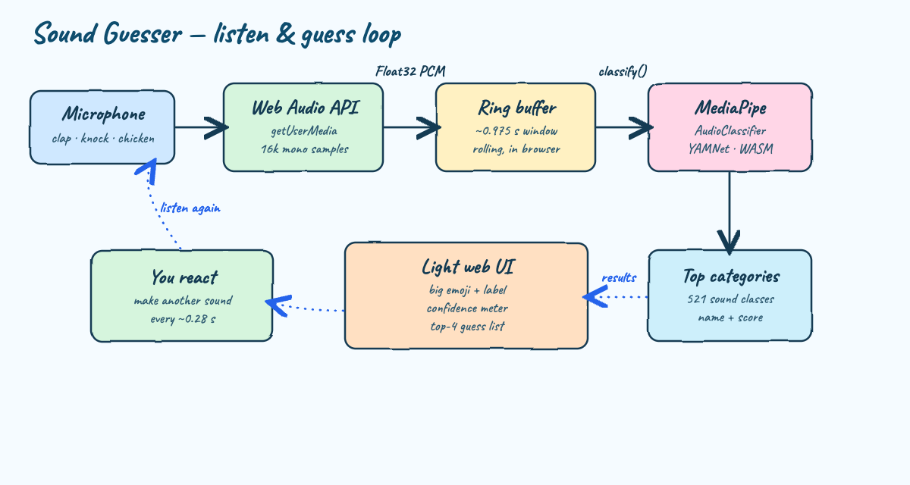
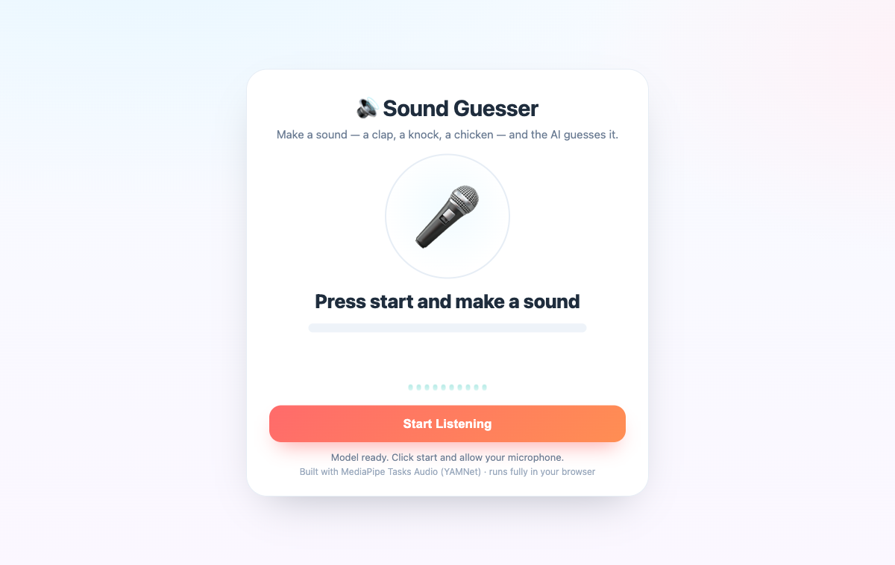
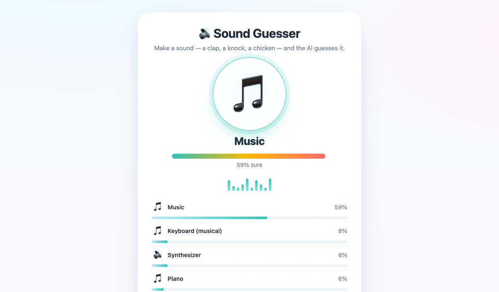

# Sound Guesser

A tiny light-themed web app: make a sound into your microphone — a clap, a knock, a chicken, a whistle — and the AI guesses what it is, live, with a confidence meter and a ranked top-4 list. Everything runs in your browser. No upload, no server-side inference.



## Can we use OpenCV and MediaPipe for this?

Short answer: **MediaPipe yes, OpenCV no.**

- **OpenCV** is a computer-vision library. It works on images and video — pixels, not sound. It has no audio classification, so it is the wrong tool for "guess the sound".
- **MediaPipe Tasks** ships an **Audio Classifier** built on **YAMNet**, a model trained on Google's AudioSet. It recognizes **521 everyday sound classes** — clapping, chicken/rooster, knock, door, whistling, dog bark, speech, music, and many more. That is exactly this problem.

So this app drops OpenCV entirely and uses the **MediaPipe Audio Classifier (YAMNet)**, running fully client-side via WebAssembly.

## What it looks like

Idle, model loaded, waiting for you to start:



Listening live — here it is classifying a steady test tone as **Music (59%)**, with the ranked runners-up (Keyboard, Synthesizer, Piano) below. Make a real clap or knock and the top guess changes instantly:



## How it works

1. **Microphone** is captured with the Web Audio API (`getUserMedia`).
2. A `ScriptProcessorNode` streams raw mono samples into a rolling **ring buffer** that always holds the most recent **~0.975 s** (YAMNet's input window).
3. Every **~0.28 s** the latest window is handed to the MediaPipe **`AudioClassifier.classify()`** call, which runs **YAMNet** in WebAssembly on the CPU (TFLite + XNNPACK).
4. The top categories come back with scores. The UI shows the best guess as a big **emoji + label**, a confidence meter, and the **top 4** as bars.
5. Loop — it keeps listening, so the guess updates as the sound changes.

No backend does any inference. The page is static; the server only serves files.

## Run it

```bash
./start.sh
```

Then open <http://localhost:8090> and allow the microphone when asked. Make a sound.

```bash
./stop.sh
```

`start.sh` serves the folder with Python's built-in HTTP server on port `8090` (localhost is a secure context, which the microphone requires). The MediaPipe runtime and the YAMNet model are loaded from a CDN, so the first start needs internet.

## Test it

```bash
./test.sh
```

This smoke-tests the things a browser can't show on the command line: that the page and its assets are served, and that the MediaPipe WASM runtime and the YAMNet model are both reachable.

```
OK    index.html served
OK    app.js served
OK    style.css served
OK    YAMNet model reachable
OK    MediaPipe audio WASM reachable
ALL CHECKS PASSED
```

## Files

| File | Purpose |
| --- | --- |
| `index.html` | Markup for the light-theme card UI |
| `style.css` | Light theme, halo, equalizer bars, meters |
| `app.js` | Mic capture, ring buffer, MediaPipe AudioClassifier loop, emoji mapping |
| `diagram.html` | Hand-drawn Excalidraw-style flow diagram source |
| `start.sh` / `stop.sh` | Start/stop the static server on port 8090 |
| `test.sh` | Reachability smoke test |

## Notes

- Best results are short, distinct sounds (a single clap, a knock, a whistle, a cluck).
- YAMNet labels are AudioSet labels (e.g. `Crowing, cock-a-doodle-doo`), and `app.js` maps families of labels to friendly emoji.
- Tested in Chromium. The microphone needs `https://` or `http://localhost`.
