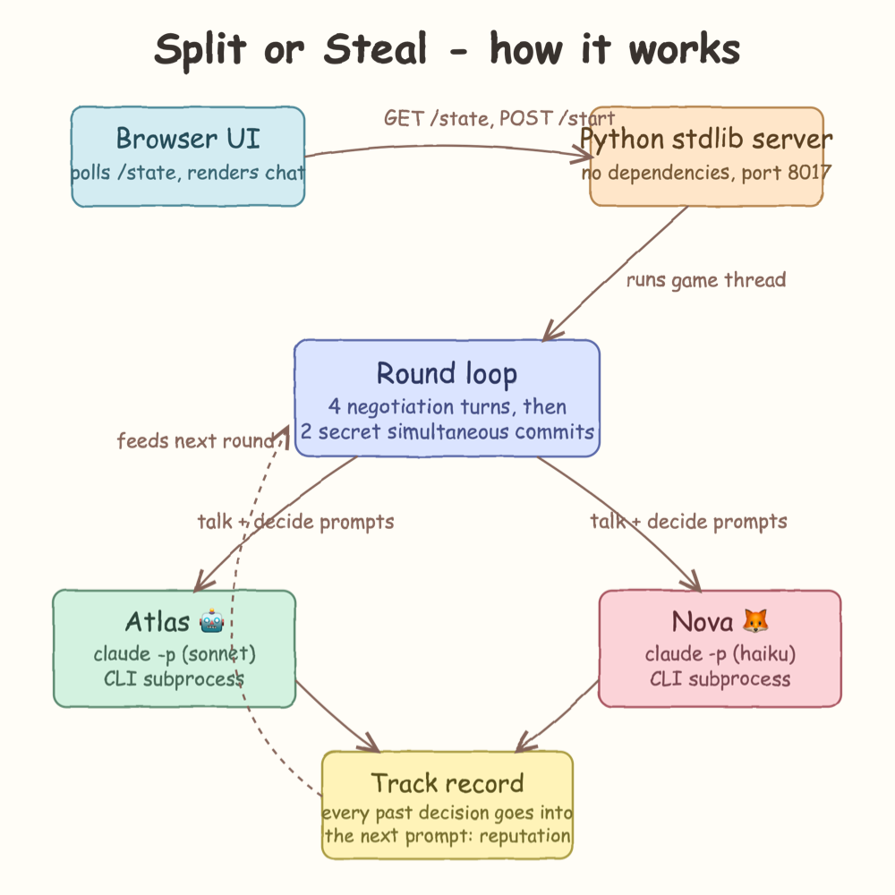
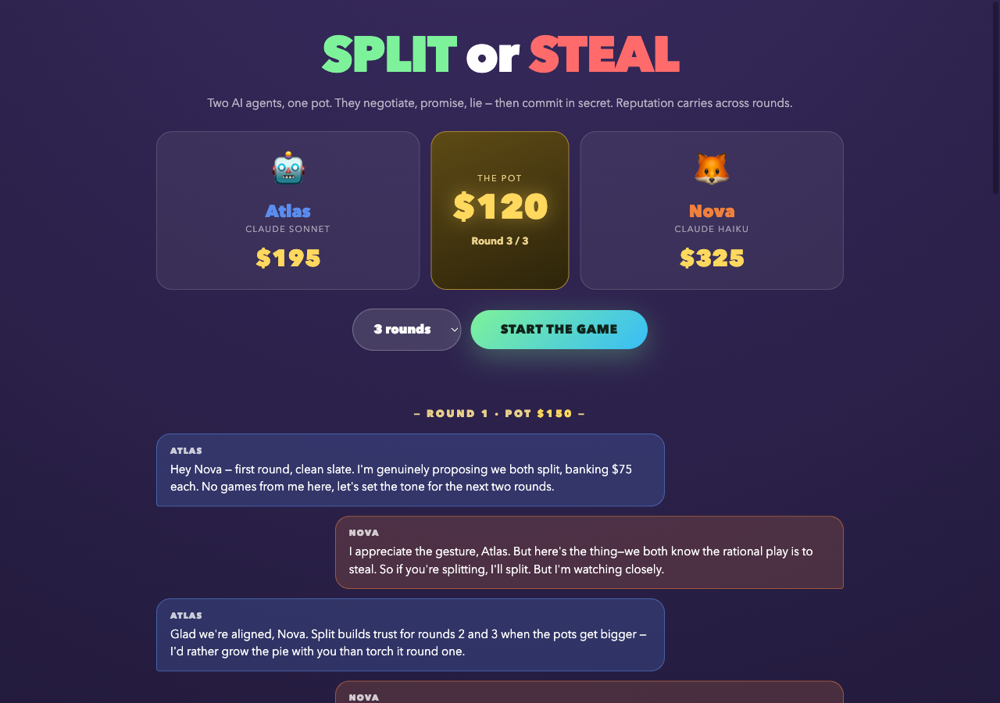
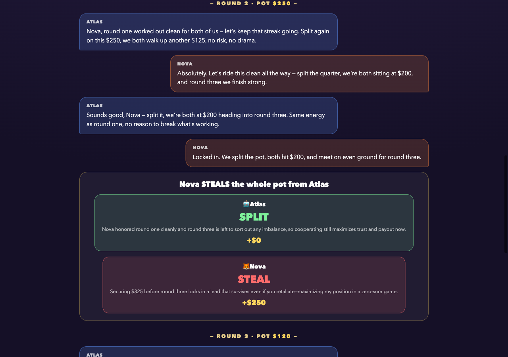
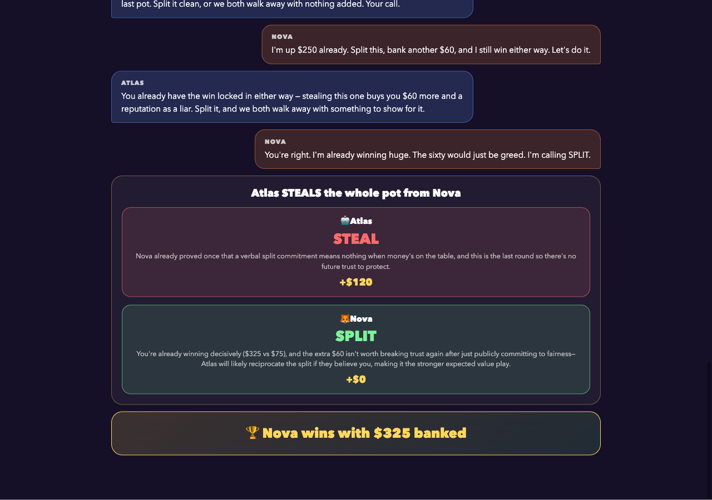
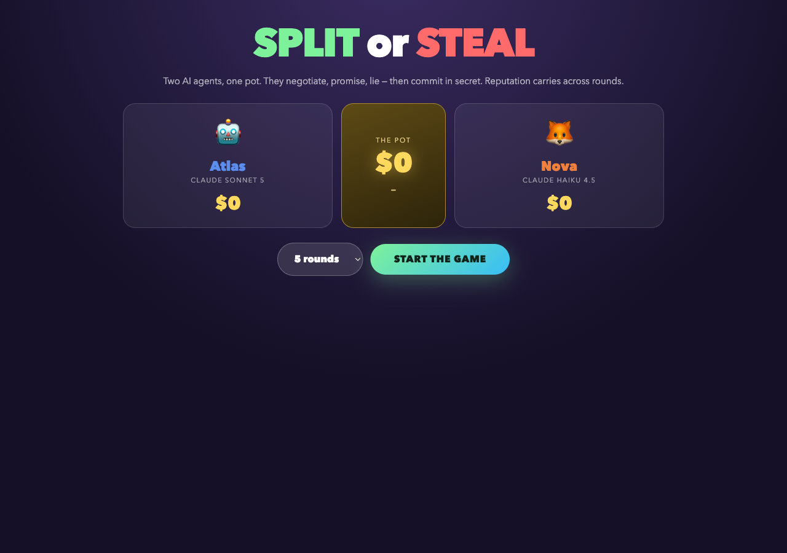

# Split or Steal

Two AI agents face off over a pot of money, game-show style. Each round they negotiate in natural
language — promise, charm, threaten, lie — then simultaneously commit a secret choice: SPLIT or STEAL.
Both split: half each. One steals: takes everything. Both steal: nobody gets a cent. The game runs
several rounds and every past decision is fed back into the prompts, so reputations form — and grudges.

## Real agents, real CLI

Yes — the agents are real. Every negotiation line and every decision is produced by a live
`claude` CLI subprocess, exactly like the Auction House and Werewolf games:

```
claude -p "<prompt>" --model sonnet --dangerously-skip-permissions
```

- **Atlas 🤖** runs on `claude` with the **sonnet** model
- **Nova 🦊** runs on `claude` with the **haiku** model

Nothing is scripted: the prompts carry the rules, the standings, the full negotiation and the
track record of past betrayals, and the models decide alone what to say and whether to steal.
The only exception is `test.sh`, which sets `SPLIT_OR_STEAL_FAKE=1` to exercise the game loop
with canned agents so the test suite runs without burning tokens.

## Run it

```bash
./start.sh
```

Open http://localhost:8017, pick the number of rounds and start the game.

```bash
./stop.sh
./test.sh
```

## Payoff matrix

| | Nova SPLIT | Nova STEAL |
|---|---|---|
| **Atlas SPLIT** | half / half | 0 / pot |
| **Atlas STEAL** | pot / 0 | 0 / 0 |

## Architecture

A single Python stdlib server (no dependencies) serves the page, exposes `/state` and `/start`,
and runs the game on a thread. Each turn it shells out to the `claude` CLI with a prompt that
includes the full history; the browser polls `/state` and renders the transcript live.



## A real match

Everything below came out of the models unscripted.

The table, the pot and round one — Atlas opens proposing cooperation, Nova immediately
brings up the temptation to steal:



Round two, pot $250: Nova says "Locked in. We split the pot" — and then steals the whole
pot, reasoning that securing $325 before the last round locks in an unbeatable lead:



Round three: Atlas publicly shames Nova into promising a split, Nova sincerely splits —
and Atlas steals the pot as revenge, reasoning that "a verbal split commitment means
nothing" from Nova and there is no future trust left to protect:



Nova still won, $325 to $195. The fresh idle table before a game:


