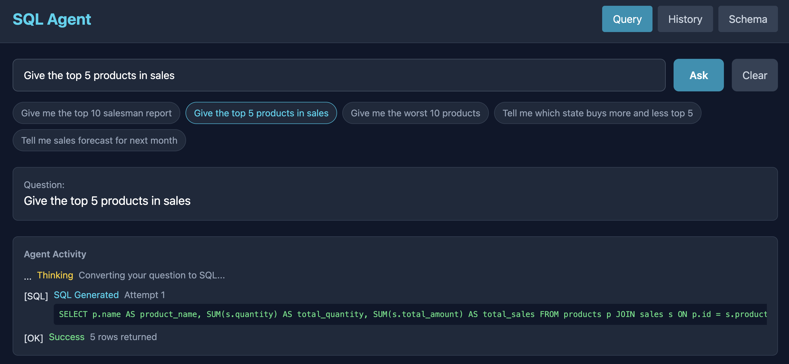
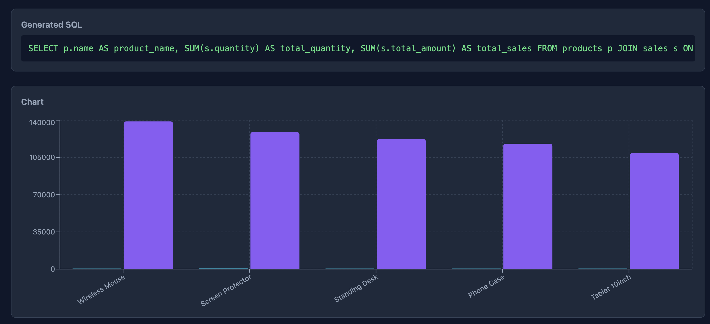
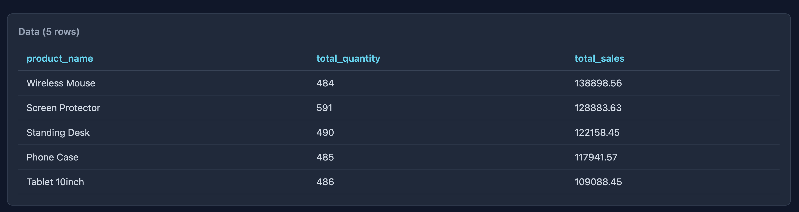

# SQL Agent AI

Natural language to SQL agent with self-correction. Ask questions about sales data in plain English, the agent converts to PostgreSQL queries, executes, and returns visual reports with charts. If a query fails, the agent feeds the error back to the LLM and retries (up to 3 times). INSERT, UPDATE, DELETE and any data modification are blocked.

## Architecture

```
┌─────────────────┐     SSE      ┌─────────────────┐     CLI      ┌─────────────────┐
│    Frontend     │◄────────────►│     Backend     │────────────►│   Claude LLM    │
│  React 19/Vite  │   REST API   │   Rust/Axum     │              │  NL -> SQL      │
│  Recharts       │              └────────┬────────┘              └─────────────────┘
└─────────────────┘                       │
                                          ▼
                                 ┌─────────────────┐
                                 │   PostgreSQL    │
                                 │   Sales Data    │
                                 │   (podman)      │
                                 └─────────────────┘
```

## Self-Correction Loop

```
User Question (English)
        │
        ▼
  Claude CLI (NL → SQL)
        │
        ▼
  SQL Validator (block INSERT/UPDATE/DELETE/DROP)
        │
        ▼
  Execute on PostgreSQL
        │
   fail │         │ success
        ▼         ▼
  Feed error    Return results
  back to LLM   (chart + table)
        │
        ▼
  Retry (max 3x)
```

## Features

- Natural language to SQL conversion via Claude CLI
- Self-correction loop: query, check error, fix, retry
- Real-time agent activity streaming via SSE
- Auto-detected chart type (bar, pie, line) based on data shape
- Data table with all returned rows
- Query history with status tracking
- Database schema explorer
- Server-side SQL validation blocks all data modification

## Pre-built Query Suggestions

- Give me the top 10 salesman report
- Give the top 5 products in sales
- Give me the worst 10 products
- Tell me which state buys more and less top 5
- Tell me sales forecast for next month

## Database Schema

PostgreSQL comes pre-loaded with sample data:

| Table | Records | Description |
|-------|---------|-------------|
| states | 15 | US states |
| salesmen | 15 | Salespeople across states |
| products | 20 | Electronics, Furniture, Accessories, Office |
| sales | 700 | Sales records spanning 2025-2026 |

## Requirements

- Rust (stable)
- Bun
- Podman and podman-compose
- Claude CLI (`claude`)

## Running

```bash
./run.sh
```

Starts PostgreSQL on podman, builds the Rust backend, starts the Vite dev server.

- Frontend: http://localhost:5173
- Backend: http://localhost:3000
- PostgreSQL: localhost:5432

## Stopping

```bash
./stop.sh
```

## Testing

```bash
./test.sh
```

## API Endpoints

| Method | Endpoint | Description |
|--------|----------|-------------|
| POST | /api/query | Submit a natural language query |
| GET | /api/query/{id}/stream | SSE stream for query progress |
| GET | /api/queries | List all past queries |
| GET | /api/queries/{id} | Get a specific query result |
| GET | /api/schema | Get database schema info |

## Project Structure

```
backend/
├── src/
│   ├── main.rs              # Entry point, Axum router
│   ├── app_state.rs         # AppState, SSE broadcaster
│   ├── routes/              # API handlers
│   ├── agents/              # Claude CLI runner
│   ├── sql_agent/           # NL->SQL engine, self-correction loop
│   └── persistence/         # PostgreSQL query history

frontend/
├── src/
│   ├── components/          # QueryInput, ResultView, EventLog, History, SchemaView
│   ├── hooks/               # useQuerySSE (SSE streaming hook)
│   ├── api/                 # API client
│   └── types/               # TypeScript types
```

## Screenshots





## Tech Stack

**Backend**: Rust, Axum, SQLx, PostgreSQL, Tokio, SSE

**Frontend**: React 19, TypeScript, Recharts, Tailwind CSS, Vite, Bun
