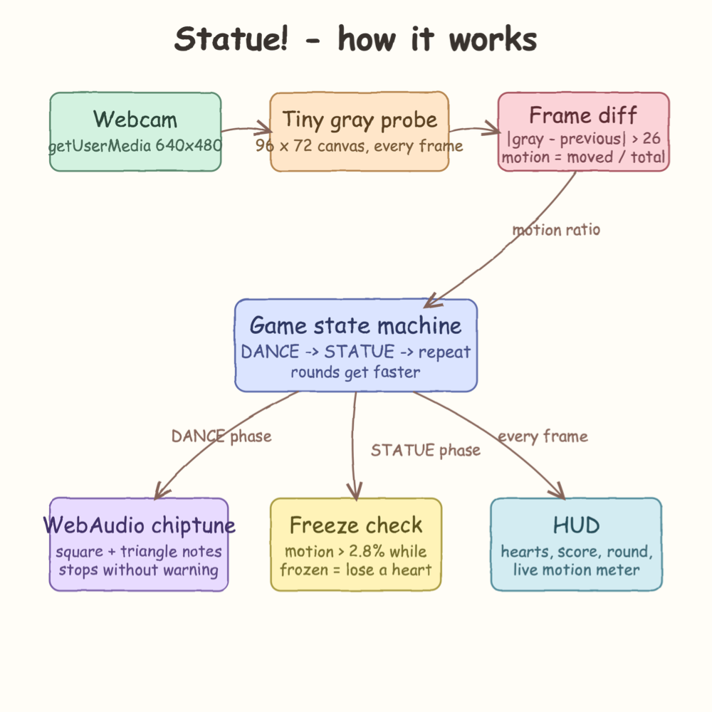
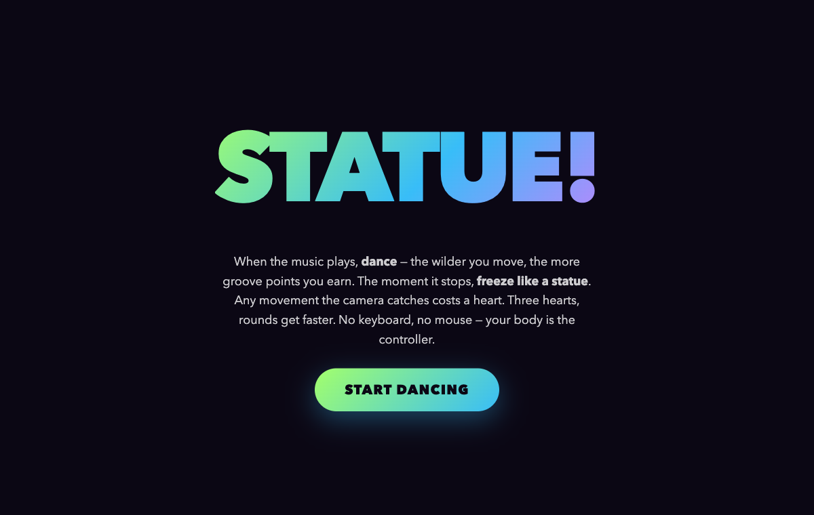
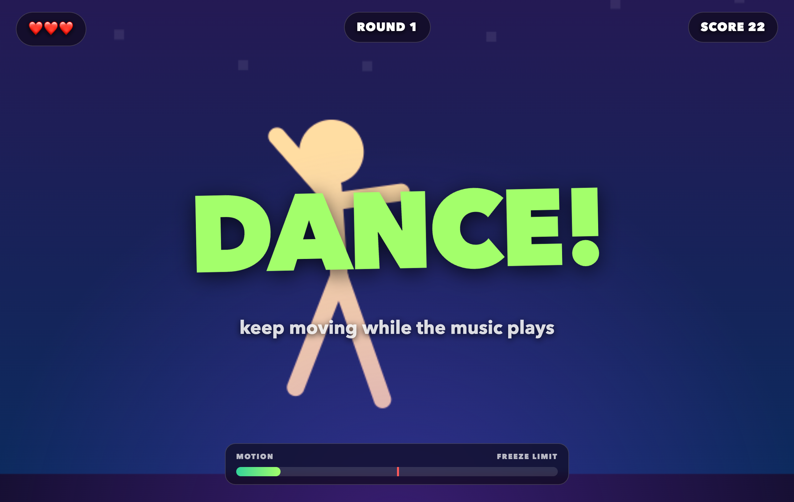
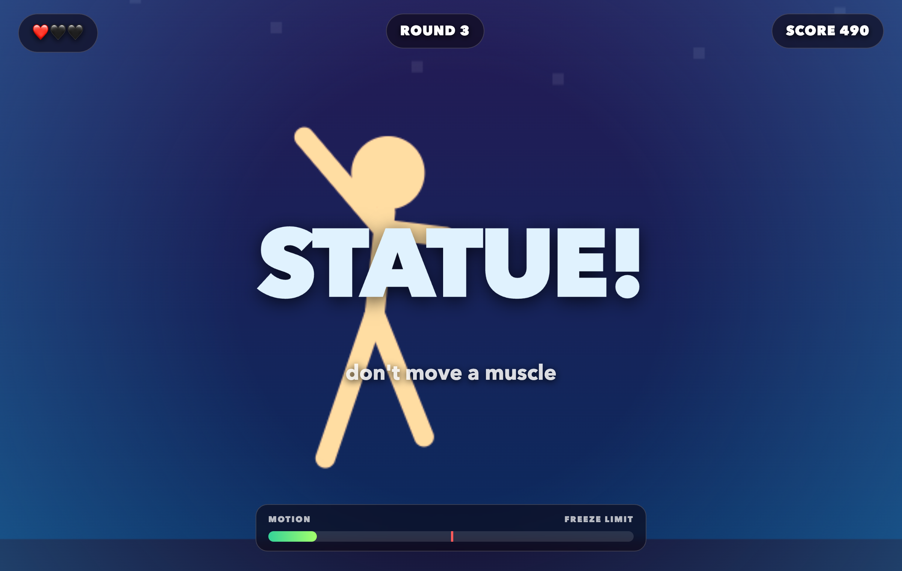
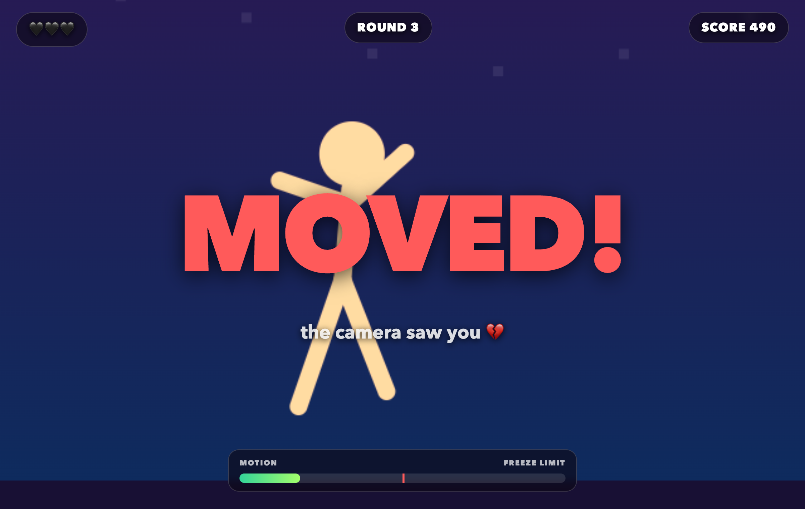
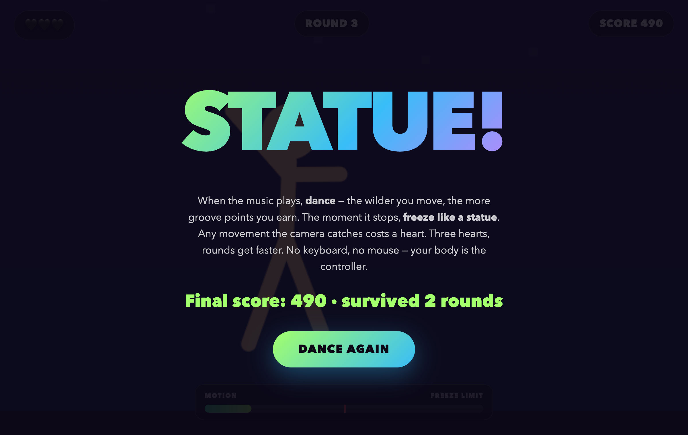

# Statue!

A motion-detection dance game played entirely with your body. Chiptune music plays and you dance;
the moment it stops you must freeze like a statue — if the camera catches any movement, you lose a heart.
Classic frame differencing on raw pixels: no MediaPipe, no models, no libraries, one HTML file.

## How to play

- **DANCE!** — while the music plays, move: the wilder you dance, the more groove points you earn
- **STATUE!** — the music stops without warning: freeze completely
- Moving during the freeze costs a heart (there is a short grace window so you can land your pose)
- Surviving a freeze pays `100 x round`, rounds get faster and the music speeds up
- 3 hearts and it's game over

## Run it

```bash
./start.sh
```

Open http://localhost:8000 and allow camera access.

```bash
./stop.sh
./test.sh
```

## How it works

Every animation frame the webcam image is drawn onto a tiny 96x72 grayscale canvas. Each pixel is
compared with the previous frame; a pixel counts as "moved" when its gray value changed by more
than 26. The motion score is the fraction of moved pixels — above 2.8% during a freeze and the
statue broke. The soundtrack is synthesized live with WebAudio square and triangle oscillators,
so the stop is sample-accurate and there are no audio files.



## Screenshots

The title screen:



DANCE phase — music playing, groove points ticking up, live motion meter at the bottom:



STATUE phase — the music just stopped, don't move a muscle:



Caught moving during a freeze — one heart gone:



Game over after the third broken pose:


